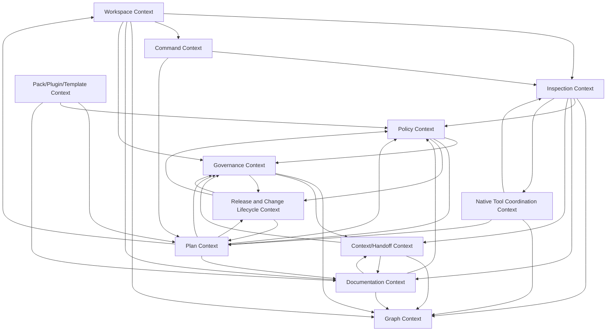

# 5. Domain Model and DDD Design

## 5.1 Purpose of This Section

This section defines the domain model and Domain-Driven Design approach for Monad OS and Monad CLI.

Its purpose is to clarify:

* the core language of the product,
* the main bounded contexts,
* the ownership boundaries between contexts,
* the major aggregates, entities, and value objects,
* the key invariants that must always hold,
* the commands and queries the domain must support,
* the policies that govern repository state and change,
* the domain events that describe important lifecycle moments,
* the ports/adapters needed to keep the system local-first and tool-agnostic,
* and how the model should guide Rust crate/module boundaries.

Monad is a repository lifecycle product. Its domain is not merely “files on disk” or “CLI commands.” Its real domain is the governed software delivery lifecycle as represented inside a repository.

The DDD model should help Monad avoid becoming a loose collection of commands. Each command should operate against a coherent domain model.

---

## 5.2 DDD Design Philosophy

Monad should use Domain-Driven Design pragmatically.

The product has enough domain complexity to justify DDD concepts:

* work packets,
* ADRs,
* policies,
* waivers,
* manifests,
* source-of-truth rules,
* command metadata,
* lifecycle graphs,
* plans,
* apply results,
* context packs,
* generated artifacts,
* native tool adapters,
* documentation state,
* and repository governance.

However, Monad should not over-model everything.

Simple filesystem scans, path checks, and format conversions should remain simple. DDD should be used where there are meaningful business/domain rules, lifecycle state, invariants, or boundaries.

The guiding principle is:

> Use DDD to protect the meaning of the repository lifecycle, not to add ceremony around simple implementation details.

DDD is especially important for:

* plan-backed mutation,
* command catalog integrity,
* canonical manifest rules,
* lifecycle graph relationships,
* policy evaluation,
* ADR/work-packet lifecycle,
* context generation,
* documentation validation,
* generated artifact traceability,
* and safe coordination of native tools.

---

## 5.3 Core Domain Thesis

The central domain thesis is:

> A repository is not just a tree of files. It is a lifecycle system composed of code, configuration, documentation, decisions, policies, work, tests, plans, releases, and context.

Monad should model these as first-class domain concepts rather than treating them as unrelated files.

The most important domain object is not a file, package, or CLI command by itself. The most important domain concept is the **governed lifecycle graph** that connects them.

Example relationships:

```text
Workspace contains Project.
Project is described by DocumentationFile.
Project is governed by Policy.
Policy produces PolicyFinding.
WorkPacket implements ProductGoal.
Layer belongs to WorkPacket.
ADR records ArchitectureDecision.
Plan proposes FileOperation.
ApplyResult records Plan execution.
ContextPack summarizes Workspace state.
CommandDefinition exposes domain capability.
NativeTool provides external capability.
```

This graph is what makes Monad more than a scaffolder or task runner.

---

## 5.4 Ubiquitous Language

The following terms should be used consistently across code, documentation, tests, CLI output, ADRs, and work packets.

| Term                 | Meaning                                                                                                      |
| -------------------- | ------------------------------------------------------------------------------------------------------------ |
| Monad OS             | Larger local-first SDLC control plane and monorepo operating system.                                         |
| Monad CLI            | Rust single-binary local runtime named `monad`.                                                              |
| `monad-cli`          | Current implementation repository for the local runtime.                                                     |
| Workspace            | A repository or repository-like root governed by Monad.                                                      |
| Workspace Root       | Filesystem directory considered the root of the governed workspace.                                          |
| Manifest             | Source-of-truth file describing the workspace, primarily `monad.toml`.                                       |
| Canonical Manifest   | The authoritative Monad manifest. In this product, `monad.toml`.                                             |
| Compatibility Mirror | Generated or secondary mirror such as `workspace.toml`; not canonical.                                       |
| Lockfile             | Resolved state file, `monad.lock`.                                                                           |
| Local State          | Runtime metadata, cache, context, plans, or temporary artifacts under `.monad/`.                             |
| Project              | An app, service, package, library, tool, doc site, infra unit, or other repo component.                      |
| Project Kind         | Classification of a project, such as app, service, package, library, docs, infra, tool, or unknown.          |
| Domain               | A business, architectural, or system area of concern.                                                        |
| Bounded Context      | A model boundary where terms, rules, and invariants have consistent meaning.                                 |
| Command Catalog      | Registry of known Monad commands and their metadata.                                                         |
| Command Definition   | Domain representation of a command, independent of CLI parser implementation.                                |
| Command Surface      | The actual CLI commands exposed to users through `monad`.                                                    |
| Placeholder Command  | A planned or incomplete command that is exposed honestly without pretending to be implemented.               |
| Lifecycle Artifact   | A first-class artifact such as ADR, work packet, policy, test, release, plan, context pack, or apply report. |
| Work Packet          | Governed implementation unit that groups purposeful work.                                                    |
| Layer                | Ordered implementation slice within a work packet.                                                           |
| ADR                  | Architecture Decision Record.                                                                                |
| Plan                 | A proposed repository change before mutation.                                                                |
| Apply                | Controlled execution of a plan.                                                                              |
| Dry Run              | Simulation of a plan without changing repository files.                                                      |
| Apply Result         | Record of what happened when a plan was applied or dry-run.                                                  |
| File Operation       | Planned create, modify, delete, move, or rename operation.                                                   |
| Command Operation    | Planned execution of an external or internal command.                                                        |
| Policy               | A rule that evaluates repository state or planned changes.                                                   |
| Policy Finding       | Result of policy evaluation.                                                                                 |
| Waiver               | Auditable exception to a policy.                                                                             |
| Context Pack         | Deterministic context artifact for humans or AI tools.                                                       |
| Handoff              | Current-state summary for another developer, session, or AI assistant.                                       |
| Lifecycle Graph      | Graph of relationships among code, docs, decisions, work, tests, policies, releases, and context.            |
| Graph Node           | Entity represented in the lifecycle graph.                                                                   |
| Graph Edge           | Relationship between graph nodes.                                                                            |
| Native Tool          | External tool coordinated by Monad, such as Cargo, Bun, Moon, Turborepo, Biome, GitHub Actions, Docker, etc. |
| Adapter              | Implementation that lets Monad interact with an external system or file format.                              |
| Port                 | Abstract interface used by Monad domain/application logic.                                                   |
| Pack                 | Curated bundle of templates, policies, docs, and conventions.                                                |
| Plugin               | Runtime extension point.                                                                                     |
| Template             | Generator source for files or project structures.                                                            |
| Profile              | Preset complexity, maturity, or governance level.                                                            |
| Finding              | Diagnostic output produced by checks, policies, inspections, docs validation, or doctor diagnostics.         |
| Severity             | Classification of finding importance, such as info, warning, error, or critical.                             |
| Source Artifact      | File or artifact from which a domain model object was derived.                                               |
| Generated Artifact   | File or output created by Monad or a template.                                                               |
| Traceability         | Ability to connect goals, decisions, work, files, tests, policies, plans, and results.                       |

---

## 5.5 Core Domain Areas

Monad’s domain can be understood as a set of overlapping but separable areas.

```text
Workspace understanding
Command governance
Repository inspection
Lifecycle graphing
Documentation lifecycle
ADR/work-packet governance
Policy evaluation
Plan-backed mutation
Context and handoff
Native tool coordination
Packs/templates/plugins
Release and change lifecycle
```

These areas should not all be implemented at once, but they should be modeled coherently so early decisions do not block future growth.

---

# 5.6 Bounded Contexts

## 5.6.1 BC-001: Workspace Context

### Purpose

The Workspace Context owns the identity, root, canonical configuration, and source-of-truth rules for a governed repository.

### Owns

* workspace identity,
* workspace root detection,
* canonical manifest loading,
* compatibility mirror detection,
* lockfile awareness,
* `.monad/` local state awareness,
* source-of-truth rules,
* workspace metadata,
* workspace capabilities.

### Does Not Own

* deep project scanning,
* policy evaluation,
* plan application,
* docs validation,
* native tool execution.

### Core Entities

* Workspace
* Manifest
* Lockfile
* LocalState
* WorkspaceRoot
* WorkspaceCapability

### Important Value Objects

* WorkspaceId
* WorkspaceName
* ManifestPath
* SchemaVersion
* WorkspaceRootPath
* ManifestHash
* SourceOfTruthStatus

### Key Invariants

1. A workspace must have one canonical Monad source of truth.
2. `monad.toml` is canonical.
3. `workspace.toml` is not canonical.
4. Compatibility mirrors must not override canonical state.
5. `.monad/` local state must not be treated as portable source of truth.
6. Missing workspace state should produce findings, not panics.

### Example Commands/Queries

* GetWorkspace
* ResolveWorkspaceRoot
* LoadManifest
* CheckSourceOfTruth
* GetWorkspaceCapabilities

### Likely Rust Crate

```text
monad-config
monad-core
```

---

## 5.6.2 BC-002: Command Context

### Purpose

The Command Context owns Monad’s command catalog, command metadata, command stability, command surface rules, and placeholder honesty.

### Owns

* command catalog,
* command metadata,
* CLI surface contracts,
* command namespace model,
* placeholder command behavior,
* command stability,
* mutating/read-only classification,
* plan-backed classification,
* dry-run capability classification.

### Does Not Own

* command implementation internals,
* Clap parser mechanics,
* filesystem mutation,
* policy execution.

### Core Entities

* CommandDefinition
* CommandNamespace
* CommandCatalog
* CommandExample
* CommandStatus

### Important Value Objects

* CommandName
* CommandPath
* CommandDescription
* StabilityLevel
* MutationStatus
* PlanBackedStatus
* DryRunSupport
* ImplementationStatus

### Key Invariants

1. Every Clap-exposed command must exist in the command catalog.
2. Every catalog command intended for CLI exposure must be represented in Clap or explicitly marked internal/planned.
3. Mutating commands must declare mutation status.
4. Unimplemented commands must not imply success.
5. Placeholder commands must expose their metadata honestly.
6. Command examples must reference known commands.

### Example Commands/Queries

* ListCommands
* GetCommandDefinition
* ValidateCommandSurface
* RenderPlaceholderCommand
* ExplainCommandStatus

### Likely Rust Crate

```text
monad-cli
monad-core
```

---

## 5.6.3 BC-003: Inspection Context

### Purpose

The Inspection Context owns read-only discovery of repository structure and repository facts.

### Owns

* repository scanning,
* project detection,
* file classification,
* tool detection,
* manifest discovery,
* docs/governance artifact discovery,
* CI workflow discovery,
* generated artifact detection,
* inspection report generation.

### Does Not Own

* policy interpretation,
* plan creation,
* file mutation,
* context summarization,
* graph export formatting.

### Core Entities

* InspectionReport
* ProjectCandidate
* ToolchainFinding
* RepoInvariant
* FileClassification
* DetectedArtifact

### Important Value Objects

* ProjectPath
* ProjectKind
* ToolName
* ToolVersion
* ArtifactKind
* DetectionConfidence
* RepoPath
* ScanScope

### Key Invariants

1. Inspection must be read-only.
2. Inspection must be deterministic for stable repository state.
3. Missing optional tools should not be fatal by default.
4. Unknown files should be classified as unknown, not ignored silently.
5. Inspection should produce findings rather than crashing on malformed files.

### Example Commands/Queries

* InspectRepository
* DetectProjects
* DetectNativeTools
* ClassifyFiles
* BuildInspectionReport

### Likely Rust Crate

```text
monad-inspect
```

---

## 5.6.4 BC-004: Graph Context

### Purpose

The Graph Context owns construction, validation, projection, and export of the lifecycle graph.

### Owns

* lifecycle graph model,
* graph nodes,
* graph edges,
* graph projections,
* graph exports,
* graph invariants,
* source artifact references.

### Does Not Own

* scanning raw filesystem directly,
* policy decisions,
* command execution,
* plan apply behavior.

### Core Entities

* LifecycleGraph
* GraphNode
* GraphEdge
* GraphProjection
* SourceArtifact

### Important Value Objects

* GraphNodeId
* GraphEdgeId
* GraphNodeKind
* GraphEdgeKind
* SourceArtifactRef
* GraphVersion
* GraphProjectionKind

### Key Invariants

1. Graph edges must not reference missing nodes.
2. Graph export must be deterministic for stable input.
3. Graph nodes should reference source artifacts when possible.
4. Missing references should become findings, not crashes.
5. Graph schema must be versioned when exported.

### Example Commands/Queries

* BuildGraph
* ValidateGraph
* ExportGraph
* GetGraphProjection
* QueryGraph

### Likely Rust Crate

```text
monad-graph
```

---

## 5.6.5 BC-005: Governance Context

### Purpose

The Governance Context owns structured governance artifacts such as ADRs, work packets, layers, governance findings, and governance lifecycle rules.

### Owns

* ADRs,
* work packets,
* layers,
* governance artifact discovery,
* governance artifact validation,
* governance status,
* governance lifecycle rules.

### Does Not Own

* low-level policy engine internals,
* plan execution,
* CLI parsing,
* hosted approval workflows.

### Core Entities

* ADR
* WorkPacket
* Layer
* GovernanceFinding
* GovernanceArtifact
* DecisionRecord

### Important Value Objects

* ADRId
* ADRStatus
* WorkPacketId
* WorkPacketStatus
* LayerId
* AcceptanceCriterion
* DecisionStatus
* GovernancePath

### Key Invariants

1. Significant architecture decisions should have ADRs.
2. Work packets should have clear purpose, scope, and acceptance criteria.
3. Layers within a work packet should be ordered.
4. Completed work packets should have validation evidence.
5. Superseded ADRs should identify their replacement when possible.

### Example Commands/Queries

* ListADRs
* ValidateADR
* CreateADRPreview
* SupersedeADRPreview
* ListWorkPackets
* ValidateWorkPacket
* PlanWorkPacket

### Likely Rust Crate

```text
monad-governance
```

or initially:

```text
monad-docs
monad-core
```

---

## 5.6.6 BC-006: Plan Context

### Purpose

The Plan Context owns proposed repository changes before mutation and controlled application of those changes.

### Owns

* plan schema,
* plan creation,
* plan validation,
* file operations,
* command operations,
* dry-runs,
* apply records,
* rollback hints,
* apply safety rules,
* policy evaluation integration for plans.

### Does Not Own

* high-level product roadmap,
* raw template design,
* native tool semantics beyond planned command operations,
* AI-generated reasoning.

### Core Entities

* Plan
* PlanStep
* FileOperation
* CommandOperation
* ApplyResult
* RollbackHint
* WorkspaceSnapshot
* PlanRisk

### Important Value Objects

* PlanId
* PlanKind
* PlanStatus
* OperationId
* FileOperationKind
* CommandOperationKind
* RiskLevel
* ApprovalStatus
* ApplyMode
* RollbackStrategy

### Key Invariants

1. A plan must be inspectable before apply.
2. A plan must list all intended file operations.
3. A plan must declare risk level.
4. A plan must be dry-run capable before trusted apply.
5. Apply must not execute hidden mutations.
6. Apply must not modify files outside the plan.
7. Dangerous operations require explicit approval.
8. Failed applies must report partial state if partial state exists.

### Example Commands/Queries

* CreatePlan
* ValidatePlan
* DryRunPlan
* ApplyPlan
* GetApplyResult
* GenerateRollbackHints

### Likely Rust Crate

```text
monad-plans
```

---

## 5.6.7 BC-007: Context/Handoff Context

### Purpose

The Context/Handoff Context owns deterministic context artifacts for humans and AI tools.

### Owns

* context packs,
* handoff summaries,
* context sections,
* AI-safe outputs,
* context redaction,
* deterministic repository summaries,
* context verification.

### Does Not Own

* AI provider calls,
* plan execution,
* raw repository scanning,
* policy rule evaluation.

### Core Entities

* ContextPack
* Handoff
* ContextSection
* ContextRule
* RedactionReport

### Important Value Objects

* ContextPackId
* ContextSectionKind
* HandoffFormat
* RedactionRule
* ContextSourceRef
* ContextVersion
* SensitivePathPattern

### Key Invariants

1. Context generation must work without AI.
2. Context generation must be deterministic for stable repository state.
3. Secrets must be excluded by default.
4. Sensitive exclusions should be reported without printing contents.
5. Context outputs should identify source inputs where practical.
6. AI-generated context must not become canonical source of truth.

### Example Commands/Queries

* GenerateContextPack
* GenerateHandoff
* VerifyContextPack
* RedactContext
* ListContextSources

### Likely Rust Crate

```text
monad-context
```

---

## 5.6.8 BC-008: Documentation Context

### Purpose

The Documentation Context owns repository documentation discovery, validation, generation preview, and documentation freshness.

### Owns

* docs discovery,
* docs check,
* docs generation preview,
* docs templates,
* docs freshness checks,
* documentation findings,
* documentation source mapping.

### Does Not Own

* ADR semantics beyond documentation file validation,
* work-packet lifecycle semantics,
* policy engine internals,
* plan application.

### Core Entities

* DocumentationSet
* DocumentationFile
* DocumentationFinding
* DocumentationTemplate
* DocumentationRequirement

### Important Value Objects

* DocumentationPath
* DocumentationKind
* DocumentationStatus
* DocumentationProfile
* DocumentationFreshness
* TemplateId

### Key Invariants

1. Docs check must be read-only.
2. Docs generation must be preview-only, dry-run, or plan-backed.
3. Missing docs should be findings, not fatal errors unless required by profile.
4. Documentation requirements should be profile-aware over time.
5. Generated documentation should be traceable to templates.

### Example Commands/Queries

* CheckDocumentation
* GenerateDocumentationPreview
* ListRequiredDocs
* ValidateDocumentationFile
* GetDocumentationFindings

### Likely Rust Crate

```text
monad-docs
```

---

## 5.6.9 BC-009: Policy Context

### Purpose

The Policy Context owns policy definitions, policy evaluation, policy findings, policy explanations, and waivers.

### Owns

* policy rules,
* policy bundles,
* policy evaluation,
* policy explanations,
* policy findings,
* policy waivers,
* waiver expiration,
* waiver audit metadata.

### Does Not Own

* arbitrary governance docs,
* raw inspection,
* plan execution,
* external OPA/Rego dependency early.

### Core Entities

* PolicyRule
* PolicyBundle
* PolicyEvaluation
* PolicyFinding
* PolicyWaiver
* PolicyExplanation

### Important Value Objects

* PolicyId
* PolicyBundleId
* PolicySeverity
* WaiverId
* WaiverStatus
* WaiverExpiration
* PolicyScope
* PolicyRemediation

### Key Invariants

1. Policy findings must have stable IDs.
2. Policy findings must include severity.
3. Policy explanations must be understandable.
4. Waivers must be explicit and auditable.
5. Waivers should expire unless explicitly permanent.
6. Policy evaluation must not mutate repository files.

### Example Commands/Queries

* CheckPolicy
* ExplainPolicy
* CreatePolicyWaiverPreview
* ValidatePolicyWaiver
* EvaluatePlanPolicy
* EvaluateWorkspacePolicy

### Likely Rust Crate

```text
monad-policy
```

---

## 5.6.10 BC-010: Pack/Plugin/Template Context

### Purpose

The Pack/Plugin/Template Context owns extension metadata, templates, packs, profiles, and future plugin boundaries.

### Owns

* pack metadata,
* template metadata,
* plugin metadata,
* profile metadata,
* extension manifests,
* template inputs,
* template outputs,
* pack install preview,
* pack apply through plan engine.

### Does Not Own

* direct file mutation,
* plugin marketplace hosting,
* plugin sandbox implementation early,
* policy evaluation internals.

### Core Entities

* Pack
* Template
* Plugin
* Profile
* ExtensionManifest
* TemplateInput
* TemplateOutput

### Important Value Objects

* PackId
* PackVersion
* TemplateId
* TemplateVersion
* PluginId
* PluginVersion
* ProfileName
* ExtensionChecksum
* CompatibilityRange

### Key Invariants

1. Packs must be versioned.
2. Templates must declare intended outputs.
3. Plugins must not execute without explicit trust rules.
4. Pack install should be preview-only or plan-backed.
5. Generated artifacts should be traceable.
6. Extension metadata should be lockable in `monad.lock`.

### Example Commands/Queries

* ListPacks
* InspectPack
* InstallPackPreview
* ListTemplates
* InspectTemplate
* GenerateFromTemplatePlan
* ListPlugins

### Likely Rust Crate

```text
monad-packs
```

---

## 5.6.11 BC-011: Native Tool Coordination Context

### Purpose

The Native Tool Coordination Context owns detection, normalization, and safe delegation to external tools.

### Owns

* native tool detection,
* native manifest detection,
* adapter interfaces,
* normalized tool findings,
* safe command delegation,
* tool capability metadata.

### Does Not Own

* replacing native tools,
* package manager internals,
* build system internals,
* arbitrary shell execution without explicit command modeling.

### Core Entities

* NativeTool
* NativeToolAdapter
* NativeManifest
* NativeToolCapability
* NativeToolFinding
* NativeCommand

### Important Value Objects

* ToolName
* ToolVersion
* ToolPath
* ToolCapability
* ManifestKind
* NativeCommandName
* ExternalCommandRisk

### Key Invariants

1. Detection must be read-only.
2. Native tools remain authoritative in their own domain.
3. Missing optional tools should not be fatal by default.
4. External command execution must be explicit.
5. Delegated results should be normalized into findings where useful.

### Example Commands/Queries

* DetectNativeTools
* GetNativeToolCapabilities
* RunNativeCommand
* NormalizeNativeToolOutput

### Likely Rust Crate

```text
monad-tools
```

or initially part of:

```text
monad-inspect
```

---

## 5.6.12 BC-012: Release and Change Lifecycle Context

### Purpose

The Release and Change Lifecycle Context owns release planning, release readiness, changelog generation, release evidence, and connection between plans, work packets, tests, policies, and release artifacts.

### Owns

* release plan,
* release readiness,
* release evidence,
* changelog inputs,
* versioning metadata,
* release gates.

### Does Not Own

* publishing to all package managers early,
* hosted approval workflow early,
* CI implementation details.

### Core Entities

* ReleasePlan
* ReleaseCandidate
* ReleaseEvidence
* ReleaseGate
* ChangelogEntry
* VersionChange

### Important Value Objects

* ReleaseId
* Version
* ReleaseStatus
* GateStatus
* EvidenceId
* ChangelogSection
* ReleaseRisk

### Key Invariants

1. Release readiness should be evidence-based.
2. Release gates should be explicit.
3. Release publication should not occur without explicit approval.
4. Release evidence should include tests, docs, policy, and change summary where practical.

### Example Commands/Queries

* CreateReleasePlan
* CheckReleaseReadiness
* GenerateChangelog
* GenerateReleaseEvidence
* PublishRelease

### Likely Rust Crate

Future:

```text
monad-release
```

---

# 5.7 Context Map

The context map shows how bounded contexts depend on or inform one another.



## 5.7.1 Context Map Interpretation

* Workspace Context is foundational. Most other contexts need a resolved workspace.
* Inspection Context discovers repository facts used by graph, docs, policy, and context.
* Command Context governs the CLI surface and must stay aligned with implementation.
* Graph Context consumes facts from other contexts and turns them into relationships.
* Plan Context is the gateway to mutation.
* Policy Context evaluates both current repository state and proposed plans.
* Context/Handoff Context consumes graph, docs, inspection, and governance state.
* Pack/Plugin/Template Context should not mutate directly; it should create plans.
* Native Tool Coordination Context integrates external tools without replacing them.
* Release Context is later-stage and should consume evidence from plans, policies, tests, and governance.

---

# 5.8 Aggregate Design

## 5.8.1 Workspace Aggregate

### Root Entity

```text
Workspace
```

### Contains

```text
WorkspaceId
WorkspaceName
WorkspaceRoot
ManifestRef
LockfileRef
LocalStateRef
WorkspaceCapabilities
SourceOfTruthStatus
```

### Responsibilities

* represent the governed repository root,
* expose canonical source-of-truth metadata,
* identify local state locations,
* provide workspace capabilities,
* serve as root input to inspection, graph, docs, context, policy, and plan operations.

### Invariants

* A workspace has one root.
* A workspace has at most one canonical Monad manifest.
* `monad.toml` wins over compatibility mirrors.
* Compatibility mirrors must not override canonical state.
* Local state must not be treated as portable source of truth.
* Workspace identity should be stable for stable configuration.

### Example Domain Methods

```text
workspace.canonical_manifest()
workspace.has_compatibility_mirror()
workspace.source_of_truth_status()
workspace.local_state_path()
workspace.supports_capability(capability)
```

---

## 5.8.2 Command Aggregate

### Root Entity

```text
CommandDefinition
```

### Contains

```text
CommandName
CommandNamespace
Description
ImplementedStatus
MutationStatus
PlanBackedStatus
DryRunSupport
Stability
Examples
OutputFormats
```

### Responsibilities

* describe a Monad command independent of CLI parser mechanics,
* declare implementation status,
* declare risk/mutation metadata,
* support command catalog rendering,
* support command surface contract tests.

### Invariants

* Every exposed command must have a definition.
* Every definition must have implementation status.
* Every mutating command must have mutation status.
* Planned commands must not imply completion.
* Examples must reference valid command paths.

### Example Domain Methods

```text
command.is_implemented()
command.is_mutating()
command.requires_plan()
command.supports_dry_run()
command.is_placeholder()
```

---

## 5.8.3 Inspection Report Aggregate

### Root Entity

```text
InspectionReport
```

### Contains

```text
WorkspaceRef
DetectedProjects
DetectedManifests
DetectedDocs
DetectedGovernanceArtifacts
DetectedNativeTools
Findings
ScanMetadata
```

### Responsibilities

* summarize read-only repository discovery,
* provide input to graph, context, docs, and policy contexts,
* report unknown or malformed artifacts as findings.

### Invariants

* Inspection is read-only.
* Findings must be deterministic where practical.
* Detected paths must be normalized.
* Missing optional artifacts should not crash inspection.

---

## 5.8.4 Lifecycle Graph Aggregate

### Root Entity

```text
LifecycleGraph
```

### Contains

```text
Nodes
Edges
Projections
SourceArtifacts
GraphVersion
Findings
```

### Responsibilities

* connect repository lifecycle artifacts,
* expose graph projections,
* validate graph consistency,
* export graph formats.

### Invariants

* Every edge references existing nodes.
* Graph output is deterministic for stable input.
* Source references should be preserved where possible.
* Graph schema is versioned when serialized.

---

## 5.8.5 Plan Aggregate

### Root Entity

```text
Plan
```

### Contains

```text
PlanId
PlanKind
CreatedAt
WorkspaceSnapshot
Steps
Risks
PolicyEvaluations
ExpectedOutputs
RollbackHints
ApprovalRequirements
```

### Responsibilities

* describe intended repository mutation,
* make mutation reviewable,
* support dry-run,
* support controlled apply,
* preserve auditability.

### Invariants

* A plan must list all intended file operations.
* A plan must list intended command operations.
* A plan must be inspectable before apply.
* A plan must declare risk.
* Hidden mutation is forbidden.
* Apply must not exceed plan scope.

---

## 5.8.6 Work Packet Aggregate

### Root Entity

```text
WorkPacket
```

### Contains

```text
WorkPacketId
Title
Purpose
Scope
OutOfScope
Layers
AcceptanceCriteria
Dependencies
Risks
Status
ValidationEvidence
```

### Responsibilities

* represent governed implementation work,
* organize layers,
* connect product intent to implementation,
* connect work to tests, docs, plans, and ADRs.

### Invariants

* Work packets should have clear purpose.
* Work packets should define scope and out-of-scope.
* Layers should be ordered.
* Completed work should have validation evidence.
* Work packets should be traceable to roadmap or product goals where practical.

---

## 5.8.7 ADR Aggregate

### Root Entity

```text
ADR
```

### Contains

```text
ADRId
Title
Status
Context
Decision
Consequences
Alternatives
Supersedes
SupersededBy
FollowUpActions
```

### Responsibilities

* record significant architecture decisions,
* preserve alternatives considered,
* support supersession,
* connect decisions to implementation artifacts.

### Invariants

* Accepted ADRs must contain a decision.
* Superseded ADRs should identify replacement where possible.
* ADR IDs should be stable.
* ADR status should be valid.

---

## 5.8.8 Policy Aggregate

### Root Entity

```text
PolicyRule
```

### Contains

```text
PolicyId
Title
Description
Severity
Scope
Condition
Remediation
WaiverEligibility
```

### Responsibilities

* define a repository or plan rule,
* evaluate state,
* produce findings,
* explain remediation.

### Invariants

* Policies must have stable IDs.
* Policies must have severity.
* Findings must be explainable.
* Waivers must be explicit and auditable.

---

## 5.8.9 Context Pack Aggregate

### Root Entity

```text
ContextPack
```

### Contains

```text
ContextPackId
GeneratedAt
WorkspaceSnapshot
Sections
SourceRefs
RedactionReport
Format
Version
```

### Responsibilities

* provide deterministic handoff context,
* support AI-safe workflows,
* preserve source references,
* record redactions.

### Invariants

* Context generation must work without AI.
* Secrets must be excluded by default.
* Context must not become canonical truth.
* Generated context should identify source inputs where practical.

---

# 5.9 Entities and Value Objects

## 5.9.1 Entity Examples

Entities have identity and lifecycle.

Examples:

```text
Workspace
Project
CommandDefinition
InspectionReport
LifecycleGraph
Plan
WorkPacket
ADR
PolicyRule
PolicyWaiver
ContextPack
ReleasePlan
Pack
Template
Plugin
```

## 5.9.2 Value Object Examples

Value objects are immutable or identity-less concepts whose value matters more than identity.

Examples:

```text
WorkspaceId
WorkspaceName
CommandName
CommandPath
ProjectKind
SchemaVersion
ManifestPath
PolicyId
PlanId
WorkPacketId
ADRId
LayerId
GraphNodeId
GraphEdgeId
Severity
RiskLevel
StabilityLevel
ApplyMode
OutputFormat
SourceArtifactRef
```

## 5.9.3 Value Object Design Rules

Value objects should:

* validate themselves on construction,
* avoid raw stringly-typed usage in domain logic,
* be serializable when needed,
* be deterministic,
* be easy to test,
* encode domain constraints where practical.

Examples:

* `CommandPath` should know that `config list` is a nested command path.
* `PolicyId` should be stable and machine-readable.
* `WorkPacketId` should preserve formatting such as `WP-0001`.
* `SchemaVersion` should be explicit and comparable.
* `RiskLevel` should be an enum, not arbitrary text.

---

# 5.10 Domain Services

Domain services should contain domain logic that does not naturally belong to a single aggregate.

## 5.10.1 WorkspaceResolver

Resolves the current workspace from a path.

Responsibilities:

* walk up directories,
* detect `monad.toml`,
* detect Git root fallback,
* return workspace or finding.

## 5.10.2 SourceOfTruthResolver

Determines canonical and non-canonical configuration sources.

Responsibilities:

* identify `monad.toml`,
* identify `workspace.toml`,
* detect conflicts,
* produce source-of-truth findings.

## 5.10.3 CommandSurfaceValidator

Validates command catalog against CLI surface.

Responsibilities:

* compare catalog commands to Clap commands,
* detect missing nested commands,
* detect unknown exposed commands,
* validate examples.

## 5.10.4 RepositoryInspector

Performs read-only repository inspection.

Responsibilities:

* scan file tree,
* detect project candidates,
* detect native manifests,
* detect docs/governance artifacts,
* produce inspection report.

## 5.10.5 GraphBuilder

Builds lifecycle graph from workspace, inspection, docs, governance, policy, and command metadata.

Responsibilities:

* create nodes,
* create edges,
* validate graph consistency,
* preserve source artifact references.

## 5.10.6 ContextGenerator

Generates deterministic context packs and handoffs.

Responsibilities:

* select context sections,
* include workspace summary,
* include command catalog summary,
* include docs/governance summary,
* apply redaction rules,
* produce Markdown/JSON outputs.

## 5.10.7 PolicyEvaluator

Evaluates policies against workspace state or plans.

Responsibilities:

* run rules,
* produce findings,
* explain policies,
* determine waiver eligibility.

## 5.10.8 PlanFactory

Creates plans from requested operations.

Responsibilities:

* translate intent into planned file and command operations,
* attach risk metadata,
* attach rollback hints,
* invoke policy pre-checks where appropriate.

## 5.10.9 PlanApplier

Applies or dry-runs plans.

Responsibilities:

* validate plan,
* simulate or execute file operations,
* execute approved command operations,
* report apply results,
* avoid hidden mutation.

## 5.10.10 NativeToolDetector

Detects external tools and native manifests.

Responsibilities:

* find tool configuration,
* normalize tool presence,
* report optional missing tools,
* avoid executing tools unless explicitly requested.

---

# 5.11 Repositories and Storage Abstractions

Monad should use repository-like abstractions internally, but these are not necessarily database repositories.

Because Monad is local-first, initial repositories are mostly file-backed.

## 5.11.1 WorkspaceRepository

```text
load_workspace(root) -> Workspace
save_workspace_metadata(workspace) -> Result
```

Initial adapter:

```text
FileWorkspaceRepository
```

## 5.11.2 ManifestRepository

```text
load_manifest(path) -> Manifest
validate_manifest(manifest) -> Findings
```

Initial adapter:

```text
TomlManifestRepository
```

## 5.11.3 CommandCatalogRepository

```text
load_catalog() -> CommandCatalog
validate_catalog(catalog) -> Findings
```

Initial adapter:

```text
StaticRustCommandCatalogRepository
```

## 5.11.4 DocumentationRepository

```text
list_docs(workspace) -> DocumentationSet
read_doc(path) -> DocumentationFile
```

Initial adapter:

```text
FileDocumentationRepository
```

## 5.11.5 GovernanceRepository

```text
list_adrs(workspace) -> Vec<ADR>
list_work_packets(workspace) -> Vec<WorkPacket>
```

Initial adapter:

```text
MarkdownGovernanceRepository
```

## 5.11.6 PlanRepository

```text
save_plan(plan) -> Result
load_plan(plan_id_or_path) -> Plan
```

Initial adapter:

```text
FilePlanRepository
```

## 5.11.7 PolicyRepository

```text
load_policy_bundle(workspace) -> PolicyBundle
```

Initial adapter:

```text
BuiltInPolicyRepository
```

Future adapter:

```text
FilePolicyRepository
```

## 5.11.8 ContextRepository

```text
save_context_pack(pack) -> Result
load_context_pack(path) -> ContextPack
```

Initial adapter:

```text
FileContextRepository
```

---

# 5.12 Ports and Adapters

Monad should use ports/adapters to keep domain logic independent from:

* filesystem details,
* shell/process execution,
* native tools,
* AI providers,
* hosted services,
* databases,
* and future plugin systems.

## 5.12.1 Filesystem Port

```text
read_file(path)
write_file(path, contents)
exists(path)
list_dir(path)
create_dir(path)
remove_file(path)
rename(path_from, path_to)
```

Domain rule:

* read-only services must use only read/list/exists operations.
* mutation services must go through plan/apply.

## 5.12.2 Process Execution Port

```text
run_command(command, args, cwd)
```

Domain rule:

* external command execution must be explicit.
* planned command operations should declare risk.

## 5.12.3 Native Tool Port

```text
detect()
capabilities()
run_known_task(task)
```

Domain rule:

* detection is read-only.
* delegation should preserve native tool authority.

## 5.12.4 AI Provider Port

Future:

```text
complete(prompt, context)
summarize(context)
explain(finding)
suggest_plan(input)
```

Domain rule:

* AI is optional.
* AI outputs are untrusted suggestions.
* AI-suggested mutation must become plans.

## 5.12.5 Clock Port

```text
now()
```

Used to make tests deterministic when timestamps are needed.

## 5.12.6 ID Generator Port

```text
new_plan_id()
new_context_pack_id()
```

Used to keep plan/context tests deterministic.

---

# 5.13 Anti-Corruption Layers

Monad should protect its domain model from external tool-specific assumptions.

## 5.13.1 Cargo Anti-Corruption Layer

Cargo concepts should be translated into Monad concepts.

Example:

```text
Cargo package -> ProjectCandidate / NativeManifest / ToolCapability
Cargo workspace -> NativeWorkspaceFact
```

Monad should not make all projects behave like Cargo packages.

## 5.13.2 JavaScript Package Manager Anti-Corruption Layer

Bun/npm/pnpm concepts should be normalized without becoming canonical Monad concepts.

Example:

```text
package.json -> NativeManifest
workspace package -> ProjectCandidate
script -> NativeTaskCandidate
```

## 5.13.3 CI Anti-Corruption Layer

GitHub Actions or other CI systems should be represented as native workflow facts.

Example:

```text
workflow file -> CIWorkflowArtifact
job -> NativeTaskCandidate
```

Monad should not assume GitHub Actions is the only CI system.

## 5.13.4 AI Anti-Corruption Layer

AI output should not directly enter the domain as truth.

Example:

```text
AI suggestion -> ProposedPlanDraft -> Plan validation -> Human approval
```

## 5.13.5 Hosted Control Plane Anti-Corruption Layer

Future hosted data should not replace local truth.

Example:

```text
hosted graph view -> projection/cache
local manifest -> canonical source of truth
```

---

# 5.14 Domain Events

Domain events describe important things that happened inside Monad’s domain.

They do not all need to be implemented as an event bus early. Initially, they may be internal records, logs, test names, or apply report entries.

Potential events:

```text
WorkspaceDetected
WorkspaceNotFound
ManifestLoaded
ManifestMissing
ManifestMirrorDetected
ManifestConflictDetected
CommandCatalogLoaded
CommandSurfaceValidated
CommandSurfaceMismatchDetected
RepositoryInspected
RepositoryCheckCompleted
DoctorDiagnosticsCompleted
GraphGenerated
GraphValidationFailed
DocumentationChecked
DocumentationFindingCreated
ADRCreated
ADRSuperseded
WorkPacketCreated
WorkPacketLayerCompleted
PolicyEvaluated
PolicyFindingCreated
PolicyWaiverCreated
PlanCreated
PlanValidated
PlanDryRunCompleted
PlanApplied
PlanApplyFailed
RollbackHintGenerated
ContextPackGenerated
HandoffGenerated
SensitivePathRedacted
NativeToolDetected
NativeToolMissing
PackInspected
TemplateRendered
ReleasePlanCreated
ReleaseReadinessChecked
```

## 5.14.1 Event Design Rules

Events should:

* use past tense,
* represent meaningful lifecycle facts,
* include source artifact references where useful,
* avoid leaking secrets,
* be serializable later if needed,
* not be required as infrastructure too early.

---

# 5.15 Commands and Queries

Monad should distinguish between commands that change intent/state and queries that read/report state.

This does not require full CQRS infrastructure early, but the distinction is useful.

## 5.15.1 Domain Commands

Potential domain commands:

```text
CreatePlan
ValidatePlan
DryRunPlan
ApplyPlan
CreateADR
SupersedeADR
CreateWorkPacket
CreatePolicyWaiver
GenerateContextPack
GenerateHandoff
GenerateDocsPreview
InstallPack
InstallPlugin
CreateReleasePlan
```

## 5.15.2 Domain Queries

Potential domain queries:

```text
GetWorkspace
ListCommands
GetCommandDefinition
InspectRepository
CheckRepository
RunDoctorDiagnostics
GetGraph
ListADRs
ListWorkPackets
ListPolicies
ExplainPolicy
GetContextHandoff
ListPacks
ListTemplates
DetectNativeTools
CheckDocumentation
GetReleaseReadiness
```

## 5.15.3 Query Rules

Queries should:

* be read-only,
* be deterministic where practical,
* not write files,
* not execute external tools unless explicitly documented,
* produce findings rather than hidden failures.

## 5.15.4 Command Rules

Commands that mutate should:

* produce a plan first,
* support dry-run where possible,
* be explicit about risk,
* produce apply results,
* preserve auditability.

---

# 5.16 Domain Policies

Initial domain policies:

```text
CanonicalManifestPolicy
CommandCatalogCompletenessPolicy
NoUnsafeMutationPolicy
DocumentationPresencePolicy
ADRFormatPolicy
WorkPacketFormatPolicy
GeneratedFileTraceabilityPolicy
PolicyWaiverAuditPolicy
SourceOfTruthConsistencyPolicy
ContextSecretRedactionPolicy
ReadOnlyCommandSafetyPolicy
PlanCompletenessPolicy
GraphConsistencyPolicy
NativeToolAuthorityPolicy
PlaceholderHonestyPolicy
```

## 5.16.1 Policy Examples

### CanonicalManifestPolicy

Rule:

```text
monad.toml is canonical.
workspace.toml is mirror-only.
```

Violation examples:

* `workspace.toml` contradicts `monad.toml`;
* command treats `workspace.toml` as source of truth.

### CommandCatalogCompletenessPolicy

Rule:

```text
Every CLI-exposed command must exist in the command catalog.
```

Violation examples:

* Clap exposes command missing from catalog;
* catalog claims command exists but CLI does not expose it.

### NoUnsafeMutationPolicy

Rule:

```text
Commands that mutate files must be plan-backed, dry-run, preview-only, or explicitly marked unsafe.
```

Violation examples:

* generator writes files directly;
* deletion command lacks approval.

### ContextSecretRedactionPolicy

Rule:

```text
Context outputs must exclude secrets by default.
```

Violation examples:

* `.env` file contents included in handoff;
* private key file included in context pack.

### PlanCompletenessPolicy

Rule:

```text
A plan must list every file and command operation it intends to perform.
```

Violation examples:

* apply writes an unplanned file;
* apply runs unlisted command.

---

# 5.17 Key Invariants Across the Whole Domain

The following invariants should be treated as product-level invariants.

1. `monad.toml` is canonical.
2. `workspace.toml` is compatibility mirror only.
3. `.monad/` local state is not canonical source of truth unless explicitly promoted.
4. Read-only commands must not mutate files.
5. Mutating commands must declare mutation status.
6. Unimplemented commands must be honest.
7. Planned commands must not pretend to be implemented.
8. AI must not be required for core correctness.
9. AI-generated mutation must become a reviewable plan.
10. Plans must be inspectable before apply.
11. Apply must not perform hidden operations.
12. Policy findings must be explainable.
13. Waivers must be explicit and auditable.
14. Context packs must exclude secrets by default.
15. Lifecycle graph edges must reference valid nodes.
16. Generated artifacts should be traceable.
17. Native tools remain authoritative in their domains.
18. Hosted state must not override local canonical state.
19. Documentation and governance artifacts are first-class lifecycle artifacts.
20. Tests must exist for critical domain invariants.

---

# 5.18 Mapping Bounded Contexts to Rust Crates

The Rust crate layout should reflect bounded contexts, but not prematurely.

## 5.18.1 Early Crate Mapping

```text
crates/
  monad-cli/       CLI parsing, dispatch, output
  monad-core/      shared domain types, findings, errors
```

This is enough for the earliest phase.

## 5.18.2 Near-Term Crate Mapping

```text
crates/
  monad-cli/
  monad-core/
  monad-config/    workspace, manifest, source-of-truth
  monad-inspect/   repository inspection
  monad-docs/      docs check/generate preview
  monad-context/   handoff/context generation
  monad-graph/     lifecycle graph model/export
```

## 5.18.3 Mid-Term Crate Mapping

```text
crates/
  monad-policy/    policy rules, findings, waivers
  monad-plans/     plan/dry-run/apply
  monad-packs/     packs/templates/profiles
  monad-tools/     native tool coordination
```

## 5.18.4 Future Crate Mapping

```text
crates/
  monad-release/   release/change lifecycle
  monad-ai/        optional AI provider abstraction
  monad-plugin/    plugin runtime and trust model
```

## 5.18.5 Crate Boundary Rule

Create a new crate when:

* the context has meaningful independent domain logic,
* the context has its own tests,
* the context has stable dependencies,
* the context boundary reduces coupling,
* and the crate is not merely an empty placeholder.

Do not create crates only to match the ideal architecture diagram.

---

# 5.19 Testing the Domain Model

DDD should make Monad easier to test.

## 5.19.1 Workspace Context Tests

Examples:

```text
monad_toml_is_canonical
workspace_toml_is_mirror_only
manifest_conflict_produces_finding
nested_directory_resolves_workspace_root
missing_workspace_returns_workspace_not_found
```

## 5.19.2 Command Context Tests

Examples:

```text
clap_surface_exposes_every_catalog_command
catalog_does_not_claim_unknown_example_commands
mutating_commands_declare_mutation_status
planned_commands_are_honest
placeholder_output_includes_metadata
```

## 5.19.3 Inspection Context Tests

Examples:

```text
inspect_detects_rust_workspace
inspect_detects_docs_directory
inspect_detects_adrs
inspect_is_read_only
unknown_files_do_not_crash_inspection
```

## 5.19.4 Graph Context Tests

Examples:

```text
graph_edges_reference_existing_nodes
graph_export_is_deterministic
graph_contains_workspace_node
graph_contains_project_nodes
mermaid_output_is_valid_enough_for_rendering
```

## 5.19.5 Plan Context Tests

Examples:

```text
plan_lists_all_file_operations
dry_run_does_not_write_files
apply_writes_only_planned_files
apply_refuses_unapproved_plan
dangerous_delete_requires_explicit_approval
```

## 5.19.6 Context/Handoff Tests

Examples:

```text
handoff_is_generated_without_ai
handoff_excludes_env_files
handoff_excludes_private_keys
handoff_includes_command_catalog_summary
handoff_is_deterministic
```

## 5.19.7 Policy Context Tests

Examples:

```text
canonical_manifest_policy_detects_conflict
policy_finding_has_stable_id
policy_explain_includes_remediation
waiver_requires_reason
expired_waiver_does_not_suppress_finding
```

---

# 5.20 DDD Implementation Guidance

## 5.20.1 Keep Domain Logic Pure Where Possible

Domain logic should avoid direct filesystem, process, AI, or network access.

Use adapters at the boundary.

## 5.20.2 Prefer Strong Types

Avoid raw strings for important domain concepts.

Use typed wrappers or enums for:

* command names,
* policy IDs,
* severity,
* risk level,
* plan kind,
* project kind,
* graph node kind,
* graph edge kind,
* schema version.

## 5.20.3 Keep CLI Parsing Outside the Domain

Clap should parse user input, but domain services should not depend on Clap types.

## 5.20.4 Keep Filesystem IO at the Edge

Domain services should receive structured inputs where practical.

File-backed adapters can translate between files and domain objects.

## 5.20.5 Avoid Premature Event Infrastructure

Domain events are useful language, but Monad does not need an event bus early.

Use events conceptually first.

## 5.20.6 Avoid Premature Persistence

Do not add SQLite, graph databases, or hosted stores until in-memory and file-backed models prove their value.

## 5.20.7 Avoid Over-Modeling Simple Scans

Not every file needs an entity. Not every directory needs a lifecycle.

Model what matters to repository understanding, governance, context, policy, planning, and traceability.

---

# 5.21 DDD Risks

| Risk                 | Description                                                | Mitigation                                 |
| -------------------- | ---------------------------------------------------------- | ------------------------------------------ |
| Over-modeling        | Too many types and contexts slow implementation.           | Model only behavior with rules/invariants. |
| Under-modeling       | Everything becomes loose strings and file scans.           | Use strong types for important concepts.   |
| Context confusion    | Policy, governance, docs, and graph responsibilities blur. | Maintain context ownership rules.          |
| Premature crates     | Empty crates create maintenance overhead.                  | Add crates when behavior justifies them.   |
| Graph complexity     | Lifecycle graph becomes too ambitious too soon.            | Start with simple nodes/edges.             |
| AI contamination     | AI outputs treated as domain truth.                        | Use AI anti-corruption layer.              |
| Native tool lock-in  | Cargo/Bun/GitHub assumptions leak into core.               | Use native tool anti-corruption layers.    |
| Mutation safety gaps | Plans fail to capture all operations.                      | Plan completeness policy and tests.        |

---

# 5.22 Recommended Initial Domain Implementation Order

The domain model should be implemented in this order:

1. CommandDefinition and CommandCatalog.
2. Finding and Severity.
3. Workspace and Manifest source-of-truth model.
4. WorkspaceResolver.
5. CommandSurfaceValidator.
6. InspectionReport and ProjectCandidate.
7. RepositoryInspector.
8. DocumentationFinding and DocsCheck.
9. ContextPack and Handoff.
10. GraphNode, GraphEdge, and LifecycleGraph.
11. PolicyRule and PolicyFinding.
12. Plan, PlanStep, and FileOperation.
13. DryRunResult and ApplyResult.
14. Pack and Template metadata.
15. NativeTool and NativeToolAdapter.
16. ReleasePlan and ReleaseEvidence.
17. AI Provider Port.

This order preserves the product strategy:

```text
command trust
-> workspace truth
-> read-only understanding
-> docs/context/graph
-> policy
-> plan-backed mutation
-> generators/packs/native tools
-> AI/hosted extensions
```

---

# 5.23 Section Acceptance Criteria

This section is complete when it clearly defines:

1. Monad’s ubiquitous language.
2. The major bounded contexts.
3. What each bounded context owns.
4. What each bounded context does not own.
5. The context map.
6. The core aggregates.
7. Important entities and value objects.
8. Domain services.
9. Repository/storage abstractions.
10. Ports and adapters.
11. Anti-corruption layers.
12. Domain events.
13. Commands and queries.
14. Domain policies.
15. Product-level invariants.
16. Rust crate mapping guidance.
17. Domain testing strategy.
18. DDD implementation risks.
19. Recommended domain implementation order.

Future implementation should use this section as the domain modeling reference, but should still avoid premature abstraction where a simpler implementation is more appropriate.
