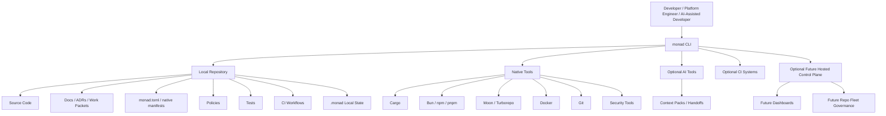
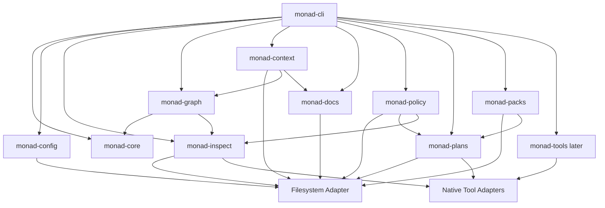
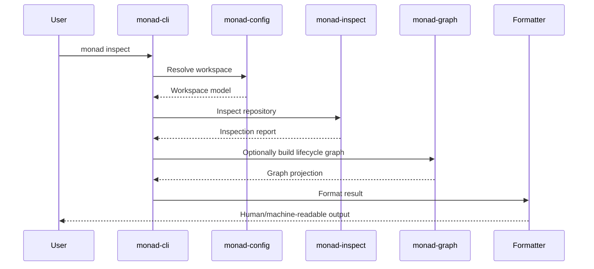
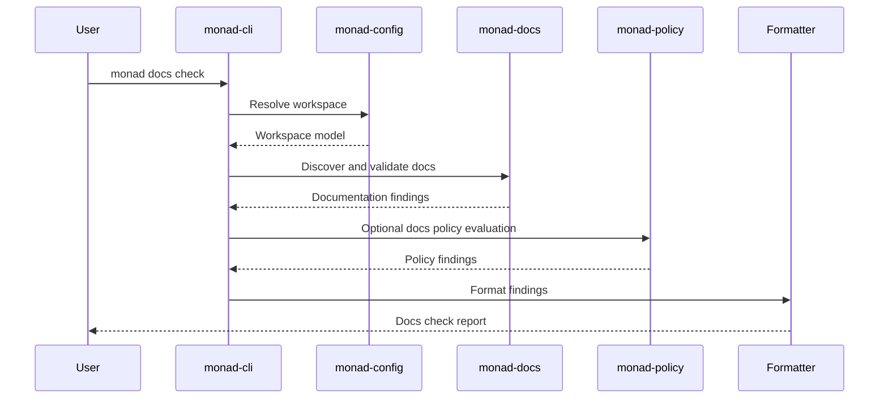
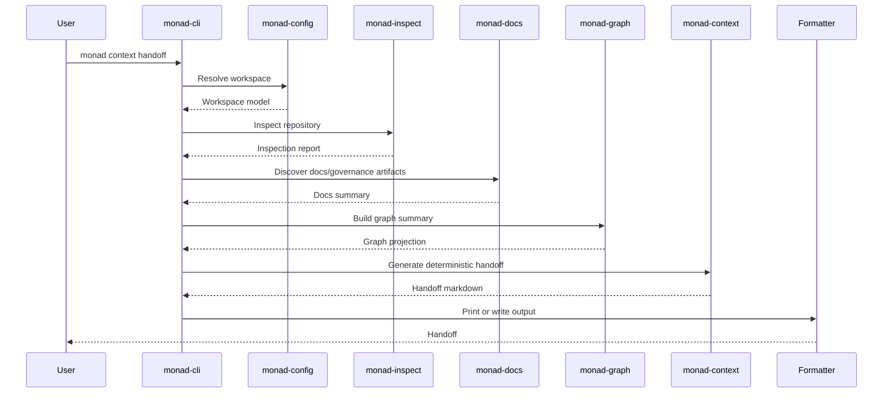
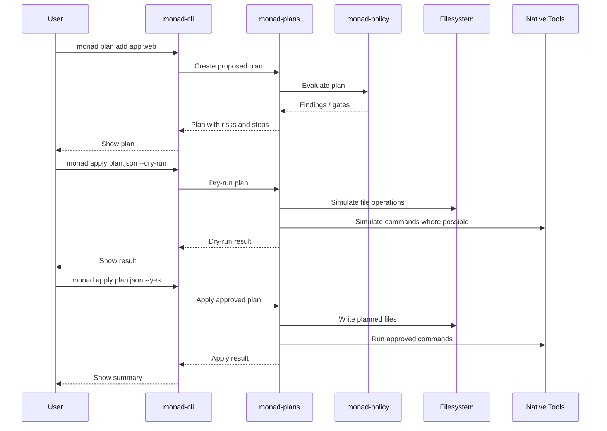

# 6. Architecture Strategy

## 6.1 Purpose of This Section

This section defines the architecture strategy for Monad OS and Monad CLI.

Its purpose is to explain:

* the architectural drivers,
* the architectural constraints,
* the options considered,
* the recommended architecture,
* the architectural styles to apply,
* the system and container boundaries,
* the runtime flows,
* the crate/module strategy,
* the dependency rules,
* the mutation safety model,
* the local-first deployment model,
* the future extension path,
* and the architecture risks that must be managed.

This section should guide implementation decisions before detailed code design begins.

The central architectural recommendation is:

> Start as a local-first modular Rust CLI with clean internal boundaries, deterministic file-backed state, schema-versioned manifests, read-only repository understanding first, and plan-backed mutation later.

---

## 6.2 Architecture Decision Summary

Monad should use:

> A local-first modular Rust CLI architecture with clean internal domain crates, deterministic file-backed state, schema-versioned manifests, read-only repository introspection first, and plan-backed mutation later.

This means:

* the first runtime is a single Rust binary named `monad`,
* the CLI works directly against a local repository,
* repository files are the initial source of truth,
* `monad.toml` is the canonical manifest,
* `workspace.toml` is a compatibility mirror only,
* `.monad/` is local state/cache/context, not canonical truth,
* read-only commands come before mutating commands,
* mutating commands eventually flow through plan/apply,
* AI is optional and never required for correctness,
* hosted services are optional and deferred,
* database-backed graph or metadata storage is optional and deferred,
* native tools are coordinated through adapters rather than replaced.

The architecture should be simple enough to build incrementally but structured enough to support the long-term product vision.

---

## 6.3 Architectural Drivers

Monad’s architecture is driven by the following product needs.

## 6.3.1 Local-First Trust

Monad must be useful without a hosted backend, SaaS account, external database, cloud account, or AI provider.

Architectural implication:

* use local files first,
* avoid required network calls,
* avoid required services,
* avoid mandatory database infrastructure,
* keep hosted sync optional.

## 6.3.2 Deterministic Repository Understanding

Monad must inspect, validate, document, graph, and summarize repositories in a repeatable way.

Architectural implication:

* keep domain logic deterministic,
* sort outputs consistently,
* version output schemas,
* use stable findings IDs,
* make context generation work without AI.

## 6.3.3 Governance-Grade Safety

Monad must be safe enough for serious repositories.

Architectural implication:

* distinguish read-only and mutating commands,
* catalog command metadata,
* prevent hidden mutation,
* require plan-backed mutation over time,
* preserve auditability for significant changes.

## 6.3.4 AI-Native but AI-Optional

Monad should support AI workflows without depending on AI.

Architectural implication:

* generate deterministic context first,
* add AI provider ports later,
* treat AI output as untrusted,
* convert AI suggestions into plans,
* require human approval for mutation.

## 6.3.5 Native Tool Coordination

Monad should coordinate tools like Cargo, Bun, Moon, Turborepo, Docker, GitHub Actions, Biome, and security scanners without replacing them by default.

Architectural implication:

* use ports/adapters,
* preserve native tool authority,
* normalize detected facts into Monad models,
* do not leak tool-specific concepts into the core domain.

## 6.3.6 Lifecycle Graph as Long-Term Moat

Monad’s durable differentiation depends on connecting code, docs, ADRs, work packets, tests, policies, plans, releases, and context.

Architectural implication:

* define graph nodes and edges early,
* start with in-memory graph,
* export JSON/Mermaid/DOT,
* defer graph database until the model is proven.

## 6.3.7 Solo Developer Practicality

The architecture must remain buildable and maintainable by one developer.

Architectural implication:

* avoid premature distributed systems,
* avoid hosted-first architecture,
* avoid excessive empty crates,
* use small testable layers,
* keep the local core simple.

---

## 6.4 Architectural Constraints

## 6.4.1 Local-First Constraint

Core commands must work locally.

No required:

* cloud account,
* SaaS backend,
* hosted database,
* AI API key,
* Kubernetes cluster,
* external service,
* telemetry endpoint.

## 6.4.2 Single-Binary Constraint

The primary runtime should be distributable as a single binary named:

```bash id="o0af9z"
monad
```

## 6.4.3 Canonical Manifest Constraint

The canonical source of truth is:

```text id="zj4lr7"
monad.toml
```

`workspace.toml` may exist as a compatibility mirror only.

## 6.4.4 Read-Only Before Mutation Constraint

Read-only repository understanding must come before real mutation.

Core read-only commands include:

```bash id="rh7qya"
monad inspect
monad check
monad doctor
monad graph
monad docs check
monad context handoff
```

## 6.4.5 Plan-Backed Mutation Constraint

Mutation should eventually use:

```bash id="lc8o4b"
monad plan ...
monad apply plan.json --dry-run
monad apply plan.json --yes
```

Direct file-writing commands should be avoided until the plan/apply engine is mature.

## 6.4.6 AI Optionality Constraint

AI support must be optional.

Core workflows must not depend on AI providers.

## 6.4.7 Database-Agnostic Constraint

Early Monad must not require a database.

Future persistence should use adapters.

## 6.4.8 Cloud-Agnostic Constraint

Hosted features, if added later, must not force a single cloud provider.

## 6.4.9 Native Tool Boundary Constraint

Monad coordinates native tools but does not replace them by default.

---

## 6.5 Quality Attribute Priorities

The architecture should prioritize these quality attributes in order.

| Priority | Quality Attribute     | Meaning for Monad                                                           |
| -------- | --------------------- | --------------------------------------------------------------------------- |
| 1        | Safety                | Avoid destructive or hidden mutation.                                       |
| 2        | Correctness           | Repository findings and source-of-truth rules must be accurate.             |
| 3        | Determinism           | Same repo state should produce stable read-only outputs.                    |
| 4        | Local-first usability | Core value must work without services.                                      |
| 5        | Testability           | Domain logic and CLI behavior must be test-backed.                          |
| 6        | Extensibility         | Future plans, packs, policies, plugins, and AI should fit without rewrites. |
| 7        | Portability           | Work across OSes and toolchains over time.                                  |
| 8        | Performance           | Common commands should feel fast.                                           |
| 9        | Auditability          | Significant findings and changes should be explainable and traceable.       |
| 10       | Operability           | Failures should produce actionable diagnostics.                             |

This priority order matters.

For example:

* safety is more important than generator convenience,
* determinism is more important than AI polish,
* local-first value is more important than hosted dashboards,
* testability is more important than rapid but fragile scripting.

---

# 6.6 Architecture Options Considered

## 6.6.1 Option 1: Simple CLI Script Architecture

### Description

A single CLI crate or script-like architecture where commands directly read and write files.

### Advantages

* fastest to build,
* simple mental model,
* low ceremony,
* minimal crate overhead,
* easy for quick prototypes.

### Disadvantages

* does not scale to the product ambition,
* hard to test cleanly,
* hard to govern,
* encourages direct mutation,
* makes plan/apply harder to retrofit,
* no clean lifecycle graph boundary,
* difficult to support packs/plugins later,
* domain logic becomes tangled with filesystem and CLI parsing,
* harder to maintain as commands grow.

### Fit for Monad

This can be acceptable for very early throwaway prototypes, but it does not fit Monad’s long-term product needs.

### Decision

Not recommended beyond prototypes.

---

## 6.6.2 Option 2: Modular Rust CLI

### Description

A Rust workspace with a CLI crate and separate internal crates/modules for core models, configuration, inspection, graph, context, documentation, policy, plans, packs, and native tool coordination.

### Advantages

* local-first,
* fast,
* portable,
* testable,
* compatible with single-binary distribution,
* supports clean internal boundaries,
* supports domain-driven design,
* supports deterministic repository tooling,
* supports plan-backed mutation,
* supports future extensions,
* avoids early hosted complexity.

### Disadvantages

* more upfront structure,
* crate boundaries require discipline,
* risk of premature abstraction,
* some functionality may initially feel spread across crates,
* requires careful dependency management.

### Fit for Monad

This is the best default because Monad needs a serious internal architecture while still preserving local-first simplicity.

### Decision

Recommended default.

---

## 6.6.3 Option 3: Modular Monolith with Local Service

### Description

A local daemon or background service manages repository state, graph indexes, caches, and integrations. The CLI communicates with that service.

### Advantages

* supports long-running cache/index operations,
* can improve large-repo performance,
* can support editor integrations,
* can support local API integrations,
* can eventually support file watching.

### Disadvantages

* more operational complexity,
* worse first-run simplicity,
* harder to debug,
* requires daemon lifecycle management,
* introduces state synchronization concerns,
* unnecessary before the CLI proves value.

### Fit for Monad

Potentially valuable later, especially if local graph indexing, editor integrations, or live repository monitoring become important.

### Decision

Defer. Consider only after the local CLI core is valuable.

---

## 6.6.4 Option 4: Hosted SaaS Control Plane First

### Description

A hosted backend stores repository metadata, lifecycle graphs, policies, dashboards, user accounts, organizations, and team workflows.

### Advantages

* clearer commercial path,
* team collaboration,
* organization-wide views,
* compliance dashboards,
* centralized policy reporting.

### Disadvantages

* violates local-first foundation,
* increases cost,
* requires auth, tenancy, infrastructure, security, billing, and operations,
* delays CLI trust-building,
* creates privacy concerns,
* narrows adoption among local/private repo users,
* risks making the product feel like another developer portal instead of a repository operating system.

### Fit for Monad

Useful later, but dangerous early.

### Decision

Not recommended early.

---

## 6.6.5 Option 5: Plugin-First Architecture

### Description

The core runtime is minimal and most features are implemented through plugins.

### Advantages

* highly extensible,
* ecosystem-friendly,
* allows external contributions,
* avoids hardcoding every workflow.

### Disadvantages

* unstable before core model is proven,
* plugin security complexity,
* version compatibility burden,
* permission/trust model required,
* risks fragmentation,
* hard to test early,
* unnecessary for initial CLI trust.

### Fit for Monad

Monad should be designed so plugins are possible later, but the product should not start plugin-first.

### Decision

Design for future plugins, but do not start plugin-first.

---

## 6.6.6 Option 6: Build-System Replacement Architecture

### Description

Monad becomes a full replacement for native build/task systems like Bazel, Nx, Turborepo, Moon, Cargo workflows, or language-specific package managers.

### Advantages

* high control,
* unified task graph,
* potentially strong caching model,
* complete governance over execution.

### Disadvantages

* enormous scope,
* difficult to compete with mature tools,
* high adoption friction,
* risks becoming a worse version of existing tools,
* contradicts native-tool coordination principle,
* distracts from lifecycle governance.

### Fit for Monad

Not recommended as the core strategy.

### Decision

Do not pursue early. Monad should coordinate native tools first.

---

## 6.6.7 Option 7: AI-Agent-First Architecture

### Description

Monad is primarily an AI agent that inspects and modifies repositories through natural language.

### Advantages

* appealing in current market,
* high perceived automation,
* can generate fast demos,
* aligns with AI-assisted development trend.

### Disadvantages

* undermines deterministic trust,
* risky mutation behavior,
* provider lock-in risk,
* poor fit for governance-grade correctness,
* hard to test,
* unsafe without strong context and plan/apply boundaries.

### Fit for Monad

AI should be a capability layer, not the foundation.

### Decision

Do not start AI-agent-first. Build deterministic context and plan safety first.

---

# 6.7 Recommended Architecture

Monad should use:

> A local-first modular Rust CLI architecture with clean internal domain crates, deterministic file-backed state, schema-versioned manifests, read-only repository introspection first, and plan-backed mutation later.

## 6.7.1 Architecture Summary

```text id="r0bbex"
User
  -> monad CLI
    -> workspace/config resolution
    -> repository inspection
    -> documentation/governance discovery
    -> policy/check/doctor findings
    -> lifecycle graph generation
    -> context/handoff generation
    -> plan creation
    -> dry-run/apply later
```

## 6.7.2 Core Architecture Commitments

1. The CLI is the first public API.
2. Domain logic should be separate from CLI parsing.
3. Filesystem IO should sit at the edges.
4. Read-only commands must remain read-only.
5. Mutation goes through plan/apply.
6. AI support is optional.
7. Native tools are accessed through adapters.
8. File-backed state comes before database-backed state.
9. Hosted sync is optional and deferred.
10. Crates should map to meaningful bounded contexts, not arbitrary folders.

---

# 6.8 Core Architectural Style

Monad should combine several architecture styles.

## 6.8.1 Clean Architecture

Use Clean Architecture to separate:

* domain types,
* application services,
* adapters,
* CLI interface,
* filesystem/process IO.

Rule:

> Domain logic should not depend on Clap, shell commands, specific filesystem implementations, or AI providers.

## 6.8.2 Hexagonal Architecture / Ports and Adapters

Use ports/adapters for:

* filesystem access,
* process execution,
* native tool detection,
* manifest parsing,
* policy loading,
* context output,
* future AI providers,
* future hosted sync,
* future storage backends.

Rule:

> External systems should adapt to Monad’s domain model, not the reverse.

## 6.8.3 Domain-Driven Design

Use DDD for:

* Workspace,
* Manifest,
* CommandDefinition,
* InspectionReport,
* LifecycleGraph,
* Policy,
* Plan,
* WorkPacket,
* ADR,
* ContextPack,
* Pack,
* Template,
* NativeTool.

Rule:

> Model concepts with real invariants as domain objects; avoid over-modeling simple file scans.

## 6.8.4 Command/Query Separation

Separate read-only queries from mutating commands.

Queries:

```text id="cq0zn0"
inspect
check
doctor
graph
docs check
context handoff
list
config inspect
```

Commands:

```text id="mrtunp"
plan
apply
generate
add
remove
rename
move
sync
migrate
upgrade
```

Rule:

> Query commands must not mutate files.

## 6.8.5 Plan/Apply Architecture

Use plan/apply for mutation.

Rule:

> A mutating operation must be inspectable before it is executable.

## 6.8.6 Documentation-as-Code

Documentation is a versioned repository artifact.

Rule:

> Docs should eventually be checkable by Monad.

## 6.8.7 Policy-as-Code

Policies are explicit, versioned, and testable.

Rule:

> Policy findings should be explainable and eventually waiverable.

---

# 6.9 High-Level System Context



## 6.9.1 System Context Interpretation

* The local repository is the first source of truth.
* The CLI is the first interaction layer.
* Native tools are coordinated, not replaced.
* AI tools consume context but are optional.
* CI systems can run Monad later.
* Hosted control plane features are future optional extensions.
* `.monad/` stores local state, cache, context, inspections, plans, or generated artifacts.

---

# 6.10 Container-Level View



## 6.10.1 Container Responsibilities

| Container       | Responsibility                                                            |
| --------------- | ------------------------------------------------------------------------- |
| `monad-cli`     | CLI parsing, command dispatch, output formatting, exit codes.             |
| `monad-core`    | Shared domain types, findings, errors, identifiers, formatting contracts. |
| `monad-config`  | Workspace root, manifest loading, source-of-truth resolution.             |
| `monad-inspect` | Read-only repository scanning and artifact detection.                     |
| `monad-graph`   | Lifecycle graph model, construction, validation, export.                  |
| `monad-context` | Context packs, handoffs, redaction, deterministic summaries.              |
| `monad-docs`    | Documentation discovery, checks, generation preview.                      |
| `monad-policy`  | Policy rules, findings, explanations, waivers.                            |
| `monad-plans`   | Plan model, dry-run, apply, rollback hints.                               |
| `monad-packs`   | Pack/template/profile metadata and plan generation.                       |
| `monad-tools`   | Future native tool coordination adapters.                                 |

## 6.10.2 Container Boundary Rule

A container/crate should exist only when it owns meaningful behavior and tests.

Do not create empty crates merely to satisfy an architecture diagram.

---

# 6.11 Component-Level View

## 6.11.1 `monad-cli`

Responsibilities:

* argument parsing,
* command dispatch,
* help output,
* command routing,
* output formatting,
* exit code mapping,
* placeholder rendering,
* workspace requirement checks.

Should not own:

* domain invariants,
* filesystem mutation logic,
* manifest semantics,
* graph semantics,
* policy rules.

## 6.11.2 `monad-core`

Responsibilities:

* shared domain types,
* workspace identifiers,
* command metadata model,
* finding/severity model,
* result/error model,
* output format enums,
* path normalization helpers where appropriate,
* schema version types.

Should not own:

* CLI parsing,
* concrete filesystem IO,
* process execution,
* native tool calls.

## 6.11.3 `monad-config`

Responsibilities:

* manifest loading,
* source-of-truth resolution,
* schema versioning,
* compatibility mirror awareness,
* workspace root detection.

Key rules:

* `monad.toml` is canonical,
* `workspace.toml` is mirror-only,
* `.monad/` is local state.

## 6.11.4 `monad-inspect`

Responsibilities:

* repository scanning,
* project detection,
* native manifest detection,
* workspace invariant discovery,
* artifact classification,
* inspection report creation.

Key rules:

* inspection is read-only,
* unknown artifacts produce findings or classifications,
* malformed files do not crash the system.

## 6.11.5 `monad-graph`

Responsibilities:

* lifecycle graph model,
* graph construction,
* graph validation,
* graph projections,
* Mermaid/DOT/JSON export.

Key rules:

* graph edges must reference valid nodes,
* graph output should be deterministic,
* graph nodes should preserve source references where possible.

## 6.11.6 `monad-context`

Responsibilities:

* context packs,
* handoff summaries,
* AI-safe deterministic output,
* current-state summaries,
* redaction rules,
* context verification.

Key rules:

* context works without AI,
* secrets are excluded by default,
* generated context is not canonical truth.

## 6.11.7 `monad-docs`

Responsibilities:

* docs discovery,
* docs check,
* docs generation preview,
* docs lifecycle validation,
* documentation findings.

Key rules:

* docs check is read-only,
* docs generation is dry-run, preview, or plan-backed.

## 6.11.8 `monad-policy`

Responsibilities:

* policy definitions,
* policy evaluation,
* policy explanation,
* waiver model,
* policy findings.

Key rules:

* policy check is read-only,
* policy findings are explainable,
* waivers are explicit and auditable.

## 6.11.9 `monad-plans`

Responsibilities:

* plan model,
* plan creation,
* plan validation,
* dry-run,
* apply,
* rollback hints,
* apply reports.

Key rules:

* plans list all intended operations,
* dry-run does not mutate files,
* apply does not exceed plan scope.

## 6.11.10 `monad-packs`

Responsibilities:

* pack metadata,
* templates,
* profiles,
* future plugin hooks,
* pack install previews,
* generation plan creation.

Key rules:

* packs are versioned,
* templates declare outputs,
* pack application goes through plans.

---

# 6.12 Dependency Rules

## 6.12.1 Directional Dependency Rule

Dependencies should generally flow inward toward core domain types.

Recommended dependency pattern:

```text id="jyelt9"
monad-cli
  -> monad-core
  -> monad-config
  -> monad-inspect
  -> monad-docs
  -> monad-context
  -> monad-graph
  -> monad-policy
  -> monad-plans
  -> monad-packs
```

However, to avoid cycles:

* `monad-core` should not depend on other Monad crates.
* domain crates should depend on `monad-core`.
* `monad-cli` can depend on all command implementation crates.
* cross-context communication should use shared core types or explicit interfaces.
* avoid circular dependencies between graph, policy, context, and plans.

## 6.12.2 Suggested Layering

```text id="j5nx90"
Interface Layer
  monad-cli

Application Layer
  command handlers
  orchestration services

Domain Layer
  monad-core
  context-specific domain models

Adapter Layer
  filesystem
  process execution
  native tools
  future AI providers
  future hosted sync
```

## 6.12.3 Forbidden Dependency Patterns

Avoid:

* domain crates depending on Clap,
* domain crates directly spawning shell commands,
* domain models depending on AI provider SDKs,
* graph core depending on hosted storage,
* policy core depending on one external policy engine too early,
* plan apply bypassing policy/safety checks,
* template generation writing files directly outside plan/apply,
* native tool-specific assumptions leaking into core project models.

---

# 6.13 Runtime Views

## 6.13.1 Typical Read-Only Command Flow



### Read-Only Flow Rules

* no file writes,
* no file deletes,
* no external command execution unless explicitly documented,
* no AI calls,
* no network calls,
* deterministic output where practical,
* findings instead of crashes where possible.

---

## 6.13.2 Docs Check Flow



---

## 6.13.3 Context Handoff Flow



### Context Flow Rules

* works without AI,
* excludes secrets by default,
* reports redactions without printing secret contents,
* uses deterministic sections,
* should include source references where practical.

---

## 6.13.4 Future Mutation Flow



### Mutation Flow Rules

* plan before apply,
* dry-run before trusted apply,
* apply only planned operations,
* policy evaluation before apply when available,
* explicit approval for risky operations,
* apply result recorded where practical.

---

# 6.14 Data and State Architecture Summary

## 6.14.1 Initial State Model

Initial state should be file-backed:

```text id="l4y30u"
monad.toml      canonical manifest
workspace.toml  compatibility mirror only
monad.lock      resolved state later
.monad/         local cache/context/plans/tmp
docs/           documentation source
governance/     governance artifacts
policies/       policy definitions later
```

## 6.14.2 In-Memory First

Use in-memory models for:

* workspace,
* inspection report,
* lifecycle graph,
* policy findings,
* docs findings,
* context handoff,
* plan draft.

Persist only when needed.

## 6.14.3 Deferred Persistence

Defer:

* SQLite,
* graph database,
* hosted metadata store,
* object storage,
* vector database.

Add storage only after clear performance, query, or collaboration needs emerge.

---

# 6.15 Deployment View

## 6.15.1 Early Deployment

Early deployment is simple:

```text id="x6ku0y"
Developer machine
  └─ monad binary
      └─ local repository
```

This is the only required deployment model for the early product.

## 6.15.2 Future Local Deployment

Future optional local deployment:

```text id="be81gt"
Developer machine
  └─ monad binary
      ├─ local repository
      ├─ optional .monad cache
      ├─ optional local graph index
      ├─ optional editor integrations
      └─ optional local daemon
```

## 6.15.3 Future Hosted Deployment

Future optional hosted deployment:

```text id="3rx2dd"
Developer machine
  └─ monad CLI
      └─ optional sync
          └─ hosted Monad control plane
              ├─ organization/team model
              ├─ graph dashboard
              ├─ policy reporting
              ├─ release governance
              └─ compliance evidence
```

Hosted deployment must not replace local canonical truth.

---

# 6.16 Evolution Architecture

Monad should evolve through architectural maturity stages.

## Stage 1: CLI Skeleton

Focus:

* Rust workspace,
* command catalog,
* CLI contracts,
* placeholder honesty.

Architecture:

```text id="ojp9k8"
monad-cli + monad-core
```

## Stage 2: Read-Only Repository Understanding

Focus:

* config,
* inspect,
* check,
* doctor,
* docs check,
* graph v0,
* context handoff.

Architecture:

```text id="mw4laf"
monad-config
monad-inspect
monad-docs
monad-context
monad-graph
```

## Stage 3: Plan-Backed Mutation

Focus:

* plan schema,
* dry-run,
* apply,
* rollback hints,
* policy gates.

Architecture:

```text id="z24h3s"
monad-plans
monad-policy
```

## Stage 4: Generators, Templates, and Packs

Focus:

* template metadata,
* pack metadata,
* generation plans,
* safe file creation.

Architecture:

```text id="29m4yj"
monad-packs
monad-plans
monad-docs
```

## Stage 5: Policy and Release Governance

Focus:

* policy bundles,
* waivers,
* release readiness,
* evidence.

Architecture:

```text id="xol4nv"
monad-policy
monad-release
```

## Stage 6: AI-Assisted Workflows

Focus:

* AI provider port,
* deterministic context to AI,
* AI-generated plan drafts,
* human approval.

Architecture:

```text id="zw75kj"
monad-ai
monad-context
monad-plans
monad-policy
```

## Stage 7: Optional Hosted Control Plane

Focus:

* dashboards,
* repo fleet visibility,
* policy reporting,
* release governance,
* compliance evidence.

Architecture:

```text id="pp81b6"
local CLI remains authoritative for local repo
hosted service consumes synced projections
```

---

# 6.17 Architecture Decision Records Required

The architecture strategy implies at least these ADRs:

1. Rust single-binary runtime.
2. Coordinate native tools instead of replacing them.
3. Local-first core.
4. AI-native but AI-optional.
5. `monad.toml` canonical manifest.
6. Plan-backed mutation.
7. Modular Rust workspace.
8. Lifecycle graph as core model.
9. Documentation-as-code.
10. Policy-as-code.
11. Deterministic context before AI assistance.
12. Honest placeholder commands.
13. File-backed local state before database persistence.
14. Future plugins require trust model.
15. Hosted control plane is optional and deferred.

Each ADR should include:

* status,
* context,
* decision,
* consequences,
* alternatives considered,
* follow-up actions.

---

# 6.18 Architecture Risks

| Risk                          | Description                                       | Mitigation                                   |
| ----------------------------- | ------------------------------------------------- | -------------------------------------------- |
| Premature abstraction         | Too many crates before behavior exists.           | Add crates when domain logic justifies them. |
| Under-architecture            | Everything becomes tangled in `monad-cli`.        | Keep domain logic separate from CLI parsing. |
| Unsafe mutation               | Commands write files without plan/apply.          | Enforce plan-backed mutation.                |
| Native tool replacement drift | Monad starts replacing mature tools.              | Use adapter/coordination model.              |
| AI foundation risk            | AI becomes required for core workflows.           | Keep deterministic first and AI optional.    |
| Hosted distraction            | SaaS layer delays local trust.                    | Defer hosted control plane.                  |
| Graph over-complexity         | Lifecycle graph becomes too ambitious early.      | Start with simple in-memory graph.           |
| Database lock-in              | Graph/persistence requires one backend too early. | Keep file-backed/in-memory first.            |
| Plugin security               | Plugins introduce unsafe execution.               | Defer plugins and require trust model.       |
| Command catalog drift         | CLI surface and catalog disagree.                 | Contract tests.                              |
| Source-of-truth ambiguity     | Multiple manifests compete.                       | `monad.toml` canonical policy.               |
| Poor testability              | IO and domain logic are tangled.                  | Ports/adapters and pure domain services.     |

---

# 6.19 Architecture Fitness Functions

Architecture fitness functions are tests or checks that prove the architecture is preserving its intended qualities.

Initial fitness functions:

## AFF-001: Command Catalog Contract

```text id="lj2cgs"
Every catalog command intended for CLI exposure exists in the CLI surface.
```

## AFF-002: Placeholder Honesty

```text id="cyvk8y"
Planned commands expose implemented=false and do not pretend to be complete.
```

## AFF-003: Read-Only Safety

```text id="sihyoe"
Read-only commands do not create, modify, or delete files.
```

## AFF-004: Canonical Manifest Rule

```text id="191zse"
monad.toml wins over workspace.toml.
```

## AFF-005: No AI Dependency

```text id="1rtebe"
Core commands work without AI configuration.
```

## AFF-006: No Network by Default

```text id="tgsu9j"
Core commands do not make external network calls.
```

## AFF-007: Graph Consistency

```text id="dsu6f9"
Graph edges reference existing nodes.
```

## AFF-008: Plan Completeness

```text id="f81mgl"
A plan lists all intended file and command operations.
```

## AFF-009: Dry-Run Safety

```text id="7m5dln"
Dry-run apply does not write files.
```

## AFF-010: Domain/CLI Separation

```text id="vx6zvb"
Core domain crates do not depend on Clap.
```

---

# 6.20 Architecture Implementation Guidance

## 6.20.1 Build from the CLI Contract Inward

Start with:

* command catalog,
* Clap surface,
* command metadata,
* placeholder honesty,
* output and exit codes.

Then move into workspace, inspection, docs, context, graph, policy, and plans.

## 6.20.2 Avoid Early Hosted Complexity

Do not create hosted APIs, databases, auth, tenancy, billing, or dashboards until the local CLI proves value.

## 6.20.3 Keep Crates Honest

A crate should have:

* domain responsibility,
* implementation code,
* tests,
* clear dependency direction.

Avoid empty “future architecture” crates.

## 6.20.4 Use Findings as a Common Diagnostic Primitive

Many contexts should produce findings:

* config,
* inspect,
* check,
* doctor,
* docs,
* policy,
* graph,
* plan validation,
* context verification.

A shared `Finding` model should likely live in `monad-core`.

## 6.20.5 Use Plans as the Only Trusted Mutation Boundary

Generators, templates, packs, migrations, sync operations, and AI-suggested changes should all become plans before writing files.

## 6.20.6 Use Context Packs as the AI Boundary

Do not connect AI directly to raw repository mutation.

The safe AI path is:

```text id="fphbb2"
repository -> inspection/check/graph/docs -> context pack -> AI suggestion -> plan -> dry-run -> approve -> apply
```

## 6.20.7 Use Native Tool Adapters Gradually

Begin with detection and reporting.

Only later add delegation.

Do not wrap every native tool immediately.

---

# 6.21 Architecture Decision

## Decision

Use a modular Rust CLI with file-backed local state and future optional hosted sync.

## Decision Rationale

This architecture:

* preserves local-first value,
* minimizes operational burden,
* supports single-binary distribution,
* supports deterministic outputs,
* enables serious internal architecture,
* avoids premature SaaS complexity,
* avoids premature database dependency,
* aligns with governance-grade repo tooling,
* supports plan-backed mutation,
* supports AI-optional context generation,
* supports native-tool coordination,
* and enables future extension without requiring it early.

## Rejected Early Directions

Rejected as early defaults:

* simple script architecture,
* hosted SaaS-first architecture,
* plugin-first architecture,
* AI-agent-first architecture,
* build-system replacement architecture,
* database-backed architecture,
* local daemon architecture.

Some may become useful later, but none should be the starting point.

---

# 6.22 Section Acceptance Criteria

This section is complete when it clearly defines:

1. The architectural drivers.
2. The architectural constraints.
3. The quality attribute priorities.
4. The options considered.
5. The recommended architecture.
6. The architectural styles to apply.
7. The system context.
8. The container boundaries.
9. The component responsibilities.
10. The dependency rules.
11. The read-only runtime flow.
12. The context handoff flow.
13. The future mutation flow.
14. The data/state posture.
15. The deployment posture.
16. The architecture evolution stages.
17. Required ADRs.
18. Architecture risks.
19. Architecture fitness functions.
20. Implementation guidance.

Future architecture or implementation decisions should be checked against this section. If a later decision contradicts this strategy, it should be documented explicitly in an ADR.
