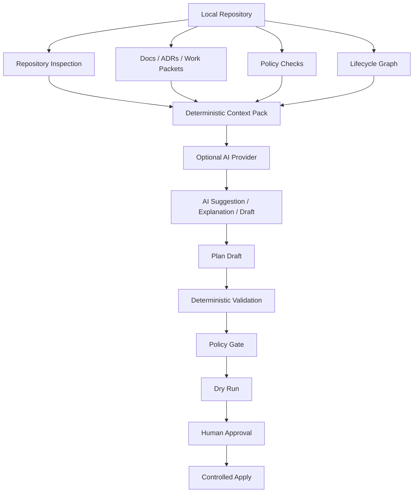

# 7. AI Architecture

## 7.1 Purpose of This Section

This section defines the AI architecture for Monad OS and Monad CLI.

It explains:

* how AI fits into Monad,
* what “AI-native but AI-optional” means,
* which workflows may benefit from AI,
* which workflows must remain deterministic,
* how AI providers should be abstracted,
* how context packs should be generated and governed,
* how AI suggestions should flow into plans,
* how human approval gates should work,
* how AI-related risks should be controlled,
* what observability and audit metadata should be captured,
* what should be tested,
* and what AI features should be deferred.

The central AI architecture decision is:

> Monad may use AI to assist, explain, summarize, draft, or suggest, but Monad’s correctness must come from deterministic repository models, policies, checks, plans, and human approval.

AI is a capability layer. It is not the foundation.

---

## 7.2 AI Positioning

Monad is **AI-native but AI-optional**.

This means:

* Monad should produce artifacts that are useful to AI tools.
* Monad should help AI assistants understand repository context.
* Monad should support AI-assisted planning eventually.
* Monad should support AI-assisted explanation eventually.
* Monad should support AI-assisted drafting eventually.
* Monad should not require AI for correctness.
* Monad should not require a specific AI provider.
* Monad should not require network access for core workflows.
* Monad should not let AI directly mutate repositories without human approval.
* Monad should not treat AI output as source of truth.

The product should be designed for a world where AI-assisted development is common, but it should remain valuable even when AI is unavailable, disabled, unwanted, unaffordable, untrusted, or disallowed by policy.

The correct posture is:

```text id="lm9223"
Deterministic core
  -> governed context
    -> optional AI assistance
      -> validated plan
        -> human approval
          -> controlled apply
```

The incorrect posture is:

```text id="lyyufa"
AI prompt
  -> direct repository mutation
```

---

## 7.3 Why AI Matters for Monad

AI matters because modern developers increasingly use tools such as chat assistants, IDE copilots, local LLMs, coding agents, and repository-aware assistants.

These tools are powerful, but they often lack governed context.

Without Monad-like context, an AI assistant may not know:

* which manifest is canonical,
* which commands are implemented,
* which commands are placeholders,
* which directories contain apps or services,
* which docs are authoritative,
* which ADRs shaped the system,
* which work packet is active,
* which files are generated,
* which policies apply,
* which changes are risky,
* which tests are expected,
* which native tools are authoritative,
* or which assumptions are unsafe.

Monad should make AI safer by producing deterministic context and requiring AI-generated changes to pass through the same planning, policy, and approval boundaries as human-authored changes.

The purpose of AI in Monad is not to replace governance.

The purpose is to make governed software delivery easier.

---

## 7.4 AI Architecture Thesis

Monad’s AI thesis is:

> AI assistants should consume governed repository context, not invent repository context.

This leads to several architecture rules:

1. The repository model must be deterministic before AI is introduced.
2. Context packs must be generated without AI.
3. AI suggestions must be treated as untrusted.
4. AI-generated changes must become plans before apply.
5. Plans must be validated by deterministic checks.
6. Policy checks must run before risky apply.
7. Human approval is required for mutation.
8. AI involvement must be auditable in governance workflows.
9. AI provider integration must be replaceable.
10. AI absence must be a supported state.

---

## 7.5 AI Capability Map

Potential AI-enhanced capabilities:

| Capability           | AI Useful? | AI Required? | Deterministic Alternative                | Recommended Phase |
| -------------------- | ---------: | -----------: | ---------------------------------------- | ----------------- |
| Context handoff      |        Yes |           No | Template-based deterministic summary     | Early             |
| Repo explanation     |        Yes |           No | Graph and inspection reports             | Early/Mid         |
| ADR drafting         |        Yes |           No | Static ADR templates                     | Mid               |
| Work packet drafting |        Yes |           No | Static work packet templates             | Mid               |
| Plan explanation     |        Yes |           No | Structured plan output                   | Mid               |
| Policy explanation   |        Yes |           No | Rule metadata and docs                   | Mid               |
| Code generation      |        Yes |           No | Templates and packs                      | Later             |
| Risk analysis        |        Yes |           No | Static risk rules and policy checks      | Mid               |
| Dependency insight   |        Yes |           No | Native graph analysis                    | Later             |
| Release notes        |        Yes |           No | Commit/work-packet aggregation           | Later             |
| Test suggestion      |        Yes |           No | Test strategy templates                  | Later             |
| Refactor planning    |        Yes |           No | Static plan templates and graph analysis | Later             |
| Migration planning   |        Yes |           No | Migration templates and policy checks    | Later             |
| Incident summary     |        Yes |           No | Runbook and event aggregation            | Later             |
| Compliance narrative |        Yes |           No | Evidence reports and policy results      | Later             |
| Architecture review  |        Yes |           No | ADRs, graph, policies, docs checks       | Later             |

The most important column is **AI Required?**

For core Monad workflows, the answer should remain **No**.

---

## 7.6 AI Architecture Principles

## Principle 1: AI Must Consume Monad Context, Not Replace Monad Logic

AI should be given Monad-generated context packs, inspection reports, graph summaries, policy findings, docs summaries, and plan outputs.

AI should not be the component that determines canonical repository truth.

## Principle 2: AI Suggestions Are Untrusted Until Validated

AI output should be treated as proposed content, not accepted fact.

Examples:

```text id="lqh7mt"
AI summary -> reviewable summary
AI ADR draft -> draft ADR
AI plan suggestion -> proposed plan
AI code suggestion -> planned file operation
```

## Principle 3: AI-Generated Mutation Must Become a Plan Before Apply

Any AI-assisted file change must enter the plan/apply pipeline.

Required flow:

```text id="c69fcy"
AI suggestion
  -> plan draft
    -> deterministic validation
      -> policy evaluation
        -> dry-run
          -> human approval
            -> apply
```

## Principle 4: AI Outputs Must Be Auditable When Used in Governance Workflows

If AI helps generate an ADR, work packet, policy explanation, release note, risk summary, or plan, the resulting artifact should eventually record AI involvement where appropriate.

## Principle 5: AI Must Not Be Needed for Core Commands

These commands must work without AI:

```bash id="d3vghb"
monad version
monad list
monad config
monad inspect
monad check
monad doctor
monad graph
monad docs check
monad policy check
monad context handoff
monad plan
monad apply --dry-run
```

## Principle 6: AI Provider Abstraction Must Prevent Lock-In

Monad should not become dependent on one provider, model, API format, or hosted service.

Providers should be adapters.

## Principle 7: Prompt and Context Artifacts Should Be Versioned

Prompt templates, context pack schemas, and AI workflow definitions should have versions.

AI behavior changes should be traceable.

## Principle 8: Human Approval Gates Are Mandatory for Risky Actions

AI must not bypass human approval for:

* file creation,
* file modification,
* file deletion,
* command execution,
* dependency changes,
* policy waivers,
* release operations,
* migration operations,
* security-sensitive operations.

## Principle 9: AI Must Respect Source-of-Truth Rules

AI should never override:

* `monad.toml` as canonical,
* command catalog metadata,
* policy findings,
* plan/apply rules,
* user approval requirements,
* explicit repository governance docs.

## Principle 10: Deterministic Fallbacks Must Exist

Every AI-assisted workflow should have a non-AI fallback.

---

## 7.7 AI System Boundary

AI sits outside the deterministic core.

Recommended boundary:

```text id="l7dnlx"
Monad deterministic core
  - workspace resolution
  - manifest rules
  - inspection
  - docs checks
  - policy checks
  - lifecycle graph
  - context pack generation
  - plan schema
  - dry-run/apply

AI capability layer
  - summarize
  - explain
  - draft
  - classify
  - suggest
  - compare alternatives
  - generate proposed plan drafts
```

AI may improve user experience, but the deterministic core remains the authority.

---

## 7.8 High-Level AI Flow



Interpretation:

* AI receives context; it does not discover truth on its own.
* AI produces suggestions; it does not directly mutate.
* Plans are validated deterministically.
* Humans approve risky actions.
* Apply is controlled.

---

## 7.9 AI Provider Abstraction

Future provider abstraction:

```text id="mky5b5"
AiProviderPort
  - complete(prompt, context)
  - summarize(context)
  - classify(input)
  - generate_plan(input)
  - explain_finding(finding)
  - draft_adr(input)
  - draft_workpacket(input)
  - explain_policy(input)
```

Potential adapters:

```text id="vy3got"
OpenAIAdapter
AnthropicAdapter
LocalModelAdapter
OllamaAdapter
LMStudioAdapter
NoopAiAdapter
MockAiAdapter
```

The most important adapter is:

```text id="m3c77u"
NoopAiAdapter
```

Because Monad must work without AI.

A `NoopAiAdapter` proves that AI absence is a first-class state.

A `MockAiAdapter` is useful for tests.

---

## 7.10 AI Provider Design Rules

## Rule 1: Providers Are Optional

The product must work with no provider configured.

## Rule 2: Providers Must Be Explicit

Monad should never silently call an AI provider.

## Rule 3: Providers Must Be Replaceable

Provider-specific request/response formats should not leak into the core domain.

## Rule 4: Providers Must Be Policy-Aware

Some repositories or profiles may forbid hosted AI calls.

## Rule 5: Providers Must Support Dry-Run-Like Preview

AI-generated artifacts should be previewed before becoming files, plans, or governance records.

## Rule 6: Providers Must Be Auditable

When AI is used in governance-sensitive workflows, record relevant metadata.

## Rule 7: Providers Must Not Receive Secrets

Context sent to providers must pass redaction and allow/deny rules.

## Rule 8: Providers Must Not Be Trusted With Mutation

Providers suggest; Monad plans and applies.

---

## 7.11 AI Configuration Model

A future AI configuration might live in `monad.toml`, but should be disabled by default.

Conceptual example:

```toml id="jf02et"
[ai]
enabled = false
default_provider = "noop"
allow_hosted_providers = false
allow_local_providers = true
require_human_approval = true
record_ai_metadata = true

[ai.context]
include_graph = true
include_docs_summary = true
include_policy_findings = true
include_file_map = true
exclude_secrets = true

[ai.providers.noop]
kind = "noop"

[ai.providers.local]
kind = "ollama"
endpoint = "http://localhost:11434"
model = "example-local-model"
```

Important rules:

* AI defaults to disabled.
* `noop` is always valid.
* Hosted providers require explicit opt-in.
* Context redaction is always on by default.
* Human approval is always required for mutation.

This configuration is illustrative, not a final schema.

---

## 7.12 Context Pack Strategy

Context packs should be deterministic bundles of repository knowledge.

They are the main bridge between Monad and AI tools.

Example structure:

```text id="j4sfrf"
.monad/context/
  current-state.md
  repo-summary.json
  command-catalog.json
  architecture-summary.md
  active-workpacket.md
  policy-summary.md
  docs-status.json
  graph.mmd
  redaction-report.json
  context-manifest.json
```

A context pack should include:

* workspace identity,
* canonical manifest summary,
* command surface,
* current layer/work packet,
* major architecture decisions,
* file map,
* project map,
* policy constraints,
* docs status,
* test status,
* known risks,
* lifecycle graph summary,
* next recommended actions,
* redaction report,
* context generation metadata.

Context packs should be useful to:

* human developers,
* new chat sessions,
* AI coding tools,
* code reviewers,
* maintainers,
* release reviewers,
* future hosted control planes.

---

## 7.13 Context Pack Requirements

## CPR-001: Deterministic Generation

Given the same repository state and Monad version, the context pack should be stable where practical.

## CPR-002: No AI Required

Context pack generation must not require an AI provider.

## CPR-003: Secret Exclusion

Context packs must exclude secrets by default.

Examples:

```text id="xkqow0"
.env
.env.*
*.pem
*.key
*.p12
*.pfx
id_rsa
id_ed25519
secrets.*
credentials.*
```

## CPR-004: Source References

Context sections should identify source artifacts where practical.

## CPR-005: Redaction Report

Context packs should include a report of excluded sensitive files without printing sensitive contents.

## CPR-006: Schema Version

Context packs should include a context schema version.

## CPR-007: Purpose Declaration

Context packs should declare their intended purpose, such as:

* handoff,
* AI planning,
* release review,
* architecture review,
* policy review,
* onboarding.

## CPR-008: Size Control

Context packs should support profiles or scopes so they do not become too large.

Potential scopes:

```text id="xs1jsn"
summary
current-work
architecture
policy
docs
full
```

## CPR-009: Canonical Truth Boundary

Context packs summarize truth. They are not canonical truth.

---

## 7.14 Context Pack Manifest

A context pack should eventually include a manifest.

Conceptual example:

```json id="lsr9i0"
{
  "schema_version": "0.1.0",
  "context_pack_id": "ctx-000001",
  "purpose": "handoff",
  "generated_by": "monad",
  "monad_version": "0.1.0",
  "workspace": {
    "name": "monad-cli",
    "root": "."
  },
  "sources": [
    "monad.toml",
    "docs/architecture/overview.md",
    "docs/roadmap/work-packets/index.md"
  ],
  "outputs": [
    "current-state.md",
    "repo-summary.json",
    "graph.mmd",
    "redaction-report.json"
  ],
  "redaction": {
    "enabled": true,
    "redacted_count": 3
  },
  "ai": {
    "generated_with_ai": false,
    "provider": "none"
  }
}
```

This is illustrative, not a final schema.

---

## 7.15 Handoff Strategy

A handoff is a human-readable current-state summary.

A handoff should answer:

* What repository is this?
* What product is being built?
* What is the current implementation layer?
* What commands exist?
* What tests are currently expected?
* What docs are important?
* What decisions matter?
* What work packet is active?
* What is known to be broken?
* What should happen next?
* What should not be done yet?

A handoff is especially useful when:

* moving to a new AI chat session,
* handing work to another developer,
* pausing and resuming work,
* preparing a review,
* creating release notes,
* documenting current project state.

The first implementation should prioritize deterministic Markdown output.

---

## 7.16 AI-Assisted Workflows

## 7.16.1 AI-Assisted Repository Explanation

Input:

* inspection report,
* graph summary,
* docs summary,
* command catalog.

AI role:

* explain the repository in plain language.

Deterministic fallback:

* static summary generated from inspection and graph reports.

Risk:

* AI may overstate or infer unsupported facts.

Control:

* include source references,
* label AI-generated explanation as non-authoritative.

---

## 7.16.2 AI-Assisted ADR Drafting

Input:

* proposed decision,
* current architecture docs,
* related ADRs,
* work packet,
* trade-offs.

AI role:

* draft ADR text.

Deterministic fallback:

* ADR template.

Risk:

* AI may invent alternatives or consequences.

Control:

* ADR remains draft,
* human review required,
* accepted ADR requires explicit action.

---

## 7.16.3 AI-Assisted Work Packet Drafting

Input:

* product goal,
* roadmap section,
* relevant docs,
* current repo state.

AI role:

* draft work packet purpose, scope, layers, acceptance criteria.

Deterministic fallback:

* work-packet template.

Risk:

* over-scoping.

Control:

* generated work packet is draft/plan-backed.

---

## 7.16.4 AI-Assisted Policy Explanation

Input:

* policy metadata,
* policy finding,
* affected path,
* remediation docs.

AI role:

* explain the policy finding in user-friendly language.

Deterministic fallback:

* static policy explanation.

Risk:

* AI weakens or misstates policy.

Control:

* static rule remains authoritative.

---

## 7.16.5 AI-Assisted Plan Explanation

Input:

* structured plan,
* policy findings,
* risk metadata.

AI role:

* explain what the plan will do and what risks exist.

Deterministic fallback:

* structured plan output.

Risk:

* AI minimizes risk.

Control:

* deterministic plan and policy findings remain authoritative.

---

## 7.16.6 AI-Assisted Plan Drafting

Input:

* user intent,
* repository context pack,
* templates,
* policies,
* graph.

AI role:

* suggest a plan draft.

Deterministic fallback:

* template/rule-based plan factory.

Risk:

* AI suggests unsafe or incomplete operations.

Control:

* plan validation,
* plan completeness policy,
* dry-run,
* human approval.

---

## 7.16.7 AI-Assisted Code Generation

Input:

* plan,
* templates,
* coding standards,
* project context.

AI role:

* propose code content.

Deterministic fallback:

* static templates and packs.

Risk:

* code may be wrong, insecure, untested, or inconsistent.

Control:

* generated code becomes planned file changes,
* tests required,
* policy checks required,
* human approval required.

---

## 7.17 AI Safety Controls

Required controls:

* AI is off by default.
* AI provider must be explicit.
* Hosted AI providers require explicit opt-in.
* AI context must exclude secrets.
* AI-generated changes must become plans.
* Plans must be reviewable.
* Applying AI-suggested plans requires explicit approval.
* Policy checks must run before apply where available.
* Audit records should include AI involvement where relevant.
* AI outputs must not become canonical source of truth automatically.
* AI workflows must have deterministic fallbacks.
* AI should not run external commands.
* AI should not receive unrestricted repository contents by default.
* AI should not create waivers without human approval.
* AI should not publish releases.
* AI should not modify dependency manifests without plan/review.

---

## 7.18 AI Security and Privacy Requirements

## AIS-001: No AI Calls by Default

Monad must not call an AI provider unless explicitly configured.

## AIS-002: No Secrets to AI

Context sent to AI must exclude likely secret files and sensitive paths.

## AIS-003: Local Provider Support

The architecture should support local model adapters later, such as local inference runtimes, without making them required.

## AIS-004: Hosted Provider Control

Hosted providers should require explicit opt-in and clear configuration.

## AIS-005: Prompt Injection Awareness

Monad should treat repository text as untrusted input when building prompts.

Risky repository content could attempt to instruct the model to ignore rules.

Control:

* prompt templates should separate instructions from repository content,
* repository content should be labeled as data,
* critical rules should be repeated in system/developer prompt portions where applicable,
* AI output should still be validated deterministically.

## AIS-006: Data Minimization

Send only the context needed for the requested task.

## AIS-007: Audit Metadata

When AI is used, record metadata where appropriate:

* provider,
* model,
* prompt template version,
* context pack version,
* generated artifact ID,
* plan ID,
* approval status.

## AIS-008: No Autonomous Apply

AI must never directly apply repository changes.

---

## 7.19 Prompt and Context Versioning

Prompt templates should eventually be versioned.

Versioned items may include:

* context pack schema,
* handoff template,
* ADR drafting prompt,
* work-packet drafting prompt,
* plan explanation prompt,
* policy explanation prompt,
* risk analysis prompt,
* release notes prompt.

Version metadata should include:

```text id="pna0uv"
template_id
template_version
input_schema_version
output_schema_version
intended_use
risk_level
```

Prompt templates should be treated like governed artifacts, not random strings embedded throughout the codebase.

---

## 7.20 AI Output Classification

AI outputs should be classified by risk.

| Class | Description                              | Examples                                           | Required Controls                        |
| ----- | ---------------------------------------- | -------------------------------------------------- | ---------------------------------------- |
| AI-C0 | Harmless explanation                     | explain repo summary                               | label as AI-generated if needed          |
| AI-C1 | Draft text artifact                      | ADR draft, work-packet draft                       | human review                             |
| AI-C2 | Plan explanation                         | explain plan risks                                 | deterministic plan remains authoritative |
| AI-C3 | Proposed mutation                        | generated file changes                             | plan validation + dry-run + approval     |
| AI-C4 | Security/governance-sensitive suggestion | policy waiver, release approval, dependency change | explicit human approval + audit          |
| AI-C5 | Forbidden autonomous action              | direct apply, publish release, exfiltrate context  | block                                    |

Monad should never allow AI-C5 behavior.

---

## 7.21 Plan/Apply Integration

AI-generated mutation must flow into the plan/apply architecture.

Required sequence:

```text id="lp52ca"
1. User requests AI-assisted change.
2. Monad generates deterministic context.
3. AI suggests a change.
4. Suggestion is converted into a plan draft.
5. Plan is validated.
6. Policy checks run.
7. User reviews plan.
8. User runs dry-run.
9. User explicitly approves apply.
10. Monad applies only planned operations.
11. Apply result is recorded.
```

Important rule:

> AI suggestions do not write files. Plans write files only after approval.

---

## 7.22 Policy Integration

AI workflows should be policy-aware.

Potential policies:

```text id="dkvyrl"
AiDisabledPolicy
HostedAiProviderForbiddenPolicy
NoSecretsInAiContextPolicy
AiMutationRequiresPlanPolicy
AiPlanRequiresHumanApprovalPolicy
AiOutputAuditPolicy
PromptTemplateVersionPolicy
AiProviderAllowlistPolicy
```

Examples:

* A regulated profile may forbid hosted AI providers.
* A security profile may require local-only AI.
* A project may allow AI explanation but block AI code generation.
* A policy may require all AI-assisted plans to include audit metadata.

---

## 7.23 AI Observability

Future AI workflows should track:

* whether AI was used,
* provider used,
* model used,
* prompt template version,
* context pack version,
* context purpose,
* user approval status,
* generated plan ID,
* policy findings,
* dry-run result,
* apply result,
* rejected suggestions,
* token/cost estimates where possible,
* latency where useful,
* error category,
* fallback behavior.

Observability should support:

* debugging,
* auditability,
* cost awareness,
* governance,
* safety review,
* evaluation,
* regression detection.

AI observability should not leak prompt contents or repository contents unless explicitly configured and safe.

---

## 7.24 AI Evaluation Strategy

AI outputs should be evaluated differently depending on risk.

## 7.24.1 Low-Risk Explanation Evals

Evaluate:

* clarity,
* faithfulness to context,
* no unsupported claims,
* source alignment.

## 7.24.2 Draft Artifact Evals

Evaluate:

* template compliance,
* completeness,
* consistency with existing docs,
* no invented decisions,
* correct status.

## 7.24.3 Plan Suggestion Evals

Evaluate:

* plan completeness,
* no hidden operations,
* policy compliance,
* risk labeling,
* dry-run compatibility.

## 7.24.4 Security Evals

Evaluate:

* no secret inclusion,
* no prompt-injection compliance,
* no autonomous apply,
* no unsafe command execution,
* no policy waiver without approval.

Early Monad does not need a full AI eval platform, but the architecture should leave room for one.

---

## 7.25 Testing Requirements

AI architecture should be tested even before real AI provider support exists.

## 7.25.1 Noop Provider Tests

Examples:

```text id="2qa5p0"
noop_ai_provider_is_default
core_commands_work_with_no_ai_config
ai_disabled_policy_blocks_ai_commands
```

## 7.25.2 Context Safety Tests

Examples:

```text id="gdbli2"
context_handoff_excludes_env_files
context_handoff_excludes_private_keys
context_pack_includes_redaction_report
context_generation_is_deterministic
```

## 7.25.3 Plan Safety Tests

Examples:

```text id="gqfvb5"
ai_suggestion_cannot_apply_directly
ai_generated_change_requires_plan
ai_plan_requires_dry_run_before_apply
ai_plan_requires_human_approval
```

## 7.25.4 Provider Abstraction Tests

Examples:

```text id="05di1y"
provider_specific_response_does_not_leak_into_domain
mock_provider_can_generate_deterministic_response
hosted_provider_requires_explicit_opt_in
```

## 7.25.5 Prompt Injection Tests

Examples:

```text id="a8x6ie"
repository_text_cannot_override_system_rules
context_content_is_labeled_as_untrusted_data
ai_output_still_requires_plan_validation
```

---

## 7.26 Fallback Behavior

If AI is unavailable, disabled, misconfigured, forbidden by policy, or failing:

* `monad context handoff` still works.
* `monad docs check` still works.
* `monad inspect` still works.
* `monad check` still works.
* `monad graph` still works.
* `monad plan` still works if template/rule-based.
* `monad policy explain` uses static metadata.
* `monad adr new --dry-run` uses templates.
* `monad workpacket new --dry-run` uses templates.
* `monad docs generate --dry-run` uses templates.
* AI-enhanced explanation gracefully degrades to deterministic output.

Fallback behavior should be explicit, not surprising.

Example message:

```text id="umwjqc"
AI assistance is disabled. Using deterministic template-based output.
```

---

## 7.27 AI Non-Goals

Monad should not become:

* an autonomous coding agent by default,
* an LLM framework,
* a chat application,
* a prompt-only tool,
* a replacement for deterministic repository logic,
* a replacement for human review,
* a replacement for tests,
* a replacement for policy checks,
* a direct AI-to-filesystem mutation layer,
* a direct AI-to-shell execution layer,
* an AI provider marketplace,
* or a hosted AI coding platform.

AI should enhance the governed SDLC control plane. It should not redefine the product around prompt execution.

---

## 7.28 AI Feature Phasing

## Phase 0: No AI, AI-Ready Artifacts

Build:

* deterministic context handoff,
* command catalog export,
* graph export,
* docs status,
* policy findings,
* plan schema.

AI providers:

```text id="c3p2wo"
none
```

Goal:

> Make Monad useful to AI tools without integrating AI.

---

## Phase 1: Noop and Mock Provider Architecture

Build:

* `AiProviderPort`,
* `NoopAiAdapter`,
* `MockAiAdapter`,
* AI config model draft,
* tests proving AI is optional.

Goal:

> Prove provider abstraction without real provider dependency.

---

## Phase 2: AI-Assisted Explanation

Build:

* explain repository,
* explain finding,
* explain policy,
* explain plan.

Controls:

* AI output labeled as assistive,
* deterministic source remains authoritative.

Goal:

> Improve comprehension without mutation risk.

---

## Phase 3: AI-Assisted Drafting

Build:

* draft ADR,
* draft work packet,
* draft release notes,
* draft risk summary.

Controls:

* output is draft,
* human review required,
* artifact creation is dry-run or plan-backed.

Goal:

> Speed up governance artifacts without bypassing governance.

---

## Phase 4: AI-Assisted Plan Drafting

Build:

* suggest plan,
* convert suggestion to structured plan,
* validate plan,
* policy-check plan,
* dry-run plan.

Controls:

* no direct apply,
* human approval required.

Goal:

> Use AI to propose changes while Monad controls safety.

---

## Phase 5: AI-Assisted Code Generation

Build:

* template-aware code suggestion,
* plan-backed file creation/modification,
* test/policy integration.

Controls:

* planned file operations only,
* no hidden shell execution,
* approval required.

Goal:

> Allow AI to help produce code without letting AI become the repository authority.

---

## Phase 6: Governance and Enterprise AI Controls

Build:

* AI provider allowlists,
* hosted/local provider policy,
* AI audit reports,
* prompt template registry,
* AI evaluation gates,
* organization/team controls in future hosted layer.

Goal:

> Support serious AI governance.

---

## 7.29 Recommended Initial AI-Related Implementation

The first AI-related implementation should not call an AI model.

Recommended initial work:

1. deterministic `monad context handoff`,
2. context redaction rules,
3. context pack manifest,
4. command catalog export,
5. graph export,
6. docs status export,
7. policy findings export,
8. `NoopAiAdapter` design document,
9. AI safety ADR,
10. tests proving no AI is required.

The best first AI architecture milestone is:

> Monad can produce a high-quality AI-safe handoff without using AI.

---

## 7.30 AI-Related ADRs Required

Recommended ADRs:

1. AI-native but AI-optional architecture.
2. Deterministic context before AI assistance.
3. No AI calls by default.
4. AI-generated mutation must become plans.
5. AI provider abstraction.
6. Noop AI adapter.
7. Prompt and context template versioning.
8. Hosted AI providers require explicit opt-in.
9. AI audit metadata for governance workflows.
10. AI outputs are not source of truth.

---

## 7.31 AI Architecture Risks

| Risk                | Description                                     | Mitigation                                     |
| ------------------- | ----------------------------------------------- | ---------------------------------------------- |
| AI becomes required | Core workflows depend on provider availability. | Noop provider, deterministic fallback tests.   |
| Provider lock-in    | Product becomes tied to one AI API.             | Provider port and adapters.                    |
| Secret leakage      | Context includes sensitive files.               | Redaction rules, context tests.                |
| Prompt injection    | Repo content manipulates AI behavior.           | Treat repo content as untrusted data.          |
| Direct mutation     | AI writes files without plan.                   | Plan/apply boundary.                           |
| Over-trust          | AI summaries treated as facts.                  | Deterministic source references.               |
| Policy bypass       | AI suggests ignoring governance.                | Policy checks and human approval.              |
| Cost surprise       | Hosted provider usage becomes expensive.        | Explicit provider config, cost tracking later. |
| Unclear audit       | AI involvement not recorded.                    | AI metadata in plans/artifacts.                |
| Low-quality output  | AI drafts are incomplete or wrong.              | Review, templates, evals.                      |
| Scope creep         | Product becomes an AI framework.                | Keep AI as capability layer.                   |

---

## 7.32 AI Architecture Fitness Functions

Architecture fitness functions:

## AIAF-001: No AI Required

```text id="amcwur"
Core commands work with no AI configuration.
```

## AIAF-002: No AI Calls by Default

```text id="qpbpe7"
Monad does not call AI providers unless explicitly configured.
```

## AIAF-003: Context Redaction

```text id="uf3u6i"
Context generation excludes common secret files.
```

## AIAF-004: AI Suggestion Cannot Apply

```text id="scrw2o"
AI suggestions cannot directly modify files.
```

## AIAF-005: AI Mutation Requires Plan

```text id="fek1ob"
AI-generated changes must become plans before apply.
```

## AIAF-006: Human Approval Required

```text id="l748ks"
AI-assisted mutation requires explicit human approval.
```

## AIAF-007: Provider Isolation

```text id="j03aej"
Provider-specific types do not leak into core domain models.
```

## AIAF-008: Deterministic Fallback

```text id="vhxfo4"
AI-enhanced workflows have deterministic fallback behavior.
```

## AIAF-009: AI Metadata Captured

```text id="iq5cl9"
Governance-sensitive AI workflows record provider/context/prompt metadata where applicable.
```

## AIAF-010: Prompt Injection Resistance

```text id="o2y6r9"
Repository content is treated as untrusted input in AI prompts.
```

---

## 7.33 Section Acceptance Criteria

This section is complete when it clearly defines:

1. AI-native but AI-optional positioning.
2. Why AI matters to Monad.
3. AI boundaries.
4. AI capability map.
5. AI architecture principles.
6. AI provider abstraction.
7. Noop provider importance.
8. AI configuration posture.
9. Context pack strategy.
10. Context pack requirements.
11. Handoff strategy.
12. AI-assisted workflows.
13. AI safety controls.
14. AI security and privacy requirements.
15. Prompt and context versioning.
16. AI output risk classification.
17. Plan/apply integration.
18. Policy integration.
19. AI observability.
20. AI evaluation strategy.
21. AI testing requirements.
22. Fallback behavior.
23. AI non-goals.
24. AI feature phasing.
25. Initial AI implementation recommendation.
26. AI-related ADRs.
27. AI risks.
28. AI architecture fitness functions.

Future AI features should be rejected, deferred, or redesigned if they violate this section’s core rule:

> AI assists; Monad governs.
