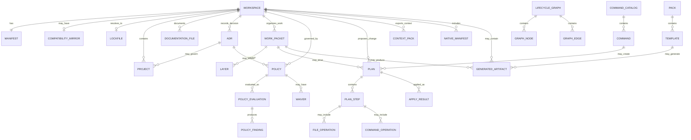

# 8. Data Architecture

## 8.1 Purpose of This Section

This section defines the data architecture for Monad OS and Monad CLI.

It explains:

* what data Monad owns,
* what data Monad reads from native tools,
* what data is canonical,
* what data is generated,
* what data is cached,
* what data is local-only,
* what data may be portable,
* what schemas are required,
* how schema versions should evolve,
* how future storage backends should be added,
* how context and AI-related data should be governed,
* how data should be migrated,
* how data should be retained,
* how generated artifacts should be traced,
* and how the product preserves local-first, cloud-agnostic, database-agnostic behavior.

The central data architecture decision is:

> Monad should begin with a deterministic, file-backed data architecture where repository files are the source of truth, generated data is traceable, cache data is invalidatable, and future database or hosted storage is added only through adapters.

---

## 8.2 Data Architecture Summary

Monad OS should begin with deterministic, file-backed data.

At the current stage, Monad does not need a database.

Its first source of truth should be structured repository files, especially:

```text id="8rf5oe"
monad.toml
monad.lock
docs/
governance/
policies/
work-packets/
architecture decision records
native package manifests
native workspace manifests
CI workflow files
tool configuration files
```

Monad may also use `.monad/` for local runtime state, cache, generated context, inspection snapshots, graph outputs, plan artifacts, and temporary data.

However:

> `.monad/` should not be treated as portable canonical source of truth unless a specific file is intentionally promoted and documented.

The long-term product may later support:

* embedded databases,
* graph stores,
* relational stores,
* hosted metadata services,
* search indexes,
* vector indexes,
* object storage,
* and fleet-level repository metadata stores.

However, the early local-first version should not depend on any required database.

The recommended strategy is:

> Use files as the canonical local source of truth, expose stable domain models internally, and keep persistence behind ports so that future storage backends can be added without rewriting the product.

---

## 8.3 Data Architecture Goals

The data architecture should support the following goals.

## Goal 1: Local-First Operation

Core Monad workflows must work against local repository files without any hosted service, database server, AI provider, or network dependency.

## Goal 2: Clear Source of Truth

Users and commands must be able to determine which files are canonical, which are mirrors, which are generated, which are cache, and which are temporary.

## Goal 3: Deterministic Outputs

Given the same repository state and Monad version, read-only commands should produce stable outputs where practical.

## Goal 4: Schema-Versioned Artifacts

Structured Monad artifacts should include schema versions so they can evolve safely.

## Goal 5: Traceable Generation

Generated files, context packs, graph exports, plans, and reports should identify their source inputs where practical.

## Goal 6: Safe Context and AI Data

Context packs and AI-bound data must exclude secrets by default and preserve privacy.

## Goal 7: Future Storage Flexibility

Future SQLite, PostgreSQL, graph, search, vector, object-storage, or hosted stores should be addable through adapters.

## Goal 8: No Accidental Hosted Dependency

Hosted data stores must not become required for local CLI value.

---

## 8.4 Data Architecture Principles

1. `monad.toml` is canonical.
2. `workspace.toml` is a compatibility mirror only.
3. `monad.lock` records resolved state.
4. `.monad/` stores local runtime, cache, context, plan, graph, inspection, and temporary artifacts.
5. Native manifests remain authoritative for native tools.
6. Monad coordinates native tool metadata; it does not blindly overwrite native tool configuration.
7. Generated data should be traceable to source inputs, templates, plans, and versions where practical.
8. Cached data must be invalidatable and rebuildable.
9. AI context data must exclude secrets by default.
10. Future database support must be adapter-based.
11. Hosted storage must be optional.
12. Schema versions must be explicit.
13. File formats should be human-readable when they are intended for humans.
14. File formats should be machine-readable when they are intended for automation.
15. Read-only commands should not modify data.
16. Mutating operations should flow through plan/apply.
17. Data migrations should be plan-backed.
18. Local canonical truth should not be overridden by remote projections.

---

# 8.5 Source-of-Truth Hierarchy

Monad needs a clear hierarchy of truth.

Recommended hierarchy:

```text id="uqmuzr"
1. User-authored canonical files
2. Native authoritative manifests
3. Monad lock/resolved files
4. Generated but traceable artifacts
5. Local cache/index artifacts
6. Temporary artifacts
7. Future hosted projections
```

## 8.5.1 User-Authored Canonical Files

Examples:

```text id="6uv5pi"
monad.toml
docs/product/charter.md
docs/product/prd.md
docs/architecture/decision-records/*.md
docs/roadmap/work-packets/*.md
governance/risk-register.md
policies/*.md or policies/*.toml
```

These are intentional source files that users may edit.

## 8.5.2 Native Authoritative Manifests

Examples:

```text id="l44u0j"
Cargo.toml
package.json
bun.lockb
pnpm-workspace.yaml
moon.yml
turbo.json
biome.json
Dockerfile
docker-compose.yml
.github/workflows/*.yml
```

Monad may read these, interpret them, and graph them, but should not pretend to be their canonical owner.

## 8.5.3 Monad Lock/Resolved Files

Example:

```text id="9wm32b"
monad.lock
```

This records resolved versions, checksums, and reproducibility state.

It is generated or maintained by Monad, but it may be committed when reproducibility matters.

## 8.5.4 Generated but Traceable Artifacts

Examples:

```text id="3vx271"
generated docs
generated ADR drafts
generated work packets
generated reports
generated context packs
generated graph exports
generated plans
```

These should include traceability metadata where practical.

## 8.5.5 Local Cache and Index Artifacts

Examples:

```text id="6j01go"
.monad/cache/
.monad/inspections/
.monad/graph/
```

These should be invalidatable and rebuildable.

They should not become canonical source of truth.

## 8.5.6 Temporary Artifacts

Examples:

```text id="652fc6"
.monad/tmp/
dry-run scratch files
transient apply staging files
```

These should be safe to delete.

## 8.5.7 Future Hosted Projections

Future hosted data may include:

* graph projections,
* policy reports,
* release evidence,
* compliance dashboards,
* team-level summaries.

Hosted data should be treated as projection, synchronization target, or reporting layer unless a future ADR explicitly changes that model.

---

# 8.6 Canonical Data Sources

## 8.6.1 Canonical Monad Manifest

Canonical file:

```text id="b5coxv"
monad.toml
```

Purpose:

* identifies the workspace,
* declares Monad schema version,
* defines canonical Monad configuration,
* describes workspace intent,
* declares supported packs/profiles,
* defines policy sources,
* identifies docs/governance conventions,
* defines context generation rules,
* declares source-of-truth behavior,
* defines mutation safety defaults,
* defines optional AI posture,
* defines extension behavior over time.

Recommended early shape:

```toml id="1i6wur"
schema_version = "0.1"
workspace_name = "monad-cli"
workspace_kind = "monorepo"

[manifest]
canonical = "monad.toml"
compatibility_mirror = "workspace.toml"

[paths]
docs = "docs"
governance = "governance"
policies = "policies"
work_packets = "docs/roadmap/work-packets"
adrs = "docs/architecture/decision-records"

[commands]
catalog = "crates/monad-cli/src/command_catalog.rs"

[context]
default_output = ".monad/context"
include_git_status = true
include_command_catalog = true
include_docs_status = true
include_policy_status = true
exclude_secrets = true

[mutation]
require_plan_for_mutation = true
default_dry_run = true

[ai]
enabled = false
provider = "none"
```

This is an illustrative early schema, not necessarily the final schema.

## 8.6.2 Compatibility Mirror

Compatibility file:

```text id="u5ee7o"
workspace.toml
```

Purpose:

* supports older workflows,
* supports adjacent tools,
* mirrors selected canonical data,
* eases migration,
* improves compatibility.

Policy:

```text id="tngphq"
If monad.toml and workspace.toml conflict, monad.toml wins.
```

Rules:

1. `workspace.toml` must not override `monad.toml`.
2. Mirror drift should produce a finding.
3. Mirror generation should be plan-backed or explicitly requested.
4. Mirror presence should not be required for Monad to function.

## 8.6.3 Lockfile

Lockfile:

```text id="r4mc35"
monad.lock
```

Purpose:

* records resolved pack versions,
* records policy bundle versions,
* records template versions,
* records schema resolution,
* records plugin checksums in the future,
* records dependency resolution for Monad-managed extensions,
* improves reproducibility.

Recommended early shape:

```toml id="1bme59"
schema_version = "0.1"
generated_by = "monad"
generated_at = "2026-07-03T00:00:00Z"

[workspace]
name = "monad-cli"
manifest_hash = "sha256:..."

[[packs]]
name = "core"
version = "0.1.0"
checksum = "sha256:..."

[[policies]]
name = "canonical-manifest"
version = "0.1.0"
checksum = "sha256:..."
```

Rules:

1. `monad.lock` is resolved state, not user intent.
2. It may be committed when reproducibility matters.
3. It should be regenerated through explicit commands.
4. It should not silently override `monad.toml`.

## 8.6.4 Local State Directory

Local state directory:

```text id="rra2uo"
.monad/
```

Purpose:

* stores local cache,
* stores generated context packs,
* stores inspection snapshots,
* stores graph exports,
* stores dry-run outputs,
* stores temporary plan artifacts,
* stores local-only runtime metadata.

Recommended structure:

```text id="xl0fiv"
.monad/
  README.md
  cache/
  context/
  inspections/
  graph/
  plans/
  reports/
  tmp/
```

Important rule:

> `.monad/` should not be treated as portable source of truth unless a specific file is intentionally promoted and documented.

Recommended `.gitignore` posture:

```text id="dh7dbp"
.monad/cache/
.monad/tmp/
.monad/inspections/
.monad/graph/
.monad/reports/
```

Context and plans may be ignored or committed depending on project policy.

Recommended project policy:

```text id="p8u1ov"
Commit:
  .monad/README.md only by default.

Usually ignore:
  .monad/cache/
  .monad/tmp/
  .monad/inspections/
  .monad/graph/
  .monad/reports/

Case-by-case:
  .monad/context/
  .monad/plans/
```

---

# 8.7 Native Data Sources

Monad should read native data sources but avoid taking ownership of them.

Examples:

## Rust

```text id="51msde"
Cargo.toml
Cargo.lock
rust-toolchain.toml
deny.toml
```

## JavaScript/TypeScript

```text id="s0i87v"
package.json
bun.lockb
pnpm-lock.yaml
pnpm-workspace.yaml
npm-shrinkwrap.json
turbo.json
moon.yml
biome.json
tsconfig.json
```

## Docker/Containers

```text id="vjjui4"
Dockerfile
docker-compose.yml
compose.yaml
.dockerignore
```

## CI/CD

```text id="3izpm7"
.github/workflows/*.yml
.github/workflows/*.yaml
.gitlab-ci.yml
.circleci/config.yml
```

## Documentation and Governance

```text id="thqtcp"
README.md
CONTRIBUTING.md
SECURITY.md
CODE_OF_CONDUCT.md
docs/**/*.md
governance/**/*.md
policies/**/*
```

## Rule

Native tools remain authoritative in their own domain.

Monad may:

* detect,
* inspect,
* summarize,
* graph,
* validate,
* report drift,
* plan changes,
* and coordinate.

Monad should not blindly rewrite native files.

---

# 8.8 Logical Data Model

Core logical entities:

```text id="8k89gn"
Workspace
Manifest
CompatibilityMirror
Lockfile
LocalState
Project
Domain
Command
CommandCatalog
InspectionReport
Finding
LifecycleGraph
GraphNode
GraphEdge
ContextPack
Handoff
DocumentationFile
ADR
WorkPacket
Layer
Policy
PolicyEvaluation
PolicyFinding
Waiver
Plan
PlanStep
FileOperation
CommandOperation
ApplyResult
Pack
Template
Plugin
Profile
NativeTool
NativeManifest
GeneratedArtifact
ReleasePlan
ReleaseEvidence
```

## 8.8.1 Entity Ownership

| Entity            | Owning Context           |
| ----------------- | ------------------------ |
| Workspace         | Workspace/Config         |
| Manifest          | Workspace/Config         |
| Lockfile          | Workspace/Config         |
| Project           | Inspection               |
| Command           | Command                  |
| CommandCatalog    | Command                  |
| InspectionReport  | Inspection               |
| Finding           | Core                     |
| LifecycleGraph    | Graph                    |
| ContextPack       | Context                  |
| Handoff           | Context                  |
| DocumentationFile | Documentation            |
| ADR               | Governance               |
| WorkPacket        | Governance               |
| Policy            | Policy                   |
| Waiver            | Policy/Governance        |
| Plan              | Plan                     |
| ApplyResult       | Plan                     |
| Pack              | Pack/Template            |
| Template          | Pack/Template            |
| NativeTool        | Native Tool Coordination |
| GeneratedArtifact | Plan/Pack/Docs           |
| ReleasePlan       | Release                  |

---

# 8.9 Conceptual Data Model



---

# 8.10 Physical Data Storage Strategy

## 8.10.1 Phase 1: File-Backed Only

Use:

```text id="wiiczg"
TOML for manifests and lockfiles
Markdown for docs and governance records
JSON for machine-readable generated reports
Mermaid/DOT for graph exports
Plain text for human terminal output
YAML only where native tools already use it
```

Rationale:

* local-first,
* easy to version in Git,
* easy to diff,
* no service dependency,
* works for solo developers,
* compatible with documentation-as-code,
* compatible with policy-as-code,
* easy to inspect manually,
* easy to recover from mistakes.

## 8.10.2 Phase 2: Optional Embedded Index

Potential future use:

```text id="iox0k9"
SQLite
```

Purpose:

* cache inspection results,
* speed up large repo queries,
* index graph nodes/edges,
* enable local search,
* support local history of inspections,
* support incremental scanning.

Why SQLite:

* local-first,
* serverless,
* portable,
* well understood,
* easy to delete/rebuild,
* widely available.

Rules:

1. SQLite must not become mandatory source of truth early.
2. SQLite data must be rebuildable from files.
3. SQLite must be behind a storage adapter.
4. SQLite schema must be versioned if introduced.

## 8.10.3 Phase 3: Optional Hosted Metadata Store

Potential future use:

```text id="1xevsq"
PostgreSQL
```

Purpose:

* team dashboards,
* repo fleet governance,
* compliance evidence,
* cross-repo graph queries,
* organizational policy reporting,
* release governance,
* multi-user review workflows.

Rules:

1. Postgres is for optional hosted control plane.
2. Postgres must not be required for local CLI value.
3. Hosted state should be projection/sync unless explicitly redefined.
4. Local repository source of truth remains authoritative.

## 8.10.4 Phase 4: Optional Graph/Search/Vector Stores

Potential future adapters:

```text id="p2gk7g"
Kuzu / Memgraph / Neo4j for graph workloads
Tantivy / Meilisearch / OpenSearch for search
Qdrant / pgvector / LanceDB for vector search
Object storage for artifacts
```

These should remain optional.

They should be introduced only when there is a clear use case that cannot be served well by local files, in-memory models, or SQLite.

---

# 8.11 File Format Strategy

## 8.11.1 TOML

Use TOML for:

* `monad.toml`,
* `monad.lock`,
* local configuration where human editing is expected.

Rationale:

* readable,
* good for configuration,
* compatible with Rust ecosystem,
* easy to diff.

## 8.11.2 Markdown

Use Markdown for:

* product docs,
* architecture docs,
* ADRs,
* work packets,
* runbooks,
* governance records,
* handoff summaries.

Rationale:

* human-readable,
* version-control friendly,
* documentation-as-code friendly,
* easy to review.

## 8.11.3 JSON

Use JSON for:

* machine-readable reports,
* graph exports,
* command catalog exports,
* context manifests,
* plan files,
* inspection reports,
* policy findings.

Rationale:

* easy for tools to consume,
* schema-friendly,
* cross-language,
* stable enough for automation.

## 8.11.4 Mermaid and DOT

Use Mermaid and DOT for graph exports.

Rationale:

* Mermaid is documentation-friendly.
* DOT is graph-tool-friendly.

## 8.11.5 YAML

Use YAML only when integrating with tools that already use YAML.

Examples:

* GitHub Actions,
* Docker Compose,
* Kubernetes later,
* policy bundles if justified.

Avoid YAML as the primary Monad configuration format unless there is a strong reason.

---

# 8.12 Schema Versioning Strategy

Structured Monad artifacts should include schema versions.

Artifacts requiring schema versions:

```text id="z2i79k"
monad.toml
monad.lock
plan.json
context-manifest.json
inspection-report.json
graph.json
policy-findings.json
apply-result.json
command-catalog.json
```

## 8.12.1 Version Format

Recommended:

```text id="awcyv6"
major.minor
```

or semantic versioning where appropriate:

```text id="uqn220"
major.minor.patch
```

## 8.12.2 Compatibility Rules

Recommended rules:

1. Patch versions should be backward compatible.
2. Minor versions may add fields.
3. Major versions may break compatibility.
4. Unknown fields should be preserved where practical for user-authored files.
5. Unknown fields in machine-generated files should produce warnings, not crashes, when possible.
6. Downgrades should not be automatic.
7. Migrations should be explicit and plan-backed.

## 8.12.3 Schema Location

Future schemas may live under:

```text id="rrf3rh"
schemas/
  manifest.schema.json
  lockfile.schema.json
  plan.schema.json
  context-pack.schema.json
  graph.schema.json
  inspection-report.schema.json
  policy-finding.schema.json
  command-catalog.schema.json
```

---

# 8.13 Data Access Patterns

## 8.13.1 Read-Only Commands

Read-only commands should:

* resolve workspace,
* load manifest,
* read native manifests,
* inspect docs/governance files,
* build in-memory reports,
* output findings/reports,
* avoid file writes,
* avoid cache mutation unless explicitly configured.

Examples:

```bash id="bd08pr"
monad inspect
monad check
monad doctor
monad graph
monad docs check
monad context handoff
```

## 8.13.2 Plan Creation Commands

Plan creation commands should:

* read current state,
* create proposed operations,
* attach schema version,
* attach source references,
* evaluate policies where available,
* write plan only if explicitly requested,
* otherwise print or preview.

Examples:

```bash id="jp0ygk"
monad plan ...
monad docs generate --dry-run
monad adr new --dry-run
```

## 8.13.3 Apply Commands

Apply commands should:

* load plan,
* validate plan schema,
* validate workspace snapshot,
* run policy gates,
* support dry-run,
* require explicit approval for apply,
* write only planned files,
* record apply result where practical.

Examples:

```bash id="ea50lp"
monad apply plan.json --dry-run
monad apply plan.json --yes
```

## 8.13.4 Cache Access

Cache access should:

* be optional,
* be invalidatable,
* be rebuildable,
* never override canonical data,
* include cache key/version metadata.

---

# 8.14 Database-Agnostic Persistence Design

Use ports for persistence:

```rust id="qjlhmh"
pub trait WorkspaceStore {
    fn load_workspace(&self, root: &WorkspaceRoot) -> Result<Workspace>;
    fn save_workspace_state(&self, workspace: &Workspace) -> Result<()>;
}

pub trait GraphStore {
    fn load_graph(&self, workspace: &WorkspaceId) -> Result<LifecycleGraph>;
    fn save_graph(&self, graph: &LifecycleGraph) -> Result<()>;
}

pub trait PlanStore {
    fn save_plan(&self, plan: &Plan) -> Result<()>;
    fn load_plan(&self, id: &PlanId) -> Result<Plan>;
}

pub trait PolicyStore {
    fn load_policies(&self, workspace: &Workspace) -> Result<Vec<Policy>>;
}

pub trait ContextStore {
    fn save_context_pack(&self, pack: &ContextPack) -> Result<()>;
    fn load_context_pack(&self, id: &ContextPackId) -> Result<ContextPack>;
}

pub trait InspectionStore {
    fn save_inspection(&self, report: &InspectionReport) -> Result<()>;
    fn load_inspection(&self, id: &InspectionId) -> Result<InspectionReport>;
}
```

Initial adapters:

```text id="jwsm79"
FileWorkspaceStore
FileGraphStore
FilePlanStore
FilePolicyStore
FileContextStore
FileInspectionStore
```

Future adapters:

```text id="e1cu6n"
SqliteGraphStore
SqliteInspectionStore
PostgresControlPlaneStore
ObjectStorageArtifactStore
SearchIndexStore
VectorContextStore
HostedGraphProjectionStore
```

## 8.14.1 Persistence Rule

The domain should not care whether data came from:

* filesystem,
* SQLite,
* Postgres,
* graph database,
* object storage,
* or hosted API.

Adapters translate storage into domain models.

---

# 8.15 Cache and Invalidation Strategy

## 8.15.1 Cacheable Data

Potentially cacheable data:

* inspection reports,
* graph exports,
* native tool detection results,
* docs status,
* policy evaluation results,
* context packs,
* generated reports.

## 8.15.2 Cache Keys

Cache keys should consider:

* Monad version,
* schema version,
* workspace root,
* manifest hash,
* relevant file hashes,
* command options,
* profile,
* policy bundle version,
* pack/template versions.

## 8.15.3 Invalidation Rules

Cache should be invalidated when:

* `monad.toml` changes,
* relevant docs change,
* native manifests change,
* policy files change,
* command catalog changes,
* Monad version changes,
* schema version changes,
* requested output format changes,
* profile changes,
* pack/template version changes.

## 8.15.4 Cache Rule

Cache may speed up Monad.

Cache must not determine truth.

---

# 8.16 Migration Strategy

Because Monad is file-first, migrations apply to:

* manifest schema versions,
* lockfile schema versions,
* plan schema versions,
* policy schema versions,
* context pack schema versions,
* graph schema versions,
* inspection report schema versions,
* command catalog schema versions,
* local cache schema versions.

Recommended migration commands:

```bash id="jm2zlx"
monad migrate check
monad migrate plan
monad migrate apply --dry-run
monad migrate apply --yes
```

Migration principles:

1. Never silently rewrite source-of-truth files.
2. Always generate a migration plan.
3. Preserve backups or rollback hints.
4. Explain breaking changes.
5. Validate after migration.
6. Use semantic schema versions.
7. Allow users to inspect migration diffs.
8. Treat downgrade migrations carefully.
9. Keep generated/cache migrations rebuildable where possible.
10. Prefer migration through plan/apply.

---

# 8.17 Data Classification

Recommended classification levels:

```text id="3vzrcr"
public
internal
confidential
secret
regulated
```

| Data Type          | Likely Classification | Notes                                             |
| ------------------ | --------------------- | ------------------------------------------------- |
| README             | Public/Internal       | Depends on repository visibility.                 |
| Product docs       | Public/Internal       | May include strategy.                             |
| Architecture docs  | Internal              | May reveal system design.                         |
| ADRs               | Internal              | May reveal strategic decisions.                   |
| Work packets       | Internal              | May reveal roadmap.                               |
| Policy files       | Internal              | May reveal controls.                              |
| Context packs      | Internal/Confidential | Must exclude secrets.                             |
| Plans              | Internal/Confidential | May reveal intended changes.                      |
| Apply results      | Internal/Confidential | May reveal file paths and commands.               |
| Audit logs         | Confidential          | May contain sensitive metadata.                   |
| AI prompts/context | Internal/Confidential | Must be scrubbed.                                 |
| Secrets            | Secret                | Must never enter context packs.                   |
| Regulated data     | Regulated             | Should be excluded from early context by default. |

---

# 8.18 Data Privacy Strategy

Even though early Monad is local-first, it should still treat privacy seriously.

Controls:

* no telemetry by default,
* no AI upload by default,
* no external calls without explicit configuration,
* secrets excluded from context packs,
* `.env` and secret-like files ignored by default,
* context redaction rules,
* explicit warning for exporting repository context,
* optional allowlist-based context generation,
* denylist-based sensitive path exclusion,
* hosted provider opt-in only,
* local context generation by default.

## 8.18.1 Sensitive File Patterns

Default exclusion patterns should include:

```text id="eqf1qh"
.env
.env.*
*.pem
*.key
*.p12
*.pfx
id_rsa
id_ed25519
secrets.*
credentials.*
*.kubeconfig
*.tfstate
*.tfvars
```

## 8.18.2 Context Export Warning

When writing or exporting context, Monad should eventually warn users if the output may include repository-sensitive data.

Example:

```text id="xi141u"
Context export may include internal repository structure and documentation.
Secrets are excluded by default, but review before sharing externally.
```

---

# 8.19 Data Retention Strategy

## 8.19.1 Local Retention Defaults

Recommended defaults:

```text id="02x0py"
inspection snapshots: optional and cacheable
plans: retained if explicitly saved
context packs: retained in .monad/context if generated to disk
dry-run outputs: safe to delete
logs: minimal by default
graph exports: cacheable/rebuildable
reports: optional and rebuildable
tmp files: safe to delete
```

## 8.19.2 Local Cleanup

Future command:

```bash id="t8uy8s"
monad clean
```

Potential cleanup targets:

```bash id="pgxd8n"
monad clean cache
monad clean tmp
monad clean inspections
monad clean graph
monad clean reports
```

Cleanup must not delete user-authored source-of-truth files.

## 8.19.3 Future Hosted Retention

Future hosted retention should support:

* configurable retention policies,
* tenant-level data deletion,
* audit retention,
* compliance evidence retention,
* export workflows,
* delete workflows,
* data residency where needed,
* organization policies.

Hosted retention is out of scope for early local CLI.

---

# 8.20 Data Lineage

Monad should track lineage for generated artifacts.

Example metadata:

```yaml id="jd6q31"
generated_by: monad
generator: docs.generate
source_manifest: monad.toml
source_manifest_hash: sha256:...
created_at: 2026-07-03T00:00:00Z
plan_id: plan_...
work_packet: WP-0003
template: docs/product-charter
template_version: 0.1.0
monad_version: 0.1.0
```

## 8.20.1 Lineage Should Answer

Lineage should answer:

* What generated this?
* When was it generated?
* Which Monad version generated it?
* Which template or pack generated it?
* Which plan authorized it?
* Which source files influenced it?
* Which work packet did it support?
* Can it be regenerated safely?

## 8.20.2 Lineage Requirements

Lineage is most important for:

* generated docs,
* generated plans,
* generated context packs,
* generated graph exports,
* generated policy reports,
* generated release evidence,
* generated code/templates later.

Lineage metadata should be lightweight and not make files unpleasant to read.

---

# 8.21 Generated Artifact Strategy

Generated artifacts should be clearly classified.

## 8.21.1 Generated Artifact Categories

| Category                     | Example                |      Commit? |         Regenerate? |
| ---------------------------- | ---------------------- | -----------: | ------------------: |
| Human-edited generated draft | ADR draft              |  Usually yes |           Carefully |
| Machine report               | inspection report JSON |   Usually no |                 Yes |
| Context handoff              | current-state.md       | Case-by-case |                 Yes |
| Graph export                 | graph.mmd              | Case-by-case |                 Yes |
| Plan                         | plan.json              | Case-by-case | No, should preserve |
| Apply result                 | apply-result.json      | Case-by-case | No, should preserve |
| Cache                        | `.monad/cache/*`       |           No |                 Yes |
| Temporary                    | `.monad/tmp/*`         |           No |                 Yes |

## 8.21.2 Generated File Header

Generated human-readable files may include a header:

```markdown id="ww5vg6"
<!--
generated_by: monad
generator: docs.generate
schema_version: 0.1
template_version: 0.1.0
plan_id: plan_...
-->
```

Use headers carefully. Do not clutter files unnecessarily.

---

# 8.22 Data Quality Strategy

Data quality matters because Monad’s outputs guide decisions.

## 8.22.1 Data Quality Dimensions

| Dimension    | Meaning                                    |
| ------------ | ------------------------------------------ |
| Accuracy     | Data reflects actual repository state.     |
| Freshness    | Data reflects current repository state.    |
| Completeness | Required artifacts are present.            |
| Consistency  | Sources do not contradict each other.      |
| Traceability | Data can be traced to source artifacts.    |
| Determinism  | Same input produces stable output.         |
| Safety       | Sensitive data is excluded where required. |

## 8.22.2 Data Quality Checks

Potential checks:

```text id="p5xo6t"
manifest_exists
manifest_schema_valid
workspace_mirror_not_conflicting
required_docs_present
adrs_index_matches_files
work_packets_index_matches_files
command_catalog_matches_cli
context_pack_has_redaction_report
graph_edges_reference_existing_nodes
plan_lists_all_file_operations
```

---

# 8.23 Data Security Strategy

Data security controls:

1. No external calls by default.
2. No telemetry by default.
3. No AI upload by default.
4. Context redaction enabled by default.
5. Secret-like files excluded by default.
6. Plans show intended operations before mutation.
7. Apply only writes planned paths.
8. Plugins disabled or absent early.
9. Native command execution explicit.
10. Hosted sync opt-in only.

## 8.23.1 Secret Handling Rule

Secrets are never intentionally included in:

* context packs,
* AI prompts,
* handoff summaries,
* graph exports intended for external sharing,
* hosted sync payloads unless explicitly configured and safe.

## 8.23.2 Local Security Note

Because Monad works on local repositories, local file permissions and local machine security still matter. Monad should not claim to protect data from a compromised local machine.

---

# 8.24 AI and Context Data Strategy

Context data is one of the most important data categories in Monad.

## 8.24.1 Context Data Sources

Context packs may use:

* manifest summary,
* command catalog,
* inspection report,
* graph summary,
* docs status,
* ADR index,
* work-packet state,
* policy findings,
* test status,
* known risks,
* Git status where enabled.

## 8.24.2 Context Data Rules

1. Context must work without AI.
2. Context must exclude secrets.
3. Context should include source references.
4. Context should include generation metadata.
5. Context should include a redaction report.
6. Context should be scoped to purpose.
7. Context is summary/projection, not canonical truth.

## 8.24.3 Context Data Profiles

Potential profiles:

```text id="rtmj74"
handoff
ai-planning
architecture-review
policy-review
release-review
onboarding
```

Each profile should select different source sections and detail levels.

---

# 8.25 Future Hosted Data Boundary

If Monad later adds a hosted control plane, the boundary should be explicit.

## 8.25.1 Hosted Data Should Be Projection First

Hosted systems may store:

* repository metadata,
* graph projections,
* policy reports,
* release evidence,
* team comments,
* approval records,
* dashboard views.

But local canonical files remain authoritative unless a future ADR explicitly changes this.

## 8.25.2 Sync Direction

Recommended default:

```text id="tvf75l"
local repository -> generated projection -> hosted control plane
```

Avoid early bidirectional mutation from hosted to local.

## 8.25.3 Hosted Mutation Risk

Hosted mutation introduces risks:

* auth/authorization complexity,
* conflict resolution,
* audit trail requirements,
* sync failures,
* local/remote truth conflicts,
* data privacy obligations.

Therefore, hosted mutation should be deferred.

---

# 8.26 Backup and Recovery Strategy

## 8.26.1 Local Backup

Because canonical data is file-backed, Git is the primary backup and recovery mechanism for committed artifacts.

Important files to commit:

```text id="4yak68"
monad.toml
monad.lock when reproducibility is desired
docs/
governance/
policies/
work-packets/
ADRs
```

## 8.26.2 Local Recovery

Recovery should be possible by:

* reverting Git changes,
* deleting rebuildable `.monad/cache`,
* regenerating inspection reports,
* regenerating graph exports,
* regenerating context packs,
* re-running checks.

## 8.26.3 Apply Recovery

For plan/apply operations, Monad should eventually provide:

* dry-run output,
* apply result,
* rollback hints,
* backup file strategy for risky operations,
* Git status warning before apply.

---

# 8.27 Data Architecture Fitness Functions

Fitness functions are tests or checks that preserve the architecture.

## DAF-001: Canonical Manifest

```text id="zt17gb"
monad.toml is treated as canonical.
```

## DAF-002: Mirror Cannot Override Canonical

```text id="jq88n9"
workspace.toml cannot override monad.toml.
```

## DAF-003: Local State Not Canonical

```text id="blrtf4"
.monad cache artifacts are not treated as source of truth.
```

## DAF-004: Read-Only Commands Do Not Write

```text id="rmg8bm"
Read-only commands do not create, modify, or delete files.
```

## DAF-005: Context Excludes Secrets

```text id="8vzjpx"
Context packs exclude common secret files.
```

## DAF-006: Generated Artifacts Are Traceable

```text id="vx1qip"
Generated artifacts include lineage metadata where required.
```

## DAF-007: Schema Versions Are Present

```text id="ahfr1c"
Structured Monad artifacts include schema_version.
```

## DAF-008: Cache Is Rebuildable

```text id="xiow7t"
Deleting .monad/cache does not destroy canonical data.
```

## DAF-009: Plans List Operations

```text id="xqjtfv"
Plans list all file and command operations.
```

## DAF-010: No External Data Upload by Default

```text id="iiu8t3"
Core workflows do not upload repository data by default.
```

---

# 8.28 Data Architecture Risks

| Risk                         | Description                                               | Mitigation                                 |
| ---------------------------- | --------------------------------------------------------- | ------------------------------------------ |
| Competing truths             | `workspace.toml` conflicts with `monad.toml`.             | Canonical manifest policy.                 |
| Cache treated as truth       | `.monad/` artifacts become authoritative accidentally.    | Clear docs and validation.                 |
| Over-abstraction             | Database agnosticism creates weak models.                 | Keep rich domain model; adapters at edges. |
| Secret leakage               | Context packs include sensitive files.                    | Redaction and ignore rules.                |
| Schema drift                 | Generated artifacts become incompatible.                  | Schema versioning and migrations.          |
| Future hosted lock-in        | SaaS layer becomes required.                              | Keep local-first contract.                 |
| Generated artifact confusion | Users edit generated files without understanding lineage. | Generated headers and docs.                |
| Plan/apply data loss         | Apply modifies files without recoverability.              | Dry-run, apply results, rollback hints.    |
| Native manifest corruption   | Monad rewrites native tool config incorrectly.            | Coordinate, do not blindly overwrite.      |
| Context bloat                | Context packs become too large to be useful.              | Profiles, scopes, summaries.               |
| Privacy misunderstanding     | Users share context externally without review.            | Warnings and redaction reports.            |
| Migration breakage           | Schema migration rewrites important files incorrectly.    | Plan-backed migration and backups.         |

---

# 8.29 Recommended Initial Data Implementation Order

The data architecture should be implemented in this order:

1. Define `Finding`, `Severity`, and source references.
2. Define workspace root and manifest data types.
3. Parse `monad.toml`.
4. Detect `workspace.toml` as compatibility mirror.
5. Implement source-of-truth conflict findings.
6. Define command catalog data model.
7. Define inspection report model.
8. Define documentation finding model.
9. Define context handoff model.
10. Define lifecycle graph node/edge model.
11. Define plan schema.
12. Define policy finding model.
13. Define lockfile model.
14. Define `.monad/` local state conventions.
15. Add schema exports later.
16. Add migration model later.
17. Add SQLite only if local indexing becomes justified.

This preserves the product sequence:

```text id="6dgqz3"
source of truth
-> command trust
-> inspection
-> docs/context/graph
-> policy
-> plan/apply
-> packs/templates
-> indexes/hosted/AI
```

---

# 8.30 Open Questions

The following should be resolved later through ADRs, work packets, or implementation experiments:

1. What is the exact stable `monad.toml` schema?
2. Should `monad.lock` be committed by default?
3. Which `.monad/` subdirectories should be committed, if any?
4. What is the initial JSON schema for inspection reports?
5. What is the initial graph node/edge schema?
6. Should plans be stored as JSON, TOML, or another format?
7. Should context packs be committed or ignored by default?
8. How should generated file headers be standardized?
9. What is the initial migration command surface?
10. When does SQLite become justified?
11. Should context redaction use denylist, allowlist, or both?
12. What is the first hosted sync payload, if any?
13. What data should never be sent to hosted providers?
14. Should Monad maintain a local history of inspections?
15. How should schema compatibility be tested?

---

# 8.31 Section Acceptance Criteria

This section is complete when it clearly defines:

1. The local-first file-backed data strategy.
2. The source-of-truth hierarchy.
3. The canonical role of `monad.toml`.
4. The mirror-only role of `workspace.toml`.
5. The resolved-state role of `monad.lock`.
6. The local-state role of `.monad/`.
7. Native data source boundaries.
8. Logical data entities.
9. Conceptual data relationships.
10. Physical storage phases.
11. File format strategy.
12. Schema versioning strategy.
13. Data access patterns.
14. Persistence ports/adapters.
15. Cache and invalidation rules.
16. Migration strategy.
17. Data classification.
18. Privacy strategy.
19. Retention strategy.
20. Data lineage requirements.
21. Generated artifact rules.
22. Data quality strategy.
23. Data security posture.
24. AI/context data strategy.
25. Future hosted-data boundary.
26. Backup and recovery posture.
27. Fitness functions.
28. Risks.
29. Recommended implementation order.
30. Open questions.

Future data architecture decisions should preserve this section’s core rule:

> Local repository files are the first source of truth; everything else is a projection, cache, generated artifact, or optional future adapter.
