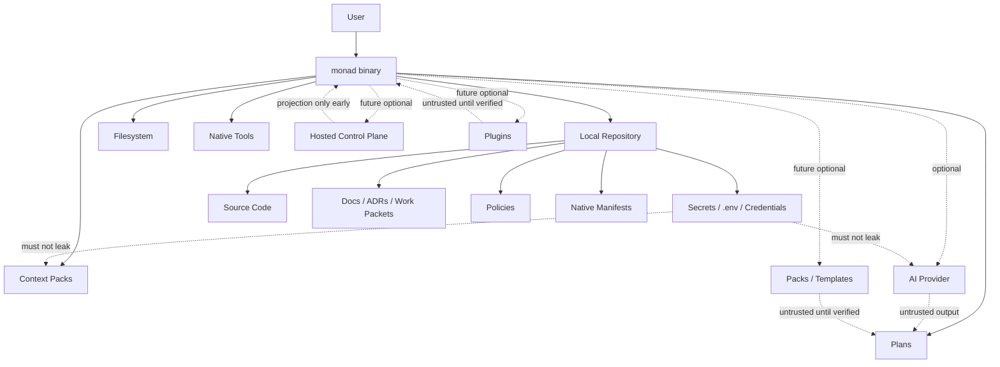

# 10. Security, Privacy, Compliance, and Governance

## 10.1 Purpose of This Section

This section defines the security, privacy, compliance, and governance strategy for Monad OS and Monad CLI.

It explains:

* what Monad must protect,
* which threats matter,
* where trust boundaries exist,
* what security posture should govern the product,
* what privacy guarantees should exist by default,
* how mutation should be controlled,
* how AI-related risks should be handled,
* how plugins, packs, templates, and native tools should be treated,
* how supply-chain risks should be reduced,
* how governance workflows should operate,
* what compliance evidence Monad may eventually produce,
* and what should be deferred until the product matures.

Monad is a developer tool that reads repository files and may eventually write files, execute native tools, generate plans, produce context packs, coordinate AI workflows, and sync projections to a hosted control plane.

That makes security important from the beginning, even before any hosted service exists.

The central rule is:

> Monad should be safe, local-first, explicit, auditable, and conservative by default.

---

## 10.2 Security Summary

Monad’s early security model is shaped by the fact that it runs locally against a developer’s repository.

The first product surface is a Rust CLI named:

```text id="50kd8g"
monad
```

The CLI may read:

* source code,
* manifests,
* documentation,
* ADRs,
* work packets,
* policies,
* CI workflows,
* tool configuration,
* environment-related files,
* generated artifacts,
* and local Monad state.

Future versions may also:

* write files,
* generate plans,
* apply plans,
* execute native tools,
* install packs,
* render templates,
* call AI providers,
* sync metadata to a hosted control plane,
* and support plugins.

Primary risks include:

* accidental destructive mutation,
* secret leakage into context packs,
* unsafe execution of external tools,
* malicious plugins or packs,
* compromised templates,
* supply-chain compromise,
* misleading generated docs,
* untrusted AI-generated plans,
* prompt injection,
* policy bypass,
* stale or incorrect compliance evidence,
* hosted sync leakage,
* and ambiguity about source of truth.

Monad should treat these as product-level design concerns, not afterthoughts.

---

## 10.3 Security Posture

Monad’s security posture should be:

```text id="6fbylx"
local-first
safe-by-default
no-network-by-default
no-telemetry-by-default
no-AI-by-default
read-only-before-mutation
plan-backed-before-apply
explicit-before-external
auditable-before-governed
```

This means the default user experience should be conservative.

A user should be able to run common commands such as:

```bash id="iqae3m"
monad version
monad list
monad config
monad inspect
monad check
monad doctor
monad graph
monad docs check
monad context handoff
```

without worrying that Monad will:

* upload repository data,
* call an AI provider,
* send telemetry,
* modify files,
* execute unknown tools,
* create policy waivers,
* install plugins,
* or silently rewrite configuration.

The product should earn trust before it earns authority.

---

## 10.4 Security Principles

1. **Safe by default.**
   Default behavior should avoid mutation, network calls, AI calls, telemetry, and hidden execution.

2. **Local-first by default.**
   Repository data stays local unless the user explicitly exports, syncs, or sends it elsewhere.

3. **No external network calls by default.**
   Update checks, pack registries, hosted sync, telemetry, and AI providers must be explicit.

4. **No telemetry by default.**
   Monad should not report usage data unless a future user explicitly opts in.

5. **No AI calls by default.**
   AI is optional and must be explicitly configured.

6. **No mutation without explicit plan/apply or approval.**
   Repository changes must be reviewable before they are applied.

7. **No secret inclusion in context by default.**
   Context packs, handoffs, AI prompts, and reports must exclude secrets unless explicitly and safely configured.

8. **No plugin execution without a trust model.**
   Plugins must not execute until installation, permissions, signatures/checksums, and sandboxing are addressed.

9. **No silent policy waivers.**
   Waivers must be explicit, justified, auditable, and preferably expiring.

10. **No hidden file rewrites.**
    Any file write should be planned, previewed, or explicitly requested.

11. **Human-readable and machine-readable audit evidence.**
    Governance-sensitive actions should produce evidence humans and tools can inspect.

12. **Deterministic before intelligent.**
    AI must not replace deterministic checks, policies, plans, and human approval.

13. **Coordinate native tools safely.**
    Monad should not execute external tools unexpectedly.

14. **Preserve source-of-truth integrity.**
    `monad.toml` remains canonical, and generated/cache/hosted data must not override it.

---

# 10.5 Threat Model

## 10.5.1 Assets

Monad should protect the following assets:

```text id="ks8gor"
source code
repository structure
secrets
environment files
credentials
private keys
architecture decisions
work packets
plans
policies
context packs
generated artifacts
developer machine
CI environment
native tool outputs
future hosted metadata
future audit evidence
```

## 10.5.2 Sensitive Assets

Especially sensitive assets include:

```text id="at4sr9"
.env files
API keys
private keys
tokens
cloud credentials
database credentials
SSH keys
Terraform state
Kubernetes config
production deployment details
security findings
compliance evidence
AI context exports
```

These must never be casually included in context packs, AI prompts, hosted sync payloads, or external reports.

## 10.5.3 Actors

Actors include:

```text id="ri42jo"
developer
maintainer
platform engineer
malicious contributor
malicious pack author
malicious plugin author
compromised dependency
compromised native tool
AI assistant
CI runner
future hosted control plane user
future hosted control plane administrator
attacker with repository write access
attacker with local machine access
```

## 10.5.4 Trust Boundaries

Trust boundaries include:

```text id="f6h4vl"
User terminal
Local monad binary
Local repository
Filesystem
Native tools
Generated plans
Generated context packs
External plugins
External packs
External templates
AI providers
CI systems
Future hosted service
Future plugin registry
Future pack registry
```

## 10.5.5 Primary Threats

| Threat                         | Description                                          | Primary Control                                    |
| ------------------------------ | ---------------------------------------------------- | -------------------------------------------------- |
| Secret leakage                 | Context or AI export includes secrets.               | Redaction, denylist, allowlist, tests.             |
| Destructive mutation           | Command overwrites/deletes files unexpectedly.       | Plan/apply, dry-run, approval.                     |
| Hidden execution               | Monad runs external tools without user awareness.    | Explicit command execution model.                  |
| Malicious plugin               | Plugin executes unsafe code.                         | Defer plugins, trust model, sandboxing.            |
| Malicious pack/template        | Pack generates unsafe files or commands.             | Checksums, review, plan-backed generation.         |
| AI hallucination               | AI invents repo facts or unsafe actions.             | Deterministic context, validation, human approval. |
| Prompt injection               | Repository content manipulates AI behavior.          | Treat repo text as untrusted data.                 |
| Policy bypass                  | User or AI creates undocumented waiver.              | Waiver workflow and audit trail.                   |
| Source-of-truth conflict       | `workspace.toml` overrides `monad.toml`.             | Canonical manifest policy.                         |
| Supply-chain compromise        | Dependency or release artifact compromised.          | cargo audit, cargo deny, SBOM, checksums.          |
| Hosted sync leakage            | Local repo metadata sent remotely unexpectedly.      | Hosted sync opt-in only.                           |
| Misleading compliance evidence | Reports imply certification or assurance not earned. | Clear evidence labels and disclaimers.             |

---

## 10.6 Trust Boundary Diagram



## 10.6.1 Trust Boundary Interpretation

* The local repository is trusted only as input data, not as executable instruction.
* Repository text may be malicious or misleading.
* Native tools are outside Monad’s trust boundary.
* AI providers are outside Monad’s trust boundary.
* Plugins and packs are outside Monad’s trust boundary until verified.
* Hosted control-plane data should be treated as projection, not canonical local truth.
* Generated plans are not automatically trusted; they must be validated.
* Context packs are sensitive exports and must be redacted.

---

# 10.7 Security Control Families

Monad’s controls can be grouped into the following families:

```text id="8530bd"
SEC: General security controls
MUT: Mutation safety controls
CTX: Context and secret controls
AI: AI safety controls
PLG: Plugin/pack/template controls
NAT: Native tool execution controls
SUP: Supply-chain controls
PRI: Privacy controls
GOV: Governance controls
CMP: Compliance evidence controls
AUD: Audit/evidence controls
```

This structure helps future policies, findings, tests, and docs stay organized.

---

# 10.8 Core Security Controls

## SEC-001: Safe Defaults

Monad must default to safe behavior.

Default behavior:

* no network,
* no telemetry,
* no AI calls,
* no plugin execution,
* no hidden file writes,
* no hidden external command execution.

## SEC-002: Secret Redaction

Context generation must ignore likely secret files:

```text id="cex19x"
.env
.env.*
*.pem
*.key
*.p12
*.pfx
id_rsa
id_ed25519
secrets.*
credentials.*
*.kubeconfig
*.tfstate
*.tfvars
```

It should also eventually scan for likely secret patterns before exporting context.

## SEC-003: Explicit Mutation Approval

Mutating operations require one of:

```text id="2s6b2p"
--dry-run
--plan
--yes
```

Dangerous operations should require extra confirmation or be blocked until plan/apply is mature.

## SEC-004: Plan Visibility

Plans must list:

* file creates,
* file modifications,
* file deletions,
* file moves,
* file renames,
* external commands,
* risks,
* policy findings,
* approval requirements,
* rollback hints.

## SEC-005: Policy Gate

Plans should be policy-evaluated before apply.

Blocking findings should prevent apply unless explicitly waived through an auditable workflow.

## SEC-006: No Network by Default

No network calls unless the user explicitly enables:

* update checks,
* pack registry,
* plugin registry,
* AI provider,
* hosted sync,
* telemetry.

## SEC-007: No Telemetry by Default

Monad should not phone home by default.

If telemetry ever exists, it must be:

* opt-in,
* documented,
* minimal,
* inspectable,
* disableable,
* and privacy-preserving.

## SEC-008: No AI by Default

AI calls require explicit configuration.

The default AI provider should conceptually be:

```text id="mmms5l"
NoopAiAdapter
```

## SEC-009: No Hidden External Command Execution

Monad must not run native tools unless the user requested a workflow that clearly includes execution.

Tool detection should be read-only.

## SEC-010: Clear Error and Finding Output

Security-related failures should produce clear messages and remediation where possible.

---

# 10.9 Mutation Safety Controls

## MUT-001: Read-Only Command Safety

Read-only commands must not create, modify, delete, move, or rename files.

Read-only commands include:

```bash id="gsarcb"
monad version
monad list
monad config list
monad config inspect
monad inspect
monad check
monad doctor
monad graph
monad docs check
monad policy check
monad context handoff
```

Exception:

* A read-oriented command may write output only when the user explicitly provides an output path, such as `--output`.

## MUT-002: Plan Required for Mutation

Mutating commands should eventually require plans.

Examples:

```bash id="e6f6dh"
monad add
monad remove
monad rename
monad move
monad generate
monad sync
monad clean
monad migrate
monad upgrade
```

## MUT-003: Dry-Run Required Before Trusted Apply

Mature apply flow should support:

```bash id="xav57w"
monad apply plan.json --dry-run
monad apply plan.json --yes
```

## MUT-004: Apply Must Not Exceed Plan Scope

Apply must only perform operations listed in the plan.

## MUT-005: Dangerous Operation Controls

Dangerous operations include:

* file deletion,
* directory deletion,
* recursive overwrite,
* dependency upgrades,
* migration rewrites,
* external command execution,
* policy waiver creation,
* release publication.

These should require explicit approval and policy evaluation.

## MUT-006: Dirty Working Tree Warning

Before applying changes, Monad should eventually warn if the Git working tree is dirty.

## MUT-007: Rollback Hints

Plans and apply results should include rollback hints where practical.

## MUT-008: Apply Result Evidence

Apply should eventually produce an apply result artifact containing:

* plan ID,
* operations attempted,
* operations completed,
* failures,
* policy findings,
* timestamp,
* user approval mode,
* rollback hints.

---

# 10.10 Context and Secret Controls

## CTX-001: Secret Exclusion by Default

Context packs and handoffs must exclude likely secret files.

## CTX-002: Redaction Report

Context generation should produce a redaction report that identifies excluded paths without printing secret contents.

## CTX-003: Purpose-Scoped Context

Context should be generated for a purpose, such as:

```text id="bkl3tc"
handoff
ai-planning
architecture-review
policy-review
release-review
onboarding
```

## CTX-004: Context Size Control

Context packs should support scopes or profiles to avoid excessive exports.

## CTX-005: No Context Upload by Default

Generated context remains local unless explicitly exported or sent to a provider.

## CTX-006: User-Controlled Ignore Rules

Monad should eventually support custom ignore/exclusion rules.

## CTX-007: Review Before External Sharing

Human-readable warnings should remind users that context may include internal repository details.

Example:

```text id="9feg9x"
Context export may include internal repository structure and documentation.
Secrets are excluded by default, but review before sharing externally.
```

---

# 10.11 AI Security Controls

## AI-001: AI Disabled by Default

AI must not run unless explicitly enabled.

## AI-002: AI Provider Explicitness

The user must explicitly configure a provider before hosted or local AI calls occur.

## AI-003: AI Context Redaction

AI-bound context must pass secret redaction rules.

## AI-004: Repository Text Is Untrusted Input

Repository content used in prompts must be treated as data, not instruction.

## AI-005: AI Output Is Not Truth

AI summaries, plans, and drafts are suggestions until validated.

## AI-006: AI Mutation Requires Plan

AI-generated changes must become plans before apply.

## AI-007: Human Approval Required

AI-assisted mutation requires explicit human approval.

## AI-008: AI Metadata for Governance

Governance-sensitive AI workflows should record:

* provider,
* model,
* prompt template version,
* context pack version,
* plan ID,
* approval status.

## AI-009: Hosted AI Provider Policy

Some profiles may forbid hosted AI providers.

## AI-010: No Autonomous AI Apply

AI must not directly apply file changes, create waivers, execute commands, or publish releases.

---

# 10.12 Plugin, Pack, and Template Security

## PLG-001: Plugins Deferred Until Trust Model Exists

Monad should not support arbitrary plugin execution early.

Before plugins exist, Monad needs:

* plugin manifest schema,
* permissions model,
* checksum verification,
* signature strategy,
* install/update/remove lifecycle,
* sandbox strategy,
* compatibility model,
* audit metadata,
* policy controls.

## PLG-002: Pack Metadata Required

Packs should declare:

* pack ID,
* version,
* checksum,
* included templates,
* included policies,
* intended outputs,
* permissions or capabilities,
* compatibility range.

## PLG-003: Template Output Declaration

Templates must declare intended output files before rendering.

## PLG-004: Pack/Template Application Through Plans

Pack install and template generation should produce plans rather than directly writing files.

## PLG-005: No Untrusted Script Execution

Packs and templates must not execute arbitrary scripts unless explicitly allowed and modeled as command operations in a plan.

## PLG-006: Registry Security Later

A future registry requires:

* signed metadata,
* checksums,
* immutable releases,
* provenance,
* vulnerability reporting,
* takedown process,
* trust levels.

---

# 10.13 Native Tool Security

## NAT-001: Detection Is Read-Only

Detecting Cargo, Bun, Git, Docker, Moon, Turborepo, or other tools must be read-only.

## NAT-002: Execution Is Explicit

Running native tools must require an explicit user command.

Examples:

```bash id="2e7rdp"
monad test
monad lint
monad build
monad run
```

## NAT-003: Native Tool Output Is Untrusted

External tool output should be parsed carefully and normalized into findings.

## NAT-004: Native Tool Authority Is Preserved

Monad should not rewrite native manifests unless a plan explicitly includes the change.

## NAT-005: External Command Risk Classification

External commands should eventually carry risk metadata.

Example categories:

```text id="o3vbxl"
read-only
build
test
format
networked
mutating
destructive
unknown
```

## NAT-006: No Shell Injection

Monad should avoid shell string construction where possible and use argument arrays.

---

# 10.14 Supply-Chain Controls

## SUP-001: Dependency Auditing

Use tools such as:

```text id="l2jd27"
cargo audit
cargo deny
```

where practical.

## SUP-002: Dependency Policy

Dependency policy should address:

* allowed licenses,
* denied licenses,
* vulnerable crates,
* duplicate versions,
* yanked crates,
* unmaintained crates where detectable.

## SUP-003: SBOM Generation

Future release workflows should generate an SBOM.

## SUP-004: Release Checksums

Release artifacts should eventually have checksums.

## SUP-005: Reproducible Release Inputs

Release evidence should include:

* Git commit,
* build version,
* dependency lockfile,
* test status,
* security scan status.

## SUP-006: Pinned CI Actions

CI workflows should pin actions where practical.

## SUP-007: Minimal Dependency Surface

Avoid unnecessary dependencies, especially for security-sensitive paths.

## SUP-008: Plugin/Packs Provenance

Future external extensions require provenance tracking.

---

# 10.15 Privacy Controls

Privacy controls:

* local-first data stays local,
* no telemetry by default,
* no network calls by default,
* context export requires explicit command,
* AI export requires explicit provider and approval,
* sensitive file exclusion,
* user-controlled ignore patterns,
* future hosted sync opt-in only,
* hosted AI opt-in only,
* context redaction report,
* data minimization for exported context,
* clear warnings for external sharing.

## 10.15.1 Privacy Promise

Early Monad’s practical privacy promise should be:

> Core Monad commands run locally and do not send repository data anywhere by default.

## 10.15.2 Data Minimization

When generating context, reports, AI prompts, or hosted projections, Monad should include only what is needed for the requested purpose.

## 10.15.3 Future Hosted Privacy

If hosted sync is added, it should include:

* explicit opt-in,
* clear data inventory,
* data deletion,
* export,
* retention controls,
* organization settings,
* role-based access,
* audit events,
* and privacy documentation.

---

# 10.16 Compliance Strategy

Monad should support compliance evidence later, especially for:

```text id="vha3vl"
SOC 2-style SDLC controls
ISO 27001-style change management controls
NIST SSDF-style secure development practices
SLSA-style supply-chain controls
internal enterprise SDLC policies
```

Early Monad should not claim certification.

It should instead produce evidence artifacts that may help users support their own compliance processes.

## 10.16.1 Evidence Monad May Produce

Potential evidence artifacts:

```text id="fr5qf3"
policy reports
change plans
apply results
ADR index
work packet status
test reports
release readiness reports
security findings
dependency reports
SBOMs
context export logs
waiver records
risk register links
release evidence
```

## 10.16.2 Compliance Positioning Rule

Monad may say:

```text id="2w76rd"
Monad can help generate SDLC governance and compliance evidence.
```

Monad should not say early:

```text id="xwccmp"
Monad makes your organization SOC 2 compliant.
Monad certifies ISO 27001 compliance.
Monad guarantees SLSA compliance.
```

Compliance evidence is not the same as certification.

---

# 10.17 Compliance Evidence Mapping

## 10.17.1 Change Management Evidence

Possible Monad evidence:

* work packet,
* ADR,
* plan,
* dry-run result,
* policy findings,
* approval record,
* apply result,
* test result,
* release evidence.

## 10.17.2 Secure Development Evidence

Possible Monad evidence:

* security policy checks,
* dependency audit reports,
* SBOM,
* code ownership checks,
* documentation checks,
* threat-model docs,
* release readiness reports.

## 10.17.3 Architecture Governance Evidence

Possible Monad evidence:

* ADR index,
* architecture overview,
* lifecycle graph,
* dependency graph,
* policy findings,
* work-packet traceability.

## 10.17.4 AI Governance Evidence

Possible Monad evidence:

* AI provider config,
* context pack manifest,
* redaction report,
* prompt template version,
* plan ID,
* human approval,
* policy findings.

## 10.17.5 Supply-Chain Evidence

Possible Monad evidence:

* lockfile,
* dependency audit,
* SBOM,
* checksums,
* release provenance,
* CI workflow findings.

---

# 10.18 Governance Workflows

## 10.18.1 ADR Workflow

Recommended workflow:

```text id="m6k71o"
draft -> proposed -> accepted -> superseded/deprecated
```

Rules:

* significant architecture decisions should have ADRs,
* accepted ADRs should contain context, decision, consequences, and alternatives,
* superseded ADRs should identify replacement where possible.

## 10.18.2 Work Packet Workflow

Recommended workflow:

```text id="ope7j3"
planned -> active -> review -> complete -> archived
```

Rules:

* work packets should define purpose, scope, out-of-scope, layers, risks, and acceptance criteria,
* completed work packets should include validation evidence.

## 10.18.3 Plan Workflow

Recommended workflow:

```text id="n7t5n9"
created -> reviewed -> dry-run passed -> policy passed -> approved -> applied -> verified
```

Rules:

* plans must be inspectable,
* plans must list operations,
* plans should be policy-checked,
* approved apply should produce result evidence.

## 10.18.4 Policy Waiver Workflow

Recommended workflow:

```text id="6ef37x"
requested -> justified -> approved -> expires -> reviewed
```

Rules:

* waivers must have reason,
* waivers must identify policy,
* waivers must identify scope,
* waivers should expire,
* waivers must not be silently created.

## 10.18.5 Release Workflow

Recommended workflow:

```text id="1y2er9"
planned -> candidate -> validated -> approved -> released -> post-release reviewed
```

Rules:

* release readiness should include tests, docs, policy, security, and change evidence,
* release publication should require explicit approval.

---

# 10.19 Governance Artifacts

Core governance artifacts:

```text id="z201m8"
ADRs
work packets
layers
policy rules
policy findings
policy waivers
risk register
traceability matrix
release plans
apply results
security reports
context export records
```

## 10.19.1 Governance Artifact Requirements

Governance artifacts should be:

* version-controlled where appropriate,
* human-readable where appropriate,
* machine-readable where appropriate,
* traceable to source inputs,
* linked to work packets or ADRs where practical,
* validated by Monad over time.

---

# 10.20 Risk Register Integration

Security and governance findings should map to:

* risk IDs,
* policy IDs,
* work packets,
* ADRs,
* release gates,
* remediation plans,
* owners where teams exist,
* due dates where governance profile requires them.

Example relationship:

```text id="1cxx6z"
PolicyFinding -> RiskId -> WorkPacket -> Plan -> ReleaseGate -> Evidence
```

Risk register integration is important because findings without ownership or remediation become noise.

---

# 10.21 Audit and Evidence Strategy

## 10.21.1 Local Audit Evidence

Early Monad can produce local evidence artifacts, such as:

* command output,
* JSON reports,
* Markdown reports,
* plans,
* apply results,
* policy findings,
* docs findings,
* context manifests,
* redaction reports.

## 10.21.2 Audit Event Model Later

Future audit events may include:

```text id="nxxef4"
PlanCreated
PlanDryRunCompleted
PlanApproved
PlanApplied
PolicyWaiverCreated
ContextPackGenerated
AIProviderUsed
PackInstalled
PluginInstalled
ReleaseApproved
ReleasePublished
```

## 10.21.3 Audit Evidence Rules

Audit evidence should:

* identify what happened,
* identify when it happened,
* identify what inputs were used,
* identify what version of Monad generated it,
* identify policy findings,
* avoid leaking secrets,
* be reproducible where practical.

---

# 10.22 Security Testing Strategy

Security-related tests should exist early.

## 10.22.1 Secret Redaction Tests

Examples:

```text id="fs7dvp"
context_handoff_excludes_env_files
context_handoff_excludes_private_keys
context_pack_includes_redaction_report
```

## 10.22.2 Read-Only Safety Tests

Examples:

```text id="w75fqj"
inspect_does_not_write_files
check_does_not_write_files
docs_check_does_not_write_files
context_handoff_does_not_write_without_output_flag
```

## 10.22.3 Mutation Safety Tests

Examples:

```text id="xcxgh3"
apply_requires_plan
dry_run_does_not_write_files
apply_writes_only_planned_files
dangerous_delete_requires_approval
```

## 10.22.4 Command Honesty Tests

Examples:

```text id="3qy0bm"
planned_commands_are_honest
mutating_commands_declare_mutation_status
placeholder_commands_do_not_claim_success
```

## 10.22.5 AI Safety Tests

Examples:

```text id="sqn5o6"
ai_disabled_by_default
ai_suggestion_cannot_apply_directly
ai_context_excludes_secrets
hosted_ai_requires_explicit_opt_in
```

## 10.22.6 Plugin/Packs Tests Later

Examples:

```text id="v32ext"
unsigned_plugin_is_rejected
pack_checksum_mismatch_is_rejected
template_outputs_are_declared
pack_install_generates_plan
```

---

# 10.23 CI and Release Security

## 10.23.1 CI Checks

Recommended CI checks:

```bash id="uf8jes"
cargo fmt --all --check
cargo check --workspace
cargo test --workspace
cargo audit
cargo deny check
```

Optional or later:

```bash id="cy68op"
cargo clippy --workspace --all-targets -- -D warnings
SBOM generation
release checksum verification
SLSA provenance generation
```

## 10.23.2 Release Evidence

Release evidence should eventually include:

* version,
* Git commit,
* tests passed,
* docs checks passed,
* policy checks passed,
* dependency audit status,
* SBOM,
* checksums,
* changelog,
* known risks,
* approval metadata.

## 10.23.3 Release Artifact Integrity

Future release artifacts should include:

* checksums,
* signatures if practical,
* provenance metadata,
* reproducible build notes where practical.

---

# 10.24 Future Hosted Security Boundary

Hosted control-plane features are future and optional.

If hosted features are added, they will require:

* authentication,
* authorization,
* organization/team model,
* RBAC,
* audit logs,
* encryption in transit,
* encryption at rest,
* tenant isolation,
* secure sync protocol,
* data deletion/export,
* rate limits,
* incident response,
* backup and recovery,
* privacy policy,
* terms of service,
* compliance posture.

## 10.24.1 Hosted Sync Rule

Hosted sync must be explicit.

Recommended default:

```text id="gxuv07"
local repository -> generated projection -> hosted control plane
```

Avoid early hosted-to-local mutation.

## 10.24.2 Hosted Data Rule

Hosted data should not override local canonical source-of-truth files unless a future ADR explicitly changes the architecture.

---

# 10.25 Security Non-Goals for Early Versions

Early Monad does not need:

* enterprise SSO,
* remote access controls,
* hosted RBAC,
* cloud KMS,
* centralized audit backend,
* plugin marketplace,
* real-time threat detection,
* hosted compliance dashboard,
* multi-tenant SaaS security model,
* organization-level policy management,
* production incident response system,
* signed plugin ecosystem,
* hosted billing,
* or full compliance certification.

But Monad must not make those impossible.

Early local-first architecture should leave room for these later without carrying their complexity now.

---

# 10.26 Recommended Initial Security Implementation Order

Recommended order:

1. Mark every command as read-only or mutating in the command catalog.
2. Add placeholder honesty for unimplemented commands.
3. Add exit code for unimplemented commands and unsafe mutation blocked.
4. Ensure read-only commands do not write files.
5. Add secret exclusion patterns for context handoff.
6. Add context redaction report.
7. Add no-network-by-default rule.
8. Add no-AI-by-default rule.
9. Add `monad.toml` canonical source-of-truth policy.
10. Add `workspace.toml` mirror conflict finding.
11. Add plan schema before mutation.
12. Add dry-run support before apply.
13. Add policy findings before waivers.
14. Add supply-chain CI checks.
15. Add release evidence later.
16. Defer plugins until trust model exists.
17. Defer hosted security until hosted architecture is justified.

This order preserves the product strategy:

```text id="242v5x"
command honesty
-> read-only safety
-> secret safety
-> source-of-truth safety
-> plan-backed mutation
-> policy gates
-> supply-chain evidence
-> plugin/hosted governance
```

---

# 10.27 Security and Governance Fitness Functions

Fitness functions are tests or checks that preserve the desired security architecture.

## SGF-001: No Network by Default

```text id="a5xio9"
Core commands make no external network calls.
```

## SGF-002: No Telemetry by Default

```text id="qjs7tp"
Monad sends no telemetry unless explicitly enabled.
```

## SGF-003: No AI by Default

```text id="52buy6"
Monad does not call AI providers unless explicitly configured.
```

## SGF-004: Read-Only Safety

```text id="h8cyac"
Read-only commands do not create, modify, move, rename, or delete files.
```

## SGF-005: Secret Redaction

```text id="ezhs1h"
Context generation excludes common secret files.
```

## SGF-006: Mutation Requires Plan

```text id="x4kd85"
Mutating commands are blocked, dry-run, preview-only, or plan-backed.
```

## SGF-007: Apply Stays Within Plan

```text id="7zmqd0"
Apply performs only operations listed in the plan.
```

## SGF-008: Policy Waiver Auditability

```text id="ghmzy9"
Waivers require policy ID, reason, scope, approval, and expiration where applicable.
```

## SGF-009: Plugin Trust Required

```text id="6pponb"
Plugins cannot execute without trust model and explicit installation.
```

## SGF-010: Command Metadata Security

```text id="ykrfjk"
Every command declares mutating, plan-backed, dry-run, implemented, and stability metadata.
```

---

# 10.28 Open Questions

The following should be resolved through ADRs, work packets, or implementation experiments:

1. What exact files and glob patterns should be excluded from context by default?
2. Should context generation use denylist, allowlist, or both?
3. Should `monad context handoff --output` be allowed before plan/apply?
4. What exact exit code should unsafe mutation blocked return?
5. What is the minimum viable plan schema for mutation safety?
6. Should policy waivers be allowed before policy bundles are stable?
7. Should `.monad/context` be ignored or committed by default?
8. Should `monad.lock` be committed by default?
9. Which supply-chain tools are required versus optional?
10. Should cargo-deny be non-fatal when missing locally?
11. What is the first security profile?
12. What security controls should exist for packs before plugins?
13. What should be the first plugin trust model?
14. When should signed releases become required?
15. What hosted security requirements are needed before any sync feature?
16. What AI metadata should be recorded for governance-sensitive workflows?
17. How should Monad detect and handle Terraform state or Kubernetes credentials?
18. How should compliance evidence be labeled to avoid overclaiming?

---

# 10.29 Section Acceptance Criteria

This section is complete when it clearly defines:

1. Security posture.
2. Security principles.
3. Protected assets.
4. Actors.
5. Trust boundaries.
6. Primary threats.
7. Trust boundary diagram.
8. Security control families.
9. Core security controls.
10. Mutation safety controls.
11. Context and secret controls.
12. AI security controls.
13. Plugin, pack, and template security.
14. Native tool security.
15. Supply-chain controls.
16. Privacy controls.
17. Compliance strategy.
18. Compliance evidence mapping.
19. Governance workflows.
20. Governance artifacts.
21. Risk register integration.
22. Audit and evidence strategy.
23. Security testing strategy.
24. CI and release security.
25. Future hosted security boundary.
26. Early security non-goals.
27. Recommended security implementation order.
28. Security/governance fitness functions.
29. Open questions.

Future implementation should preserve this section’s central rule:

> Monad should never trade local trust, explicit safety, privacy, or governance integrity for convenience.
