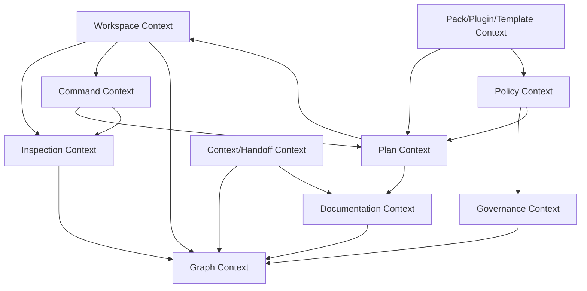
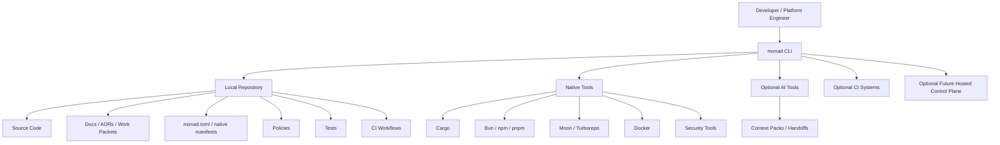
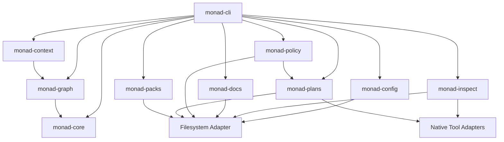
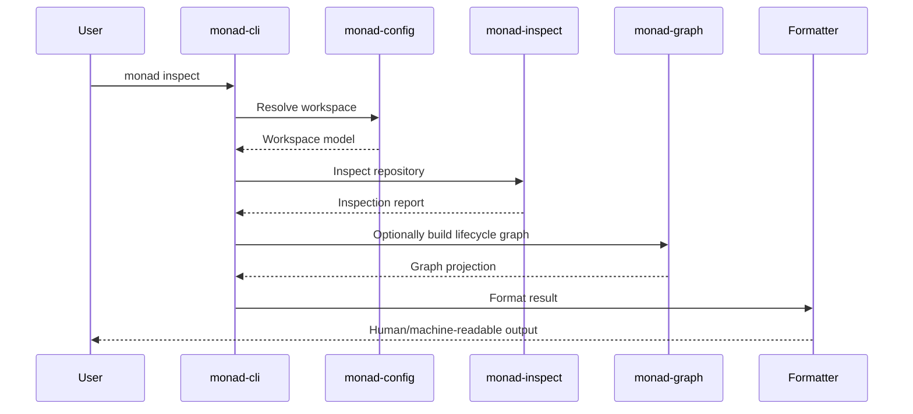
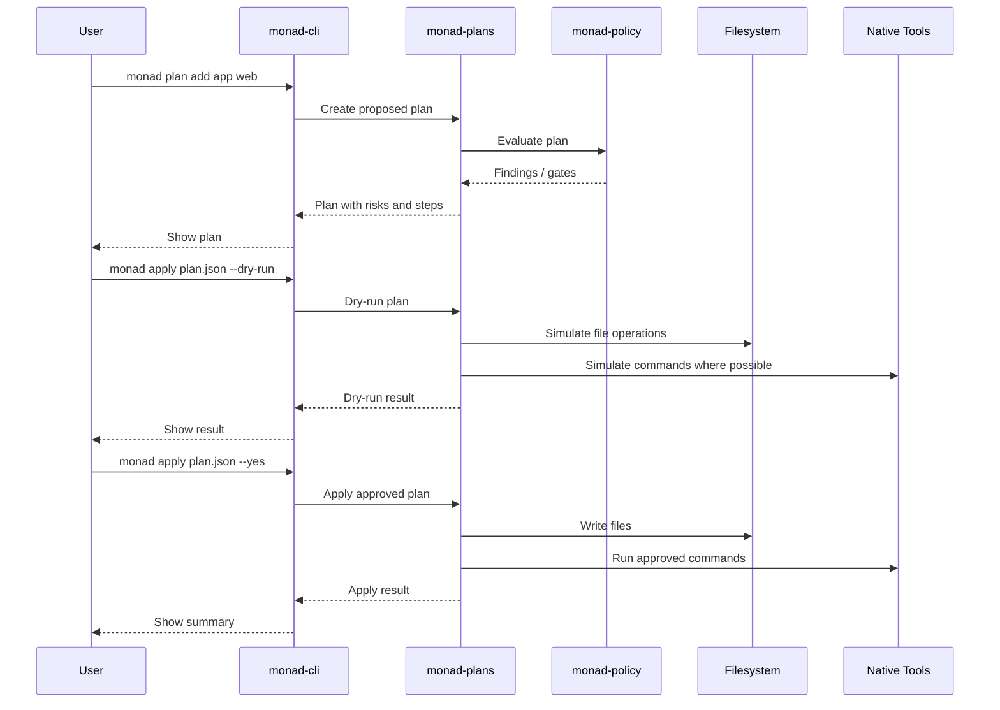

# Monad OS / Monad CLI

# Enterprise-Grade Product Planning Package

# Part 1: Product Definition, Charter, PRD, Domain Model, and Architecture Strategy

## Running Table of Contents

Part 1.
1. Product Understanding and Assumptions
2. Executive Summary
3. Product Charter
4. Product Requirements Document
5. Domain Model and DDD Design
6. Architecture Strategy
7. AI Architecture

Part 2.
8. Data Architecture
9. API and Integration Design
10. Security, Privacy, Compliance, and Governance
11. Infrastructure and Cloud-Agnostic Deployment Plan
12. Observability and Operations
13. Testing Strategy
14. BDD Specification Set

Part 3.
15. Implementation Roadmap
16. Initial Repository and Documentation Structure
17. Initial Documentation Files

Part 4.
18. ADR Set
19. Traceability Matrix
20. Risk Register
21. Governance and Decision System
22. Execution Plan
23. Recommended Technology Strategy
24. Final Review

This document begins with sections 1 through 7.

---

# 1. Product Understanding and Assumptions

## 1.1 Product Understanding

Monad OS is a local-first SDLC control plane and monorepo operating system.

The first executable product surface is `monad-cli`, a Rust single-binary command-line runtime named `monad`.

Monad is intended to make serious software repositories:

* self-describing,
* governable,
* inspectable,
* auditable,
* graphable,
* AI-ready,
* AI-optional,
* safely evolvable,
* documentation-aware,
* policy-aware,
* and lifecycle-aware.

Monad is not merely a scaffolder, task runner, documentation generator, AI wrapper, or monorepo starter. It may include those capabilities, but the larger product thesis is broader:

> Monad OS turns a repository into a governed lifecycle graph and exposes a safe local control plane for understanding, validating, documenting, planning, and evolving it.

## 1.2 Product Identity

Recommended product hierarchy:

```text
Monad OS
  ├─ monad-cli: local Rust CLI runtime
  ├─ monad-core: core domain models and contracts
  ├─ monad-plans: plan/apply mutation engine
  ├─ monad-policy: policy and governance engine
  ├─ monad-context: context and handoff engine
  ├─ monad-graph: lifecycle graph engine
  ├─ monad-packs: curated packs/templates/plugins
  └─ optional hosted control plane later
```

## 1.3 Core Product Statement

> Monad OS is a local-first, governance-grade SDLC control plane that turns software repositories into governed lifecycle graphs and provides a safe Rust CLI for understanding, validating, documenting, planning, and evolving them.

## 1.4 Developer-Facing Statement

> Monad helps developers understand, validate, document, graph, and safely evolve serious monorepos without locking into one cloud, database, framework, package manager, task runner, or AI provider.

## 1.5 Enterprise-Facing Statement

> Monad provides a deterministic repository control plane for enforcing architecture, governance, documentation integrity, policy checks, change planning, and AI-safe software delivery across complex software systems.

## 1.6 AI-Era Statement

> Monad gives humans and AI assistants a shared, governed source of truth for how a software system is structured, why it exists, what can change, and how changes should be applied safely.

## 1.7 Primary Assumptions

The following assumptions are used throughout this planning package:

1. Monad OS starts as a local-first open-source Rust CLI.
2. Hosted/cloud features are future optional extensions, not required for core value.
3. `monad.toml` is the canonical manifest.
4. `workspace.toml` is only a compatibility mirror.
5. `monad.lock` captures resolved state.
6. `.monad/` stores local Monad state.
7. The product coordinates native tools rather than replacing them.
8. Mutating commands must eventually be plan-backed.
9. Early mutating commands should be placeholder, dry-run, or preview-only until the plan engine is mature.
10. AI functionality must be optional and deterministic alternatives must exist.
11. The first serious milestone should be read-only repository understanding.
12. The second serious milestone should be safe plan-backed mutation.
13. The central long-term moat is the lifecycle graph.
14. The user is currently building incrementally as a solo developer.
15. The implementation process should favor small, testable layers.

## 1.8 Non-Assumptions

The plan does not assume:

* a hosted SaaS backend,
* a mandatory database,
* a required cloud provider,
* a required AI provider,
* Kubernetes as the first runtime,
* GitHub as the only forge,
* microservices as the first architecture,
* a web UI as the first interface,
* or direct mutation before plan/apply safety exists.

---

# 2. Executive Summary

## 2.1 Product Vision

Monad OS exists to make modern software repositories governable, understandable, and safely evolvable.

Its vision is to become the local-first operating system for software delivery: a deterministic control plane that connects code, docs, architecture decisions, work packets, tests, policies, tasks, releases, incidents, and AI context into one coherent lifecycle model.

## 2.2 Product Mission

Monad’s mission is to help developers and organizations build, inspect, govern, document, and evolve complex repositories with enterprise-grade discipline while preserving local-first usability, cloud portability, database portability, and AI optionality.

## 2.3 One-Sentence Product Definition

Monad OS is a local-first SDLC control plane and monorepo operating system that turns software repositories into governed lifecycle graphs.

## 2.4 Strategic Thesis

Modern software delivery is fragmented across many tools and artifacts:

```text
source code
package manifests
task runners
CI workflows
ADRs
docs
issues
release plans
policies
security checks
ownership files
architecture diagrams
AI prompts
context handoffs
incident records
```

Most teams lack a single deterministic system that understands how these artifacts relate.

Monad’s thesis is that repositories should become self-describing systems. A repository should be able to explain:

* what it contains,
* how it is structured,
* what depends on what,
* what policies apply,
* what work is in progress,
* what decisions shaped it,
* what tests prove it,
* what docs are stale,
* what changes are safe,
* and what context a human or AI assistant needs before modifying it.

## 2.5 Target Users

Primary users:

* solo developers building serious systems,
* platform engineers,
* staff/principal engineers,
* technical founders,
* DevEx engineers,
* monorepo maintainers,
* architecture governance teams,
* AI-assisted software development teams.

Secondary users:

* engineering managers,
* security engineers,
* compliance teams,
* release managers,
* SREs,
* enterprise architecture teams,
* consultants implementing modern SDLC systems.

## 2.6 Target Customers

Initial likely customers:

* technical founders,
* solo developers,
* open-source maintainers,
* small engineering teams,
* internal platform teams.

Later customers:

* mid-market engineering organizations,
* enterprises with many repositories,
* regulated software organizations,
* AI-enabled development organizations,
* consulting firms standardizing client delivery.

## 2.7 Core Value Proposition

Monad helps teams move from:

```text
a repository as a loose folder of files
```

to:

```text
a repository as a governed, queryable, auditable, evolvable system
```

It gives users one local CLI surface to inspect, validate, document, graph, plan, and eventually mutate repositories safely.

## 2.8 Differentiation

Monad is differentiated by the combination of:

* local-first operation,
* Rust single-binary runtime,
* governance-grade repository model,
* lifecycle graph,
* plan-backed mutation,
* AI-ready but AI-optional context engine,
* source-of-truth manifest model,
* native-tool coordination,
* cloud-agnostic design,
* database-agnostic design,
* framework-agnostic design,
* documentation-as-code,
* policy-as-code,
* and enterprise-grade traceability.

## 2.9 Recommended Architecture Summary

Recommended default architecture:

> Start as a local-first modular Rust CLI with clean internal crate boundaries, deterministic file-backed state, schema-versioned manifests, a read-only repository inspection engine, and an eventually plan-backed mutation engine.

Avoid a hosted service, database dependency, microservice architecture, and heavy plugin runtime until the local core loop is excellent.

Recommended crate architecture:

```text
crates/
  monad-cli/
  monad-core/
  monad-config/
  monad-inspect/
  monad-graph/
  monad-context/
  monad-policy/
  monad-plans/
  monad-docs/
  monad-packs/
```

## 2.10 Recommended Delivery Strategy

Delivery should proceed in strict maturity layers:

```text
Layer 0000: repository foundation
Layer 0001: systems-grade repository surfaces
Layer 0002: Rust CLI skeleton and command contracts
Layer 0003: read-only introspection, docs, context, and governance commands
Layer 0004: plan-backed mutation engine
Layer 0005: real generators, templates, and packs
Layer 0006: policy engine and waivers
Layer 0007: release/change lifecycle
Layer 0008: lifecycle graph persistence and querying
Layer 0009: optional hosted control plane
```

## 2.11 Major Risks

The major risks are:

1. Scope explosion.
2. Too many placeholder commands.
3. Unsafe mutation behavior.
4. Unclear category positioning.
5. Reimplementing native tools unnecessarily.
6. Over-engineering before the core loop works.
7. Under-specifying governance models.
8. Treating AI as foundational rather than optional.
9. Creating competing sources of truth.
10. Building a hosted layer before local trust exists.

## 2.12 Recommended First Milestone

The first meaningful milestone is:

> A working read-only Monad CLI that can fully explain a repository.

The core command loop should become excellent:

```bash
monad version
monad config
monad list
monad inspect
monad check
monad doctor
monad graph
monad diff
monad context handoff
monad docs check
```

---

# 3. Product Charter

## 3.1 Product Name

Primary name:

```text
Monad OS
```

Executable/runtime name:

```text
monad
```

Repository/runtime component:

```text
monad-cli
```

## 3.2 Product Type

Monad OS is a:

* local-first SDLC control plane,
* monorepo operating system,
* repository intelligence runtime,
* governance-grade developer CLI,
* AI-ready context/handoff engine,
* and safe repository evolution system.

## 3.3 Problem Statement

Modern software repositories are increasingly complex, but the knowledge required to understand and safely evolve them is scattered across code, docs, CI workflows, scripts, package manifests, tickets, ADRs, policies, and human memory.

As AI-assisted coding grows, this problem becomes more dangerous. AI tools can modify code quickly, but they often lack a governed understanding of the repository’s architecture, policies, decisions, risks, and delivery process.

Teams need a deterministic local control plane that makes the repository understandable and governable before humans or AI agents modify it.

## 3.4 Opportunity Statement

There is an opportunity to create a new category of SDLC tooling:

> a local-first repository operating system that connects software lifecycle artifacts into one governed graph and exposes safe command-line workflows for inspection, validation, documentation, planning, and change.

This category becomes more important as software systems become more polyglot, AI-assisted, regulated, distributed, and tool-fragmented.

## 3.5 Jobs to Be Done

### JTBD-001: Understand a Repository

When I enter a complex repo, I want to quickly understand its apps, services, packages, docs, policies, and dependency relationships so that I can work safely.

### JTBD-002: Validate Repository Health

When I maintain a repo, I want to check whether it follows expected structure, documentation, policy, dependency, and governance rules so that drift is detected early.

### JTBD-003: Generate AI-Safe Context

When I use an AI assistant, I want deterministic context packs and handoff summaries so that the assistant does not operate blindly.

### JTBD-004: Plan Repository Changes

When I need to add, remove, rename, move, or generate repository elements, I want a change plan before mutation so that I can review risk and impact.

### JTBD-005: Govern Software Delivery

When I build serious systems, I want work packets, ADRs, policies, and release plans connected to implementation so that the repo is auditable and maintainable.

### JTBD-006: Coordinate Native Tools

When my repo uses many tools, I want one control plane that coordinates them without replacing them so that I can preserve best-of-breed native workflows.

## 3.6 Primary Personas

### Persona 1: Solo Systems Builder

A solo developer building serious infrastructure or product foundations.

Needs:

* strong defaults,
* local-first workflow,
* copy-pasteable commands,
* no SaaS dependency,
* safe incremental layers,
* clear docs,
* high leverage.

### Persona 2: Platform Engineer

A developer responsible for internal tools and repo standards.

Needs:

* policy checks,
* graph outputs,
* template standards,
* CI integration,
* documentation validation,
* ownership models,
* repeatable governance.

### Persona 3: Staff/Principal Engineer

A senior technical leader responsible for architecture coherence.

Needs:

* ADR tracking,
* architecture boundaries,
* dependency visibility,
* domain modeling,
* change impact analysis,
* lifecycle traceability.

### Persona 4: AI-Assisted Developer

A developer using ChatGPT, Cursor, Copilot, Claude, or local LLMs.

Needs:

* deterministic repo context,
* handoff summaries,
* AI-safe constraints,
* file relevance maps,
* implementation boundaries,
* current work packet state.

### Persona 5: Enterprise Governance Team

A team responsible for compliance, risk, and SDLC controls.

Needs:

* audit evidence,
* policy-as-code,
* decision records,
* release gates,
* traceability matrices,
* security controls,
* evidence generation.

## 3.7 Product Principles

1. Local-first before hosted.
2. Deterministic before AI.
3. Plan-backed before mutation.
4. Explain before acting.
5. Coordinate native tools; do not replace them unnecessarily.
6. Make the repository self-describing.
7. Treat docs, policies, ADRs, and tests as first-class lifecycle artifacts.
8. Make governance useful, not bureaucratic.
9. Prefer small safe layers over giant unsafe jumps.
10. Preserve portability across clouds, databases, frameworks, and AI providers.

## 3.8 Quality Principles

Monad must be:

* correct,
* deterministic,
* test-backed,
* schema-versioned,
* honest about unimplemented features,
* safe by default,
* machine-readable and human-readable,
* auditable,
* extensible,
* fast enough for everyday CLI use,
* reliable on common developer machines.

## 3.9 Governance Principles

Monad should enforce the following governance posture:

* every significant architectural choice should have an ADR,
* every significant implementation unit should map to work packets,
* every mutating operation should be plan-backed or explicitly marked unsafe,
* every policy waiver should be recorded,
* every generated artifact should be traceable,
* every command should be cataloged,
* every placeholder should declare its status honestly,
* every source of truth should be unambiguous.

## 3.10 Non-Goals for Early Versions

Monad should not initially be:

* a hosted SaaS-only platform,
* a Kubernetes-first platform,
* a mandatory AI agent,
* a generic project management app,
* a replacement for Cargo, Bun, Moon, Turborepo, Nx, Bazel, or GitHub Actions,
* a mandatory database-backed system,
* a full enterprise portal,
* a complex distributed system,
* or a fully autonomous code-writing agent.

---

# 4. Product Requirements Document

## 4.1 Goals

### Goal 1: Repository Understanding

Monad must inspect a repository and report its structure, projects, manifests, docs, policies, and known lifecycle artifacts.

### Goal 2: Repository Validation

Monad must validate that the repository conforms to expected structure, source-of-truth rules, command catalog expectations, and documentation lifecycle rules.

### Goal 3: Governed Command Surface

Monad must expose a cataloged CLI surface where each command has metadata describing whether it is implemented, mutating, dry-run capable, and plan-backed.

### Goal 4: Lifecycle Graph

Monad must model repository artifacts and relationships as a graph.

### Goal 5: Context and Handoff

Monad must produce deterministic context packs and handoff summaries for humans and AI assistants.

### Goal 6: Plan-Backed Mutation

Monad must eventually require repository mutations to be represented as explicit change plans before application.

### Goal 7: Documentation Integrity

Monad must help validate and generate repository documentation.

### Goal 8: Policy and Governance

Monad must support policy checks, explanations, and eventually waivers.

### Goal 9: Tool Coordination

Monad must coordinate native tools without unnecessarily replacing them.

### Goal 10: Portability

Monad must avoid required dependencies on a specific cloud, database, framework, or AI provider.

## 4.2 Non-Goals

Early versions do not need:

* a hosted dashboard,
* a required database,
* real-time collaboration,
* autonomous AI code changes,
* complex distributed execution,
* enterprise SSO,
* fleet-wide repo management,
* visual graph UI,
* all possible language/framework generators,
* or deep replacement of native build systems.

## 4.3 Functional Requirements

### FR-001: CLI Version Command

The CLI must expose:

```bash
monad version
```

It should output the binary version and optionally build metadata.

### FR-002: Command Catalog

Monad must maintain an internal command catalog.

Each command entry should include:

```text
name
description
namespace
implemented
mutating
plan_backed
supports_dry_run
stability
```

### FR-003: List Commands

Monad must expose:

```bash
monad list
```

It should list known commands and distinguish implemented commands from planned commands.

### FR-004: Config Inspection

Monad must expose:

```bash
monad config
monad config list
monad config inspect
```

It should explain canonical config sources and resolved configuration.

### FR-005: Repository Inspection

Monad must expose:

```bash
monad inspect
```

It should inspect repository structure, manifests, workspace files, docs, and known project areas.

### FR-006: Repository Check

Monad must expose:

```bash
monad check
```

It should validate core repository invariants.

### FR-007: Doctor

Monad must expose:

```bash
monad doctor
```

It should provide higher-level diagnostics and recommended fixes.

### FR-008: Graph Output

Monad must expose:

```bash
monad graph
```

It should eventually support:

```bash
monad graph --format text
monad graph --format json
monad graph --format mermaid
monad graph --format dot
```

### FR-009: Diff

Monad must expose:

```bash
monad diff
```

It should eventually compare actual repo state against expected or planned state.

### FR-010: Context Handoff

Monad must expose:

```bash
monad context handoff
monad context pack
monad context verify
```

It should produce deterministic context artifacts.

### FR-011: Docs Check

Monad must expose:

```bash
monad docs check
```

It should validate documentation existence, freshness, and consistency.

### FR-012: ADR Lifecycle

Monad must expose:

```bash
monad adr list
monad adr new
monad adr supersede
```

Early mutating ADR commands should be dry-run or plan-backed.

### FR-013: Work Packet Lifecycle

Monad must expose:

```bash
monad workpacket list
monad workpacket new
monad workpacket plan
```

Early mutating work-packet commands should be dry-run or plan-backed.

### FR-014: Policy Commands

Monad must expose:

```bash
monad policy check
monad policy explain
monad policy waive
```

Waivers must eventually be auditable.

### FR-015: Plan Commands

Monad must expose:

```bash
monad plan
```

It should create structured change plans.

### FR-016: Apply Commands

Monad must expose:

```bash
monad apply
```

It should apply plans only through controlled behavior.

Minimum mature flags:

```bash
monad apply plan.json --dry-run
monad apply plan.json --yes
```

### FR-017: Mutating Commands

The following commands should eventually become plan-backed:

```bash
monad add
monad remove
monad rename
monad move
monad generate
monad sync
monad clean
monad migrate
monad upgrade
```

### FR-018: Placeholder Honesty

A planned command that is not fully implemented must say so clearly.

Output should include:

```text
implemented: false
mutating: true|false
plan_backed: true|false
supports_dry_run: true|false
```

## 4.4 Non-Functional Requirements

### NFR-001: Local-First Operation

Monad must work without:

* SaaS account,
* hosted backend,
* cloud account,
* API key,
* AI provider,
* external database,
* Kubernetes cluster.

### NFR-002: Performance

Common read-only commands should feel fast enough for everyday use.

Initial target:

```text
monad version: <100ms typical
monad list: <200ms typical
monad inspect small repo: <1s typical
monad check small repo: <1s typical
```

### NFR-003: Determinism

Given the same repo state and same Monad version, read-only commands should produce stable output.

### NFR-004: Machine-Readable Output

Commands should eventually support structured output:

```bash
--format text
--format json
--format markdown
```

Graph commands should also support:

```bash
--format mermaid
--format dot
```

### NFR-005: Safety

Mutating operations must not silently rewrite repositories.

### NFR-006: Testability

Core behavior must be covered by unit, integration, smoke, contract, and snapshot tests where appropriate.

### NFR-007: Portability

Monad should run on common developer platforms:

* Linux,
* macOS,
* Windows eventually.

### NFR-008: Extensibility

The design must allow future packs, templates, plugins, policies, and profiles without destabilizing the core.

### NFR-009: Security

Monad must avoid dangerous behavior such as executing untrusted code or blindly applying generated changes.

### NFR-010: Governance

Material repository changes must be traceable to plans, work packets, ADRs, or explicit user action where appropriate.

## 4.5 Release Criteria for Early v0

A credible early release should satisfy:

1. CLI installs and runs locally.
2. `monad version` works.
3. `monad list` reflects command catalog accurately.
4. Command catalog and Clap surface remain contract-tested.
5. `monad config` explains canonical manifest rules.
6. `monad inspect` provides useful read-only repo state.
7. `monad check` validates baseline invariants.
8. `monad graph` emits at least text or JSON.
9. `monad context handoff` emits deterministic Markdown.
10. Placeholder commands are honest.
11. Mutating commands are not dangerous.
12. Tests pass in CI.
13. README explains status honestly.
14. ADRs document the architecture choices.
15. Work packets document implementation sequencing.

---

# 5. Domain Model and DDD Design

## 5.1 Ubiquitous Language

| Term                 | Meaning                                                                                                      |
| -------------------- | ------------------------------------------------------------------------------------------------------------ |
| Monad OS             | Larger SDLC control plane and monorepo operating system.                                                     |
| Monad CLI            | Rust single-binary local runtime named `monad`.                                                              |
| Workspace            | A repository or repository-like root governed by Monad.                                                      |
| Manifest             | Source-of-truth file describing the workspace, primarily `monad.toml`.                                       |
| Compatibility Mirror | Generated mirror such as `workspace.toml`; not canonical.                                                    |
| Lockfile             | Resolved state file, `monad.lock`.                                                                           |
| Local State          | Runtime metadata under `.monad/`.                                                                            |
| Project              | An app, service, package, library, tool, doc site, infra unit, or other repo component.                      |
| Domain               | A business or architectural area of concern.                                                                 |
| Command Catalog      | Registry of known Monad commands and their metadata.                                                         |
| Lifecycle Artifact   | A first-class artifact such as ADR, work packet, policy, test, release, plan, or context pack.               |
| Work Packet          | Governed implementation unit.                                                                                |
| Layer                | Ordered implementation slice within a work packet.                                                           |
| ADR                  | Architecture Decision Record.                                                                                |
| Plan                 | A proposed repository change before mutation.                                                                |
| Apply                | Controlled execution of a plan.                                                                              |
| Policy               | A rule that evaluates repository state or planned changes.                                                   |
| Waiver               | Auditable exception to a policy.                                                                             |
| Context Pack         | Deterministic context artifact for humans or AI tools.                                                       |
| Handoff              | Current-state summary for another developer, session, or AI assistant.                                       |
| Lifecycle Graph      | Graph of relationships among code, docs, decisions, work, tests, policies, releases, and context.            |
| Native Tool          | External tool coordinated by Monad, such as Cargo, Bun, Moon, Turborepo, Biome, GitHub Actions, Docker, etc. |
| Pack                 | Curated bundle of templates, policies, docs, and conventions.                                                |
| Plugin               | Runtime extension point.                                                                                     |
| Template             | Generator source for files or project structures.                                                            |
| Profile              | Preset complexity or governance level.                                                                       |

## 5.2 Bounded Contexts

### BC-001: Workspace Context

Owns:

* workspace identity,
* root detection,
* manifest loading,
* source-of-truth rules,
* workspace metadata.

Core entities:

* Workspace
* Manifest
* Lockfile
* LocalState
* WorkspaceRoot

### BC-002: Command Context

Owns:

* command catalog,
* command metadata,
* CLI surface contracts,
* placeholder honesty,
* command stability.

Core entities:

* Command
* CommandNamespace
* CommandMetadata
* CommandStatus

### BC-003: Inspection Context

Owns:

* repository scanning,
* project detection,
* file classification,
* tool detection,
* manifest analysis.

Core entities:

* InspectionReport
* ProjectCandidate
* ToolchainFinding
* RepoInvariant

### BC-004: Graph Context

Owns:

* lifecycle graph construction,
* graph nodes,
* graph edges,
* graph export.

Core entities:

* LifecycleGraph
* GraphNode
* GraphEdge
* GraphProjection

### BC-005: Governance Context

Owns:

* ADRs,
* work packets,
* layers,
* policies,
* waivers,
* governance checks.

Core entities:

* ADR
* WorkPacket
* Layer
* Policy
* Waiver
* GovernanceFinding

### BC-006: Plan Context

Owns:

* proposed changes,
* file operations,
* command operations,
* dry-runs,
* apply records,
* rollback hints.

Core entities:

* Plan
* PlanStep
* FileOperation
* CommandOperation
* ApplyResult
* RollbackHint

### BC-007: Context/Handoff Context

Owns:

* context packs,
* handoff summaries,
* AI-safe outputs,
* deterministic repo summaries.

Core entities:

* ContextPack
* Handoff
* ContextSection
* ContextRule

### BC-008: Documentation Context

Owns:

* docs discovery,
* docs generation,
* docs validation,
* docs freshness.

Core entities:

* DocumentationSet
* DocumentationFile
* DocumentationFinding
* DocumentationTemplate

### BC-009: Policy Context

Owns:

* policy definitions,
* policy evaluation,
* policy explanations,
* waivers.

Core entities:

* PolicyRule
* PolicyBundle
* PolicyEvaluation
* PolicyFinding
* PolicyWaiver

### BC-010: Pack/Plugin/Template Context

Owns:

* packs,
* templates,
* plugins,
* profiles,
* extension metadata.

Core entities:

* Pack
* Template
* Plugin
* Profile
* ExtensionManifest

## 5.3 Context Map



## 5.4 Core Aggregates

### Workspace Aggregate

Root entity:

```text
Workspace
```

Contains:

```text
WorkspaceId
WorkspaceName
WorkspaceRoot
ManifestRef
LockfileRef
LocalStateRef
WorkspaceCapabilities
```

Invariants:

* a workspace must have one canonical source of truth;
* `monad.toml` wins over compatibility mirrors;
* compatibility mirrors must not override canonical state;
* local state must not be treated as portable source of truth.

### Command Aggregate

Root entity:

```text
CommandDefinition
```

Contains:

```text
CommandName
CommandNamespace
Description
ImplementedStatus
MutationStatus
PlanBackedStatus
DryRunSupport
Stability
Examples
```

Invariants:

* every Clap-exposed command must exist in the command catalog;
* every catalog command intended for CLI exposure must be represented in Clap or explicitly marked internal/planned;
* mutating commands must declare mutation status;
* unimplemented commands must not imply success.

### Plan Aggregate

Root entity:

```text
Plan
```

Contains:

```text
PlanId
PlanKind
CreatedAt
WorkspaceSnapshot
Steps
Risks
PolicyEvaluations
ExpectedOutputs
RollbackHints
```

Invariants:

* a plan must be inspectable before apply;
* a plan must list all intended file operations;
* a plan must declare risk level;
* a plan must be dry-run capable before trusted apply;
* apply must not silently execute hidden mutations.

### Lifecycle Graph Aggregate

Root entity:

```text
LifecycleGraph
```

Contains:

```text
Nodes
Edges
Projections
SourceArtifacts
GraphVersion
```

Invariants:

* graph nodes must reference source artifacts where possible;
* graph export must be deterministic for stable repo state;
* missing references should become findings, not crashes.

### Work Packet Aggregate

Root entity:

```text
WorkPacket
```

Contains:

```text
WorkPacketId
Title
Purpose
Scope
Layers
AcceptanceCriteria
Dependencies
Risks
Status
```

Invariants:

* work packets should have clear acceptance criteria;
* layers should be ordered;
* completed work packets should have validation evidence.

## 5.5 Core Domain Events

Potential domain events:

```text
WorkspaceDetected
ManifestLoaded
ManifestMirrorDetected
CommandCatalogLoaded
CommandSurfaceValidated
RepositoryInspected
RepositoryCheckCompleted
GraphGenerated
ContextPackGenerated
HandoffGenerated
DocumentationChecked
PolicyEvaluated
PlanCreated
PlanDryRunCompleted
PlanApplied
PolicyWaiverCreated
ADRCreated
ADRSuperseded
WorkPacketCreated
WorkPacketLayerCompleted
```

## 5.6 Commands and Queries

### Commands

```text
CreatePlan
ApplyPlan
CreateADR
SupersedeADR
CreateWorkPacket
CreatePolicyWaiver
GenerateContextPack
GenerateDocsPreview
InstallPack
InstallPlugin
```

### Queries

```text
GetWorkspace
ListCommands
InspectRepository
CheckRepository
GetGraph
ListADRs
ListWorkPackets
ListPolicies
ExplainPolicy
GetContextHandoff
ListPacks
ListTemplates
```

## 5.7 Domain Policies

Initial policies:

```text
CanonicalManifestPolicy
CommandCatalogCompletenessPolicy
NoUnsafeMutationPolicy
DocumentationPresencePolicy
ADRFormatPolicy
WorkPacketFormatPolicy
GeneratedFileTraceabilityPolicy
PolicyWaiverAuditPolicy
SourceOfTruthConsistencyPolicy
```

## 5.8 DDD Recommendation

Monad should use DDD internally, but pragmatically.

Recommended approach:

* Use bounded contexts to define crate/module boundaries.
* Use rich domain types for concepts like plans, commands, policies, manifests, work packets, and graph nodes.
* Avoid over-modeling simple filesystem scans.
* Keep IO at the edges.
* Keep domain logic deterministic and unit-testable.
* Use ports/adapters for filesystem, process execution, manifest parsing, and native tool coordination.

---

# 6. Architecture Strategy

## 6.1 Architecture Options Considered

### Option 1: Simple CLI Script Architecture

Description:

A single CLI crate with commands directly reading and writing files.

Advantages:

* fastest to build,
* simple,
* low ceremony.

Disadvantages:

* does not scale to product ambition,
* hard to test,
* hard to govern,
* mutation safety becomes fragile,
* no clean lifecycle graph boundary,
* difficult to support plugins/packs later.

Decision:

Not recommended beyond prototypes.

### Option 2: Modular Rust CLI

Description:

A Rust workspace with separate crates for CLI, core models, inspection, graph, plans, policy, docs, and context.

Advantages:

* local-first,
* fast,
* testable,
* portable,
* clean internal boundaries,
* suitable for single binary,
* strong fit for deterministic repo tooling.

Disadvantages:

* more upfront structure,
* crate boundaries require discipline,
* risks premature abstraction if overdone.

Decision:

Recommended default.

### Option 3: Modular Monolith with Local Service

Description:

A local daemon or service manages repository state, and the CLI communicates with it.

Advantages:

* enables caching,
* better for long-running graph/index services,
* can support editor integrations later.

Disadvantages:

* more operational complexity,
* worse first-run simplicity,
* harder to debug,
* unnecessary for current stage.

Decision:

Defer. Consider after CLI value is proven.

### Option 4: Hosted SaaS Control Plane First

Description:

A hosted backend stores graphs, policies, repo metadata, and dashboards.

Advantages:

* commercial path,
* team collaboration,
* organization-wide views.

Disadvantages:

* violates local-first foundation,
* increases cost,
* requires auth, tenancy, infra, security,
* slows CLI trust-building.

Decision:

Not recommended early.

### Option 5: Plugin-First Architecture

Description:

Core runtime is minimal and most features are plugins.

Advantages:

* extensible,
* ecosystem-friendly.

Disadvantages:

* unstable before core model is proven,
* plugin security complexity,
* versioning burden,
* risks fragmentation.

Decision:

Design for future plugins, but do not start plugin-first.

## 6.2 Recommended Architecture

Monad should use:

> A local-first modular Rust CLI architecture with clean internal domain crates, deterministic file-backed state, schema-versioned manifests, read-only repo introspection first, and plan-backed mutation later.

## 6.3 Core Architectural Style

Recommended styles:

* Clean Architecture for separating domain logic from filesystem/process IO.
* Hexagonal Architecture for ports/adapters around native tools and storage.
* DDD for lifecycle artifact modeling.
* Event-like internal records for graph construction and auditability.
* Command/query separation for CLI operations.
* Plan/apply architecture for mutation safety.

## 6.4 High-Level System Context



## 6.5 Container-Level View



## 6.6 Component-Level View

```text
monad-cli
  - argument parsing
  - command dispatch
  - output formatting
  - exit codes

monad-core
  - shared domain types
  - workspace model
  - command metadata model
  - finding/severity model
  - result/error model

monad-config
  - manifest loading
  - source-of-truth resolution
  - schema versioning
  - compatibility mirror awareness

monad-inspect
  - repository scanning
  - project detection
  - native manifest detection
  - workspace invariant discovery

monad-graph
  - lifecycle graph model
  - graph construction
  - graph projections
  - Mermaid/DOT/JSON export

monad-context
  - context packs
  - handoff summaries
  - AI-safe deterministic output
  - current-state summaries

monad-docs
  - docs discovery
  - docs check
  - docs generation preview
  - docs lifecycle validation

monad-policy
  - policy definitions
  - policy evaluation
  - policy explanation
  - waiver model

monad-plans
  - plan model
  - plan creation
  - dry-run
  - apply
  - rollback hints

monad-packs
  - pack metadata
  - templates
  - profiles
  - future plugin hooks
```

## 6.7 Runtime View

Typical read-only command flow:



Typical future mutation flow:



## 6.8 Deployment View

Early deployment is simple:

```text
Developer machine
  └─ monad binary
      └─ local repository
```

Future optional deployment:

```text
Developer machine
  └─ monad binary
      ├─ local repository
      ├─ optional local cache
      ├─ optional editor integrations
      └─ optional hosted Monad control plane
```

## 6.9 Architecture Decision

Use a modular Rust CLI with file-backed local state and future optional hosted sync.

Decision rationale:

* preserves local-first value,
* minimizes operational burden,
* supports single-binary distribution,
* supports deterministic outputs,
* allows serious internal architecture,
* avoids premature SaaS complexity,
* aligns with governance-grade repo tooling,
* enables future extension without requiring it now.

---

# 7. AI Architecture

## 7.1 AI Positioning

Monad is AI-native but AI-optional.

This means:

* Monad should produce artifacts that are useful to AI tools.
* Monad should help AI assistants understand repository context.
* Monad should support AI-assisted planning eventually.
* Monad should not require AI for correctness.
* Monad should not let AI directly mutate repositories without human approval.

## 7.2 AI Capability Map

Potential AI-enhanced capabilities:

| Capability           | AI Useful? | AI Required? | Deterministic Alternative            |
| -------------------- | ---------: | -----------: | ------------------------------------ |
| Context handoff      |        Yes |           No | Template-based deterministic summary |
| Repo explanation     |        Yes |           No | Graph and inspection reports         |
| ADR drafting         |        Yes |           No | Static ADR templates                 |
| Work packet drafting |        Yes |           No | Static work packet templates         |
| Plan explanation     |        Yes |           No | Structured plan output               |
| Policy explanation   |        Yes |           No | Rule metadata and docs               |
| Code generation      |        Yes |           No | Templates and packs                  |
| Risk analysis        |        Yes |           No | Static risk rules                    |
| Dependency insight   |        Yes |           No | Native graph analysis                |
| Release notes        |        Yes |           No | Commit/work-packet aggregation       |

## 7.3 AI Architecture Principles

1. AI must consume Monad context, not replace Monad logic.
2. AI suggestions must be treated as untrusted until validated.
3. AI-generated mutations must become plans before apply.
4. AI outputs must be auditable when used in governance workflows.
5. AI must not be needed for `check`, `inspect`, `graph`, `docs check`, or `policy check`.
6. AI provider abstraction must prevent hard lock-in.
7. Prompt and context artifacts should be versioned.
8. Human approval gates are mandatory for risky actions.

## 7.4 AI Provider Abstraction

Future provider abstraction:

```text
AiProviderPort
  - complete(prompt, context)
  - summarize(context)
  - classify(input)
  - generate_plan(input)
  - explain_finding(finding)
```

Potential adapters:

```text
OpenAIAdapter
AnthropicAdapter
LocalModelAdapter
OllamaAdapter
LMStudioAdapter
NoopAiAdapter
```

The most important adapter is:

```text
NoopAiAdapter
```

Because Monad must work without AI.

## 7.5 Context Pack Strategy

Context packs should be deterministic bundles of repository knowledge.

Example:

```text
.monad/context/
  current-state.md
  repo-summary.json
  command-catalog.json
  architecture-summary.md
  active-workpacket.md
  policy-summary.md
  docs-status.json
  graph.mmd
```

A context pack should include:

* workspace identity,
* command surface,
* current layer/work packet,
* major architecture decisions,
* file map,
* project map,
* policy constraints,
* test status,
* known risks,
* next recommended actions.

## 7.6 AI Safety Controls

Required controls:

* AI is off by default.
* AI provider must be explicit.
* AI context must exclude secrets.
* AI-generated changes must be plans.
* Plans must be reviewable.
* Applying AI-suggested plans requires explicit approval.
* Policy checks must run before apply.
* Audit records should include AI involvement where relevant.

## 7.7 Fallback Behavior

If AI is unavailable:

* `monad context handoff` still works.
* `monad docs check` still works.
* `monad plan` still works if template/rule-based.
* `monad policy explain` uses static metadata.
* `monad adr new --dry-run` uses templates.
* `monad workpacket new --dry-run` uses templates.

## 7.8 AI Observability

Future AI workflows should track:

* model/provider used,
* prompt template version,
* context pack version,
* user approval status,
* generated plan ID,
* policy findings,
* apply result,
* rejected suggestions,
* token/cost estimates where possible.

## 7.9 AI Non-Goals

Monad should not become:

* an autonomous coding agent by default,
* an LLM framework,
* a chat application,
* a prompt-only tool,
* or a replacement for deterministic repository logic.

---

# End of Part 1

Next logical continuation:

* Data Architecture
* API and Integration Design
* Security, Privacy, Compliance, and Governance
* Infrastructure and Deployment Plan
* Observability and Operations
* Testing Strategy
* BDD Specification Set
* Implementation Roadmap
