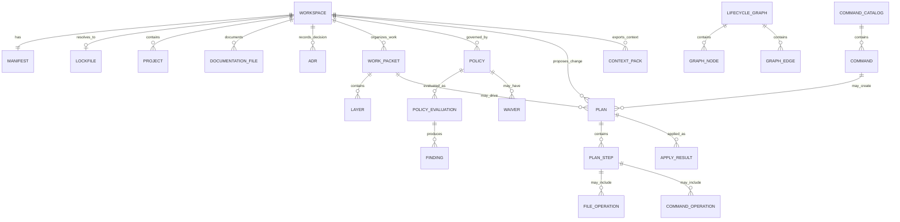
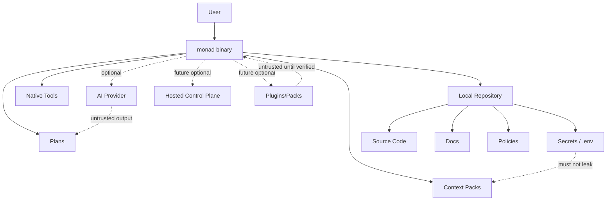

# Monad OS / Monad CLI

# Enterprise-Grade Product Planning Package

# Part 2: Data, APIs, Security, Infrastructure, Operations, Testing, and BDD

## Running Table of Contents

Part 1.
1. Product Understanding and Assumptions
2. Executive Summary
3. Product Charter
4. Product Requirements Document
5. Domain Model and DDD Design
6. Architecture Strategy
7. AI Architecture

Part 2.
8. Data Architecture
9. API and Integration Design
10. Security, Privacy, Compliance, and Governance
11. Infrastructure and Cloud-Agnostic Deployment Plan
12. Observability and Operations
13. Testing Strategy
14. BDD Specification Set

Part 3.
15. Implementation Roadmap
16. Initial Repository and Documentation Structure
17. Initial Documentation Files

Part 4.
18. ADR Set
19. Traceability Matrix
20. Risk Register
21. Governance and Decision System
22. Execution Plan
23. Recommended Technology Strategy
24. Final Review

This document covers sections 8 through 14.

---

# 8. Data Architecture

## 8.1 Data Architecture Summary

Monad OS should begin with a deterministic, file-backed data architecture.

At the current stage, Monad does not need a database. Its first source of truth should be structured repository files, especially:

```text id="hcb3b7"
monad.toml
monad.lock
.monad/
docs/
governance/
policies/
work-packets/
architecture decision records
native package manifests
native workspace manifests
CI workflow files
tool configuration files
```

The long-term product may later support graph stores, relational stores, embedded databases, hosted metadata services, and search/vector indexes. However, the early local-first version should not depend on any required database.

The recommended strategy is:

> Use files as the canonical local source of truth, expose stable domain models internally, and keep persistence behind ports so that future storage backends can be added without rewriting the product.

## 8.2 Data Architecture Principles

1. `monad.toml` is canonical.
2. `workspace.toml` is a compatibility mirror only.
3. `monad.lock` records resolved state.
4. `.monad/` stores local runtime/cache/state artifacts.
5. Native manifests remain authoritative for native tools.
6. Monad should coordinate native tool metadata, not overwrite it blindly.
7. Generated data should be traceable to its source.
8. Cached data must be invalidatable.
9. AI context data must exclude secrets by default.
10. Future database support must be adapter-based.

## 8.3 Canonical Data Sources

### 8.3.1 Canonical Monad Manifest

```text id="hvyzfm"
monad.toml
```

Purpose:

* identifies the workspace,
* declares Monad schema version,
* defines canonical Monad configuration,
* describes workspace intent,
* declares supported packs/profiles,
* defines policy sources,
* identifies docs/governance conventions,
* defines context generation rules,
* declares source-of-truth behavior.

Recommended early shape:

```toml id="vny30v"
schema_version = "0.1"
workspace_name = "monad-cli"
workspace_kind = "monorepo"

[manifest]
canonical = "monad.toml"
compatibility_mirror = "workspace.toml"

[paths]
docs = "docs"
governance = "governance"
policies = "policies"
work_packets = "docs/work-packets"
adrs = "docs/architecture/decision-records"

[commands]
catalog = "crates/monad-cli/src/command_catalog.rs"

[context]
default_output = ".monad/context"
include_git_status = true
include_command_catalog = true
include_docs_status = true
include_policy_status = true

[mutation]
require_plan_for_mutation = true
default_dry_run = true

[ai]
enabled = false
provider = "none"
```

### 8.3.2 Compatibility Mirror

```text id="rk7gg4"
workspace.toml
```

Purpose:

* supports older or adjacent workflows,
* mirrors selected canonical data,
* must not override `monad.toml`.

Policy:

```text id="g5650m"
If monad.toml and workspace.toml conflict, monad.toml wins.
```

### 8.3.3 Lockfile

```text id="bva877"
monad.lock
```

Purpose:

* records resolved pack versions,
* records policy bundle versions,
* records template versions,
* records schema resolution,
* records plugin checksums in the future,
* improves reproducibility.

Recommended early shape:

```toml id="krbxmy"
schema_version = "0.1"
generated_by = "monad"
generated_at = "2026-07-03T00:00:00Z"

[workspace]
name = "monad-cli"
manifest_hash = "sha256:..."

[[packs]]
name = "core"
version = "0.1.0"
checksum = "sha256:..."

[[policies]]
name = "canonical-manifest"
version = "0.1.0"
checksum = "sha256:..."
```

### 8.3.4 Local State Directory

```text id="shl5wa"
.monad/
```

Purpose:

* stores local cache,
* stores generated context packs,
* stores inspection snapshots,
* stores dry-run outputs,
* stores temporary plan artifacts,
* stores local-only runtime metadata.

Recommended structure:

```text id="paxbh8"
.monad/
  cache/
  context/
  inspections/
  graph/
  plans/
  tmp/
```

Important rule:

> `.monad/` should not be treated as portable source of truth unless a specific file is intentionally promoted and documented.

## 8.4 Logical Data Model

Core logical entities:

```text id="octytq"
Workspace
Manifest
Lockfile
Project
Domain
Command
CommandCatalog
InspectionReport
Finding
LifecycleGraph
GraphNode
GraphEdge
ContextPack
Handoff
DocumentationFile
ADR
WorkPacket
Layer
Policy
PolicyEvaluation
Waiver
Plan
PlanStep
FileOperation
CommandOperation
ApplyResult
Pack
Template
Plugin
Profile
```

## 8.5 Conceptual Data Model



## 8.6 Physical Data Storage Strategy

## Phase 1: File-Backed Only

Use:

```text id="0s9cmn"
TOML for manifests
Markdown for docs and governance records
JSON for machine-readable generated reports
Mermaid/DOT for graph exports
Plain text for human output
```

Rationale:

* local-first,
* easy to version in Git,
* easy to diff,
* no service dependency,
* works for solo developers,
* compatible with documentation-as-code.

## Phase 2: Optional Embedded Index

Potential future use:

```text id="x5stfy"
SQLite
```

Purpose:

* cache inspection results,
* speed up large repo queries,
* index graph nodes/edges,
* enable local search.

Why SQLite:

* local-first,
* serverless,
* portable,
* well understood,
* easy to delete/rebuild.

SQLite must not become mandatory source of truth early.

## Phase 3: Optional Hosted Metadata Store

Potential future use:

```text id="3wbs8a"
PostgreSQL
```

Purpose:

* team dashboards,
* repo fleet governance,
* compliance evidence,
* cross-repo graph queries,
* organizational policy reporting.

Postgres should be an optional hosted control-plane backend, not required for local CLI value.

## Phase 4: Optional Graph/Search/Vector Stores

Potential future adapters:

```text id="c7t9oz"
Neo4j / Memgraph / Kuzu for graph workloads
OpenSearch / Meilisearch / Tantivy for search
Qdrant / pgvector / LanceDB for vector search
Object storage for artifacts
```

These should remain optional.

## 8.7 Database-Agnostic Persistence Design

Use ports for persistence:

```rust id="2m8e99"
pub trait WorkspaceStore {
    fn load_workspace(&self, root: &WorkspaceRoot) -> Result<Workspace>;
    fn save_workspace_state(&self, workspace: &Workspace) -> Result<()>;
}

pub trait GraphStore {
    fn load_graph(&self, workspace: &WorkspaceId) -> Result<LifecycleGraph>;
    fn save_graph(&self, graph: &LifecycleGraph) -> Result<()>;
}

pub trait PlanStore {
    fn save_plan(&self, plan: &Plan) -> Result<()>;
    fn load_plan(&self, id: &PlanId) -> Result<Plan>;
}

pub trait PolicyStore {
    fn load_policies(&self, workspace: &Workspace) -> Result<Vec<Policy>>;
}

pub trait ContextStore {
    fn save_context_pack(&self, pack: &ContextPack) -> Result<()>;
}
```

Initial adapters:

```text id="sx74ej"
FileWorkspaceStore
FileGraphStore
FilePlanStore
FilePolicyStore
FileContextStore
```

Future adapters:

```text id="c5xell"
SqliteGraphStore
PostgresControlPlaneStore
ObjectStorageArtifactStore
SearchIndexStore
VectorContextStore
```

## 8.8 Migration Strategy

Because Monad is file-first, migrations apply to:

* manifest schema versions,
* lockfile schema versions,
* plan schema versions,
* policy schema versions,
* context pack schema versions,
* graph schema versions.

Recommended migration commands:

```bash id="mnjejt"
monad migrate check
monad migrate plan
monad migrate apply --dry-run
monad migrate apply --yes
```

Migration principles:

1. Never silently rewrite source-of-truth files.
2. Always generate a migration plan.
3. Preserve backups or rollback hints.
4. Explain breaking changes.
5. Validate after migration.
6. Use semantic schema versions.

## 8.9 Data Classification

Recommended classification levels:

```text id="21gdh5"
public
internal
confidential
secret
regulated
```

Initial file handling:

| Data Type          | Likely Classification | Notes                           |
| ------------------ | --------------------- | ------------------------------- |
| README             | Public/Internal       | Depends on repo.                |
| ADRs               | Internal              | May reveal strategy.            |
| Work packets       | Internal              | May reveal roadmap.             |
| Policy files       | Internal              | May reveal controls.            |
| Context packs      | Internal/Confidential | Must exclude secrets.           |
| Secrets            | Secret                | Must never enter context packs. |
| Audit logs         | Confidential          | May contain sensitive metadata. |
| AI prompts/context | Internal/Confidential | Must be scrubbed.               |

## 8.10 Data Privacy Strategy

Even though early Monad is local-first, it should still treat privacy seriously.

Controls:

* no telemetry by default,
* no AI upload by default,
* no external calls without explicit configuration,
* secrets excluded from context packs,
* `.env` and secret-like files ignored by default,
* context redaction rules,
* explicit warning for exporting repository context,
* optional allowlist-based context generation.

## 8.11 Data Retention Strategy

Local retention defaults:

```text id="x8gs74"
inspection snapshots: optional and cacheable
plans: retained if explicitly saved
context packs: retained in .monad/context
dry-run outputs: safe to delete
logs: minimal by default
```

Future hosted retention should support:

* configurable retention policies,
* tenant-level data deletion,
* audit retention,
* compliance evidence retention,
* export/delete workflows.

## 8.12 Data Lineage

Monad should track lineage for generated artifacts.

Example metadata:

```yaml id="wolahi"
generated_by: monad
generator: docs.generate
source_manifest: monad.toml
source_manifest_hash: sha256:...
created_at: 2026-07-03T00:00:00Z
plan_id: plan_...
work_packet: WP-0003
```

This enables auditability and safe regeneration.

## 8.13 Data Architecture Risks

| Risk                   | Description                                            | Mitigation                                 |
| ---------------------- | ------------------------------------------------------ | ------------------------------------------ |
| Competing truths       | `workspace.toml` conflicts with `monad.toml`.          | Canonical manifest policy.                 |
| Cache treated as truth | `.monad/` artifacts become authoritative accidentally. | Clear docs and validation.                 |
| Over-abstraction       | Database agnosticism creates weak models.              | Keep rich domain model; adapters at edges. |
| Secret leakage         | Context packs include sensitive files.                 | Redaction and ignore rules.                |
| Schema drift           | Generated artifacts become incompatible.               | Schema versioning and migrations.          |
| Future hosted lock-in  | SaaS layer becomes required.                           | Keep local-first contract.                 |

---

# 9. API and Integration Design

## 9.1 API Strategy Summary

Monad’s first API is the CLI.

The second API is structured machine-readable command output.

The third API is the internal Rust crate API.

The fourth future API may be a local daemon or hosted control-plane API.

Recommended API maturity path:

```text id="nqvdcq"
1. CLI UX
2. JSON/Markdown/Mermaid/DOT outputs
3. Stable internal Rust domain contracts
4. Local file schemas
5. Optional plugin API
6. Optional local daemon API
7. Optional hosted REST/GraphQL API
```

## 9.2 CLI API

The CLI should be treated as a public API.

Command names, flags, output formats, and exit codes should be designed carefully.

### CLI Design Principles

1. Commands should be discoverable.
2. Read-only commands should be safe by default.
3. Mutating commands should use dry-run or plan/apply.
4. Structured output should be available.
5. Human output should be clear.
6. JSON output should be stable.
7. Placeholder commands should be honest.
8. Exit codes should be meaningful.

## 9.3 Recommended Top-Level Command Surface

```text id="6l0adg"
monad init
monad add
monad remove
monad rename
monad move
monad list
monad inspect
monad check
monad doctor
monad plan
monad apply
monad diff
monad generate
monad sync
monad run
monad build
monad test
monad lint
monad format
monad graph
monad clean
monad migrate
monad upgrade
monad context
monad config
monad version
```

## 9.4 Recommended Namespaced Command Surface

```text id="90bviy"
monad policy check
monad policy waive
monad policy explain

monad template list
monad template add
monad template inspect

monad pack list
monad pack install
monad pack update

monad plugin list
monad plugin install
monad plugin remove

monad release plan
monad release apply
monad release publish

monad context pack
monad context verify
monad context handoff

monad graph projects
monad graph tasks
monad graph deps

monad docs generate
monad docs check

monad adr new
monad adr list
monad adr supersede

monad workpacket new
monad workpacket list
monad workpacket plan
```

## 9.5 Output Format Strategy

Recommended standard flags:

```bash id="0t0dj2"
--format text
--format json
--format markdown
--format mermaid
--format dot
```

Not every command needs every format.

Recommended defaults:

| Command Type      | Default  | Additional Formats |
| ----------------- | -------- | ------------------ |
| Human diagnostics | text     | json, markdown     |
| Reports           | markdown | json               |
| Graphs            | text     | json, mermaid, dot |
| Plans             | text     | json, markdown     |
| Context           | markdown | json               |
| CI checks         | text     | json               |

## 9.6 Exit Code Strategy

Recommended exit codes:

```text id="u4jafj"
0  success
1  general failure
2  validation failed
3  configuration error
4  workspace not found
5  command not implemented
6  policy violation
7  unsafe mutation blocked
8  plan required
9  apply failed
10 external tool failed
```

## 9.7 Internal Rust API Boundaries

Internal crates should expose stable domain-facing APIs.

Example:

```rust id="1ofwnj"
pub trait InspectRepository {
    fn inspect(&self, workspace: &Workspace) -> Result<InspectionReport>;
}

pub trait BuildGraph {
    fn build_graph(&self, workspace: &Workspace, inspection: &InspectionReport) -> Result<LifecycleGraph>;
}

pub trait EvaluatePolicy {
    fn evaluate_workspace(&self, workspace: &Workspace) -> Result<PolicyEvaluation>;
    fn evaluate_plan(&self, plan: &Plan) -> Result<PolicyEvaluation>;
}

pub trait GenerateContext {
    fn generate_handoff(&self, workspace: &Workspace) -> Result<Handoff>;
}

pub trait CreatePlan {
    fn create_plan(&self, request: PlanRequest) -> Result<Plan>;
}

pub trait ApplyPlan {
    fn dry_run(&self, plan: &Plan) -> Result<ApplyResult>;
    fn apply(&self, plan: &Plan, approval: Approval) -> Result<ApplyResult>;
}
```

## 9.8 File Schema API

Monad file formats are also APIs.

Versioned schemas should exist for:

```text id="cvf85k"
monad.toml
monad.lock
plan.json
inspection-report.json
graph.json
context-pack.json
policy-result.json
docs-report.json
command-catalog.json
```

Schema requirements:

* include `schema_version`,
* include generator version,
* include workspace identity where relevant,
* avoid unstable field names,
* support future-compatible parsing where possible.

## 9.9 Native Tool Integration Strategy

Monad should integrate with native tools through adapters.

Potential adapters:

```text id="z963lk"
CargoAdapter
BunAdapter
NpmAdapter
PnpmAdapter
MoonAdapter
TurborepoAdapter
BiomeAdapter
DockerAdapter
GitAdapter
GitHubActionsAdapter
PolicyToolAdapter
SecurityToolAdapter
```

Adapter principles:

1. Detect native tool presence.
2. Read native manifests without overwriting.
3. Delegate execution when appropriate.
4. Normalize results into Monad findings.
5. Preserve native tool authority.
6. Avoid becoming a replacement unless explicitly intended.

## 9.10 API Versioning Strategy

Use layered versioning:

```text id="1mj1vg"
CLI version: semantic versioning
Manifest schema version: explicit schema_version
Plan schema version: explicit schema_version
JSON output version: explicit schema_version
Pack version: semantic versioning
Policy bundle version: semantic versioning
Plugin API version: explicit compatibility range
```

## 9.11 Contract Testing Strategy

Contract tests should verify:

* command catalog matches CLI surface,
* JSON output conforms to schema,
* manifest parsing supports documented schema,
* plan schema remains compatible,
* native tool adapter outputs normalize correctly,
* generated docs match documented behavior.

## 9.12 Future Hosted API

If a hosted control plane is added later, recommended APIs:

```text id="ee571n"
REST for resource operations
GraphQL for graph/dashboard exploration
AsyncAPI/events for repo sync and governance events
Webhooks for CI/release integration
```

Do not build this first.

---

# 10. Security, Privacy, Compliance, and Governance

## 10.1 Security Summary

Monad is a developer tool that reads repository files and eventually may write files and execute native tools.

That makes its security model important even before a hosted product exists.

Primary risks:

* accidental destructive mutation,
* secret leakage into context packs,
* unsafe execution of external tools,
* malicious plugins/packs,
* supply-chain compromise,
* misleading generated docs,
* untrusted AI-generated plans,
* policy bypass.

## 10.2 Security Principles

1. Safe by default.
2. No external network calls by default.
3. No telemetry by default.
4. No AI calls by default.
5. No mutation without explicit plan/apply or approval.
6. No secret inclusion in context by default.
7. No plugin execution without trust model.
8. No silent policy waivers.
9. No hidden file rewrites.
10. Human-readable and machine-readable audit evidence.

## 10.3 Threat Model

### Assets

```text id="0x52e7"
source code
repository structure
secrets
environment files
credentials
architecture decisions
work packets
plans
policies
context packs
generated artifacts
developer machine
CI environment
```

### Actors

```text id="nswior"
developer
maintainer
platform engineer
malicious contributor
malicious pack author
compromised dependency
AI assistant
CI runner
future hosted control plane user
```

### Trust Boundaries

```text id="bhfsry"
User terminal
Local monad binary
Local repository
Native tools
Generated plans
External plugins/packs
AI providers
CI systems
Future hosted service
```

## 10.4 Trust Boundary Diagram



## 10.5 Core Security Controls

### SEC-001: Secret Redaction

Context generation must ignore likely secret files:

```text id="xs8e1m"
.env
.env.*
*.pem
*.key
*.p12
*.pfx
id_rsa
id_ed25519
secrets.*
credentials.*
```

It should also scan for likely secret patterns before exporting context.

### SEC-002: Explicit Mutation Approval

Mutating operations require one of:

```text id="8qfqkh"
--dry-run
--plan
--yes
```

Dangerous operations should require extra confirmation.

### SEC-003: Plan Visibility

Plans must list:

* file creates,
* file modifications,
* file deletions,
* external commands,
* risks,
* policy findings,
* rollback hints.

### SEC-004: Policy Gate

Plans should be policy-evaluated before apply.

### SEC-005: Plugin Trust

Future plugin execution should require:

* signed plugin metadata,
* checksum pinning,
* declared permissions,
* explicit install,
* sandboxing where practical.

### SEC-006: No Network by Default

No network calls unless the user explicitly enables:

* update checks,
* pack registry,
* AI provider,
* hosted sync,
* telemetry.

### SEC-007: Supply Chain Controls

Use:

* pinned dependencies where appropriate,
* dependency auditing,
* SBOM generation,
* cargo audit,
* cargo deny,
* vulnerability scanning,
* release artifact checksums.

## 10.6 Privacy Controls

Privacy controls:

* local-first data stays local,
* no telemetry by default,
* context export requires explicit command,
* AI export requires explicit provider and approval,
* sensitive file exclusion,
* user-controlled ignore patterns,
* future hosted sync opt-in only.

## 10.7 Compliance Mapping

Monad can support compliance evidence later, especially for:

```text id="u2z9yn"
SOC 2-style SDLC controls
ISO 27001-style change management controls
NIST SSDF-style secure development practices
SLSA-style supply-chain controls
internal enterprise SDLC policies
```

Early Monad should not claim certification.

It should instead produce useful evidence artifacts:

```text id="egholk"
policy reports
change plans
ADR index
work packet status
test reports
release readiness reports
security findings
dependency reports
context export logs
```

## 10.8 Governance Workflows

Recommended governance workflows:

### ADR Workflow

```text id="en2xkw"
draft -> proposed -> accepted -> superseded/deprecated
```

### Work Packet Workflow

```text id="88sq6b"
planned -> active -> review -> complete -> archived
```

### Plan Workflow

```text id="3n3mn5"
created -> reviewed -> dry-run passed -> policy passed -> approved -> applied -> verified
```

### Policy Waiver Workflow

```text id="bdfg87"
requested -> justified -> approved -> expires -> reviewed
```

### Release Workflow

```text id="02la58"
planned -> candidate -> validated -> approved -> released -> post-release reviewed
```

## 10.9 Risk Register Integration

Security findings should map to:

* risk IDs,
* policy IDs,
* work packets,
* release gates,
* remediation plans.

## 10.10 Security Non-Goals for Early Versions

Early Monad does not need:

* enterprise SSO,
* remote access controls,
* hosted RBAC,
* cloud KMS,
* centralized audit backend,
* plugin marketplace,
* real-time threat detection.

But it must not make those impossible.

---

# 11. Infrastructure and Cloud-Agnostic Deployment Plan

## 11.1 Infrastructure Summary

The first version of Monad requires almost no infrastructure.

This is a strength.

Initial deployment:

```text id="jk3sfv"
Developer Machine
  └─ monad binary
      └─ local repository
```

Optional future infrastructure:

```text id="x8yt55"
local cache
editor integrations
CI integration
pack registry
hosted control plane
team dashboard
graph explorer
policy reporting service
```

## 11.2 Local Development Environment

Recommended local baseline:

```text id="c7tkk3"
Rust stable
Cargo
Git
optional: Bun / Node
optional: Docker
optional: just / make
optional: cargo-nextest
optional: cargo-deny
optional: cargo-audit
```

## 11.3 Container Strategy

Monad itself should not require containers.

However, the repository should support:

* devcontainers,
* reproducible CI,
* release builds,
* integration test environments,
* future packaged distribution.

Possible files:

```text id="bdqdcw"
.devcontainer/devcontainer.json
Dockerfile
docker-compose.yml
```

Use containers for reproducibility, not as a hard local requirement.

## 11.4 Orchestration Strategy

Early:

```text id="wgb8rh"
None required.
```

Future optional:

```text id="oe57cb"
Docker Compose for local demos
Kubernetes for hosted control plane
Nomad as an alternative deployment target
```

No orchestration should be required to use the CLI.

## 11.5 Infrastructure-as-Code Strategy

Early IaC is not required for the local CLI.

Future hosted control plane may use:

```text id="o1pm94"
Terraform
Pulumi
OpenTofu
Helm
Kustomize
```

Cloud-agnostic design should separate:

```text id="wlaz06"
compute
storage
database
object storage
queue/event bus
secrets
observability
identity
networking
```

## 11.6 Secrets Management Strategy

Local CLI:

* reads no secrets unless explicitly asked,
* avoids including secrets in generated context,
* respects `.gitignore` and Monad-specific ignore rules,
* supports `.monadignore` or context ignore rules in the future.

Future hosted:

* HashiCorp Vault,
* SOPS,
* age,
* cloud KMS adapters,
* External Secrets,
* Infisical as optional provider.

No secret provider should be mandatory.

## 11.7 Cloud Portability Matrix

| Capability     | Local Default     | AWS             | GCP            | Azure              | Cloudflare            | Self-Hosted      |
| -------------- | ----------------- | --------------- | -------------- | ------------------ | --------------------- | ---------------- |
| CLI runtime    | Binary            | Binary          | Binary         | Binary             | Binary                | Binary           |
| Metadata store | Files/SQLite      | RDS             | Cloud SQL      | Azure DB           | D1/Workers KV limited | Postgres         |
| Object storage | Filesystem        | S3              | GCS            | Blob               | R2                    | MinIO            |
| Queue          | None initially    | SQS             | Pub/Sub        | Service Bus        | Queues                | NATS/Redis       |
| Secrets        | Local env ignored | Secrets Manager | Secret Manager | Key Vault          | Secrets               | Vault/SOPS       |
| Observability  | Local logs        | CloudWatch      | Cloud Ops      | Azure Monitor      | Analytics             | OTel stack       |
| Hosted app     | None initially    | ECS/EKS         | Cloud Run/GKE  | Container Apps/AKS | Workers               | Kubernetes/Nomad |

## 11.8 CI/CD Strategy

Initial CI should run:

```bash id="lekf88"
cargo fmt --all --check
cargo check --workspace
cargo test --workspace
cargo clippy --workspace -- -D warnings
```

Later CI should add:

```bash id="2sj9i2"
cargo deny check
cargo audit
cargo nextest run
cargo llvm-cov
schema validation
snapshot tests
release build checks
SBOM generation
artifact signing
```

## 11.9 Release Infrastructure

Recommended release path:

1. local build,
2. CI build,
3. cross-platform release artifacts,
4. checksums,
5. signed release artifacts later,
6. GitHub Releases initially,
7. package managers later.

Potential distribution channels:

```text id="6j4me7"
GitHub Releases
cargo install
Homebrew tap
Scoop
Nix flake
asdf/mise plugin
Docker image, optional
```

## 11.10 Disaster Recovery

For local CLI:

* source code in Git,
* releases in GitHub,
* generated artifacts reproducible from source,
* docs in repo.

For future hosted service:

* database backups,
* object storage versioning,
* IaC redeploy,
* tenant export,
* disaster recovery runbooks,
* recovery time/recovery point objectives.

## 11.11 Infrastructure Non-Goals

Early Monad does not need:

* Kubernetes,
* cloud accounts,
* hosted database,
* message broker,
* object storage,
* service mesh,
* distributed tracing backend,
* multi-region deployment.

---

# 12. Observability and Operations

## 12.1 Observability Summary

For a local CLI, observability means:

* clear terminal output,
* structured JSON output,
* useful error messages,
* debug mode,
* trace mode,
* diagnostic reports,
* reproducible findings,
* CI-friendly exit codes.

For future hosted control plane, observability expands to logs, metrics, traces, dashboards, SLOs, and incident response.

## 12.2 Observability Principles

1. Every command should explain what it did.
2. Every failure should include a useful remediation hint.
3. Every check should produce structured findings.
4. Every plan should list intended effects.
5. Every apply should produce an apply report.
6. Debug output should be opt-in.
7. Machine-readable outputs should be stable.
8. Future hosted telemetry must be opt-in.

## 12.3 Logging Strategy

Local CLI log levels:

```text id="az2wvs"
error
warn
info
debug
trace
```

Potential flags:

```bash id="ho387s"
--verbose
--quiet
--debug
--trace
--log-format text
--log-format json
```

Default output should not be noisy.

## 12.4 Findings Model

Many commands should normalize output into findings.

Recommended model:

```rust id="njixfe"
pub enum Severity {
    Info,
    Warning,
    Error,
    Critical,
}

pub struct Finding {
    pub id: String,
    pub severity: Severity,
    pub title: String,
    pub message: String,
    pub path: Option<PathBuf>,
    pub remediation: Option<String>,
    pub policy_id: Option<String>,
}
```

## 12.5 Health Checks

For a CLI, health checks become diagnostics.

Command:

```bash id="4p2v59"
monad doctor
```

Should check:

* workspace root,
* manifest presence,
* canonical source-of-truth consistency,
* command catalog integrity,
* expected docs presence,
* native tool availability,
* known config problems,
* policy configuration,
* context output path,
* Git repository status.

## 12.6 Readiness Checks

For CI:

```bash id="lbzdhk"
monad check --ci
```

Should exit nonzero on blocking issues.

## 12.7 SLOs for Local CLI

Potential product-level SLOs:

| Area                     | Target                                            |
| ------------------------ | ------------------------------------------------- |
| Command catalog contract | 100% tested                                       |
| Read-only command safety | No file mutations                                 |
| Plan visibility          | 100% of file ops listed before apply              |
| Secret redaction         | No known secret file patterns included by default |
| Schema compatibility     | No unversioned output schemas                     |
| CI reliability           | Main branch remains green                         |

## 12.8 Metrics

Local CLI metrics are not sent anywhere by default.

Possible local metrics:

* command duration,
* files scanned,
* findings count,
* graph nodes/edges count,
* plan steps count,
* policy evaluation count.

Future hosted metrics:

* active repos,
* policy pass/fail rate,
* stale docs count,
* unreviewed ADRs,
* open waivers,
* release readiness,
* AI context exports,
* plan apply success/failure.

## 12.9 Alerting

Early local CLI:

* no alerting required.

Future hosted:

* policy drift alerts,
* stale docs alerts,
* failed check alerts,
* risky plan alerts,
* expired waiver alerts,
* release gate alerts,
* sync failure alerts.

## 12.10 Runbooks

Initial runbooks:

```text id="f6tkfs"
docs/operations/runbooks/workspace-not-detected.md
docs/operations/runbooks/manifest-conflict.md
docs/operations/runbooks/command-catalog-mismatch.md
docs/operations/runbooks/docs-check-failed.md
docs/operations/runbooks/context-export-safety.md
docs/operations/runbooks/plan-apply-failed.md
```

## 12.11 Incident Response

For local CLI, incidents are mostly release defects or unsafe behavior.

Incident categories:

* destructive mutation bug,
* secret leakage bug,
* incorrect policy pass,
* incompatible schema release,
* broken command contract,
* malicious dependency,
* compromised release artifact.

Incident response should include:

1. freeze release,
2. publish advisory,
3. patch,
4. add regression test,
5. update risk register,
6. document postmortem,
7. improve safety control.

## 12.12 Operational Maturity Roadmap

### Stage 1: Local Diagnostics

* `monad doctor`
* structured findings
* debug flags
* CI exit codes

### Stage 2: Reports

* inspection reports,
* docs reports,
* graph reports,
* policy reports,
* context reports.

### Stage 3: Plan/Apply Audit

* plan IDs,
* dry-run reports,
* apply reports,
* rollback hints.

### Stage 4: Team Governance

* release readiness,
* waiver tracking,
* work packet status,
* ADR status.

### Stage 5: Hosted Observability

* fleet dashboards,
* policy compliance trends,
* graph explorer,
* alerts,
* audit evidence.

---

# 13. Testing Strategy

## 13.1 Testing Summary

Monad must be built with a serious TDD/BDD/DDD-compatible testing model.

Testing must protect:

* command surface,
* manifest parsing,
* source-of-truth rules,
* read-only command safety,
* graph generation,
* context generation,
* policy evaluation,
* plan/apply safety,
* output schemas,
* documentation consistency,
* native tool integration,
* migration behavior.

## 13.2 Testing Philosophy

Monad’s test strategy should be based on this principle:

> If Monad claims to understand, validate, document, or mutate a repository, there must be tests proving that behavior.

## 13.3 Test Categories

### 13.3.1 Unit Tests

Purpose:

* validate pure domain logic,
* test manifest resolution,
* test command metadata,
* test policy rules,
* test plan models,
* test graph node/edge creation.

Examples:

```text id="wpu3hy"
canonical_manifest_wins_over_workspace_mirror
command_metadata_declares_mutation_status
plan_requires_steps_before_apply
policy_finding_has_stable_id
context_redaction_excludes_env_files
```

### 13.3.2 Integration Tests

Purpose:

* test commands against fixture repositories.

Example fixtures:

```text id="1g2osn"
fixtures/empty-repo
fixtures/minimal-monad-repo
fixtures/manifest-conflict-repo
fixtures/rust-workspace
fixtures/polyglot-workspace
fixtures/docs-missing-repo
fixtures/policy-violation-repo
```

### 13.3.3 CLI Smoke Tests

Purpose:

* verify real binary behavior.

Examples:

```bash id="vel6to"
monad version
monad list
monad config
monad inspect
monad check
monad doctor
```

### 13.3.4 Contract Tests

Purpose:

* ensure command catalog and CLI surface remain aligned.

Existing contract pattern should be expanded:

```text id="ru6t61"
clap_surface_exposes_every_catalog_command
catalog_does_not_claim_unknown_example_commands
implemented_commands_have_tests
mutating_commands_declare_plan_status
placeholder_commands_are_honest
```

### 13.3.5 Snapshot Tests

Purpose:

* prevent accidental output regressions.

Use for:

* help output,
* command list output,
* inspect output,
* graph Mermaid output,
* context handoff output,
* docs reports,
* policy reports.

### 13.3.6 Schema Tests

Purpose:

* validate JSON outputs.

Schemas:

```text id="dbq5m9"
command-catalog.schema.json
inspection-report.schema.json
graph.schema.json
context-pack.schema.json
plan.schema.json
policy-report.schema.json
docs-report.schema.json
```

### 13.3.7 Property-Based Tests

Useful for:

* path normalization,
* graph invariants,
* command name parsing,
* manifest merge behavior,
* plan operation ordering.

Examples:

```text id="sgwos9"
graph_edges_never_reference_missing_nodes
normalized_paths_are_idempotent
manifest_resolution_is_deterministic
plan_step_ordering_is_stable
```

### 13.3.8 Mutation Safety Tests

Before enabling mutation, test:

* dry-run does not write files,
* apply writes only planned files,
* apply refuses unapproved plans,
* file deletion requires explicit approval,
* failed apply reports partial state,
* rollback hints are generated.

### 13.3.9 Security Tests

Test:

* context excludes secrets,
* `.env` files ignored,
* private key patterns redacted,
* plugins disabled by default,
* network disabled by default,
* unsafe command blocked without approval.

### 13.3.10 BDD Tests

Use Gherkin-style scenarios for core workflows:

* inspect repo,
* check repo,
* generate handoff,
* create plan,
* dry-run plan,
* apply plan,
* detect manifest conflict,
* block unsafe mutation.

### 13.3.11 AI Evaluation Tests

Since AI is optional, early tests should validate deterministic AI-free behavior.

Future AI tests:

* context pack quality,
* prompt template rendering,
* provider fallback,
* AI output converted to plan,
* unsafe AI suggestion rejected by policy.

## 13.4 Test Pyramid / Trophy

Recommended shape:

```text id="mx7osx"
Many unit tests
Many fixture integration tests
Moderate CLI smoke tests
Moderate contract/schema tests
Some BDD end-to-end tests
Few expensive native-tool integration tests
```

## 13.5 TDD Workflow

Recommended cycle:

```text id="dbj8ab"
1. Write failing unit/contract/fixture test.
2. Implement smallest domain behavior.
3. Add CLI integration if command-facing.
4. Add snapshot/schema test if output-facing.
5. Update docs.
6. Run full workspace tests.
```

## 13.6 BDD Workflow

For each user-visible workflow:

```text id="cvzp26"
Feature
  Scenario
    Given repo fixture
    When command runs
    Then expected finding/output/exit code occurs
```

BDD scenarios should map to work packet acceptance criteria.

## 13.7 DDD Testing Alignment

Each bounded context should own tests:

```text id="qfn8u4"
Workspace Context -> manifest/source-of-truth tests
Command Context -> catalog/CLI contract tests
Inspection Context -> fixture repo tests
Graph Context -> graph invariant tests
Governance Context -> ADR/work-packet tests
Plan Context -> plan/apply tests
Policy Context -> policy evaluation tests
Context Context -> handoff/context tests
Docs Context -> docs check/generate tests
```

## 13.8 CI Quality Gates

Minimum early gate:

```bash id="spw5ip"
cargo fmt --all --check
cargo check --workspace
cargo test --workspace
```

Stronger gate:

```bash id="rsmcyv"
cargo clippy --workspace --all-targets -- -D warnings
cargo test --workspace
cargo test -p monad-cli --test command_catalog_contract
```

Future gate:

```bash id="r8tm9q"
cargo deny check
cargo audit
cargo nextest run
cargo llvm-cov
schema validation
snapshot tests
docs check
policy check
```

## 13.9 Definition of Ready

A work packet is ready when it has:

* purpose,
* scope,
* out-of-scope,
* affected bounded contexts,
* acceptance criteria,
* tests to add,
* docs to update,
* risks,
* rollback plan if mutating,
* known dependencies.

## 13.10 Definition of Done

A work packet is done when:

* implementation is complete,
* tests pass,
* command catalog is updated,
* docs are updated,
* ADRs are added if needed,
* examples are updated if needed,
* safety constraints are preserved,
* acceptance criteria are satisfied,
* CI is green.

---

# 14. BDD Specification Set

## 14.1 Feature: Repository Version Command

```gherkin id="xibhph"
Feature: Version reporting

  Scenario: User checks the Monad version
    Given the Monad CLI is installed
    When the user runs "monad version"
    Then the command exits successfully
    And the output includes the current Monad version
```

## 14.2 Feature: Command Catalog

```gherkin id="yexzi0"
Feature: Command catalog visibility

  Scenario: User lists known commands
    Given the Monad CLI is installed
    When the user runs "monad list"
    Then the command exits successfully
    And the output includes implemented commands
    And the output includes planned commands
    And planned commands are clearly marked as not fully implemented
```

```gherkin id="mz2gza"
Feature: Command catalog contract

  Scenario: CLI surface matches command catalog
    Given the command catalog contains a command named "config list"
    When the command catalog contract test runs
    Then the Clap command tree exposes "config list"
```

## 14.3 Feature: Canonical Manifest

```gherkin id="x278g9"
Feature: Canonical manifest resolution

  Scenario: monad.toml exists
    Given a repository contains "monad.toml"
    When the user runs "monad config inspect"
    Then Monad treats "monad.toml" as the canonical manifest
```

```gherkin id="owl9pa"
Feature: Compatibility mirror handling

  Scenario: workspace.toml conflicts with monad.toml
    Given a repository contains "monad.toml"
    And the repository contains "workspace.toml"
    And the two files disagree
    When the user runs "monad check"
    Then Monad reports a source-of-truth warning or error
    And Monad states that "monad.toml" is canonical
```

## 14.4 Feature: Repository Inspection

```gherkin id="lh4yi2"
Feature: Repository inspection

  Scenario: User inspects a valid Monad workspace
    Given a valid Monad workspace
    When the user runs "monad inspect"
    Then Monad reports the workspace name
    And Monad reports known project areas
    And Monad reports detected native tool manifests
    And Monad does not modify any files
```

```gherkin id="msk8rz"
Feature: Repository inspection safety

  Scenario: Inspect command is read-only
    Given a repository with tracked files
    When the user runs "monad inspect"
    Then no files are created
    And no files are modified
    And no files are deleted
```

## 14.5 Feature: Repository Check

```gherkin id="ft9zvl"
Feature: Repository validation

  Scenario: Valid repository passes baseline checks
    Given a repository that satisfies Monad baseline invariants
    When the user runs "monad check"
    Then the command exits successfully
    And the output reports no blocking findings
```

```gherkin id="l3x3ok"
Feature: Repository validation

  Scenario: Missing canonical manifest is reported
    Given a repository without "monad.toml"
    When the user runs "monad check"
    Then Monad reports a configuration finding
    And the output suggests creating or initializing a canonical manifest
```

## 14.6 Feature: Doctor Diagnostics

```gherkin id="p2vjhf"
Feature: Repository diagnostics

  Scenario: Doctor explains actionable problems
    Given a repository with missing docs and a manifest conflict
    When the user runs "monad doctor"
    Then Monad reports each issue
    And each issue includes a remediation hint
```

## 14.7 Feature: Graph Generation

```gherkin id="r3mgmn"
Feature: Lifecycle graph generation

  Scenario: User generates a text graph
    Given a valid Monad workspace with projects and docs
    When the user runs "monad graph --format text"
    Then Monad emits a graph representation
    And the graph includes workspace nodes
    And the graph includes project nodes
```

```gherkin id="9s8vte"
Feature: Mermaid graph generation

  Scenario: User generates a Mermaid graph
    Given a valid Monad workspace
    When the user runs "monad graph --format mermaid"
    Then Monad emits valid Mermaid syntax
```

## 14.8 Feature: Context Handoff

```gherkin id="llloef"
Feature: Context handoff generation

  Scenario: User creates a deterministic handoff
    Given a valid Monad workspace
    When the user runs "monad context handoff"
    Then Monad emits a Markdown handoff
    And the handoff includes workspace identity
    And the handoff includes current command surface
    And the handoff includes known risks or missing data
```

```gherkin id="1n2tcb"
Feature: Context safety

  Scenario: Context handoff excludes secrets
    Given a repository contains ".env"
    And the repository contains "id_rsa"
    When the user runs "monad context handoff"
    Then the output does not include secret file contents
    And Monad reports that sensitive files were excluded
```

## 14.9 Feature: Documentation Check

```gherkin id="xi7nf6"
Feature: Documentation validation

  Scenario: Missing architecture docs are reported
    Given a Monad workspace without architecture overview documentation
    When the user runs "monad docs check"
    Then Monad reports a documentation finding
    And the finding includes the expected documentation path
```

## 14.10 Feature: ADR Lifecycle

```gherkin id="nsqkjw"
Feature: ADR listing

  Scenario: User lists ADRs
    Given a workspace with ADR files
    When the user runs "monad adr list"
    Then Monad lists known ADRs
    And each ADR includes status when available
```

```gherkin id="gs1c49"
Feature: ADR creation safety

  Scenario: ADR creation previews before mutation
    Given a valid Monad workspace
    When the user runs "monad adr new --dry-run"
    Then Monad shows the ADR file that would be created
    And no file is written
```

## 14.11 Feature: Work Packet Lifecycle

```gherkin id="ye3njv"
Feature: Work packet listing

  Scenario: User lists work packets
    Given a workspace with work packet documentation
    When the user runs "monad workpacket list"
    Then Monad lists known work packets
    And each work packet includes status when available
```

```gherkin id="5t7eo8"
Feature: Work packet planning

  Scenario: User plans work packet implementation
    Given a valid work packet
    When the user runs "monad workpacket plan"
    Then Monad emits ordered layers
    And each layer includes acceptance criteria
```

## 14.12 Feature: Policy Check

```gherkin id="1wc3od"
Feature: Policy evaluation

  Scenario: Policy violation is reported
    Given a workspace with a policy requiring docs/index.md
    And docs/index.md is missing
    When the user runs "monad policy check"
    Then Monad reports a policy finding
    And the command exits with a validation failure code
```

```gherkin id="q00opv"
Feature: Policy explanation

  Scenario: User asks why a policy failed
    Given a policy finding exists
    When the user runs "monad policy explain <policy-id>"
    Then Monad explains the policy
    And Monad explains the remediation
```

## 14.13 Feature: Plan Creation

```gherkin id="ref36f"
Feature: Change planning

  Scenario: User creates an add-app plan
    Given a valid Monad workspace
    When the user runs "monad plan add app web"
    Then Monad emits a plan
    And the plan lists files to create
    And the plan lists commands to run
    And the plan lists risks
    And no files are modified
```

## 14.14 Feature: Dry-Run Apply

```gherkin id="pi32i4"
Feature: Dry-run apply

  Scenario: User dry-runs a plan
    Given a valid Monad plan
    When the user runs "monad apply plan.json --dry-run"
    Then Monad simulates the plan
    And reports expected file operations
    And no files are modified
```

## 14.15 Feature: Approved Apply

```gherkin id="79i1rh"
Feature: Approved plan application

  Scenario: User applies an approved plan
    Given a valid Monad plan
    And the plan passes policy checks
    When the user runs "monad apply plan.json --yes"
    Then Monad applies only the operations listed in the plan
    And Monad writes an apply result
    And Monad reports verification steps
```

## 14.16 Feature: Unsafe Mutation Blocking

```gherkin id="7kmq2p"
Feature: Unsafe mutation blocking

  Scenario: User attempts mutation without plan or approval
    Given a valid Monad workspace
    When the user runs a mutating command without dry-run, plan, or approval
    Then Monad refuses the operation
    And the output explains how to create a plan or run a dry-run
```

## 14.17 Feature: Native Tool Coordination

```gherkin id="6mpd1t"
Feature: Native tool detection

  Scenario: Rust workspace is detected
    Given a repository with Cargo.toml workspace configuration
    When the user runs "monad inspect"
    Then Monad reports that Cargo workspace metadata was detected
    And Monad does not replace Cargo behavior
```

```gherkin id="9bnvkv"
Feature: Native tool delegation

  Scenario: User runs a delegated test command
    Given a repository with a known native test command
    When the user runs "monad test"
    Then Monad delegates to the configured native tool
    And reports the native tool result
```

## 14.18 Feature: AI-Optional Behavior

```gherkin id="4xq5kb"
Feature: AI-optional operation

  Scenario: User generates context without AI configuration
    Given a valid Monad workspace
    And no AI provider is configured
    When the user runs "monad context handoff"
    Then Monad generates deterministic context
    And the command exits successfully
```

```gherkin id="r5x0vu"
Feature: AI-generated plan safety

  Scenario: AI suggests a repository change
    Given AI assistance is enabled
    When AI generates a suggested change
    Then Monad converts the suggestion into a reviewable plan
    And Monad does not apply the change automatically
```

---

# End of Part 2

Next logical continuation:

* Implementation Roadmap
* Epics, Work Packets, Layers, Tasks
* Initial Repository and Documentation Structure
* Initial Documentation Files
* ADR Set
* Traceability Matrix
* Risk Register
* Governance and Decision System
* Execution Plan
* Recommended Technology Strategy
* Final Review
