# Monad Work Packet Index

## Purpose

This directory contains the work-packet registry for Monad OS / Monad CLI.

Monad uses work packets as repo-native implementation contracts. A work packet connects roadmap intent to implementation, tests, documentation, policy, risk, traceability, and release evidence.

Monad’s delivery hierarchy is:

```text id="o7xw6f"
Epic
  Work Packet
    Layer
      Task
```

A work packet should be detailed enough to implement, test, validate, review, document, and close.

This index is the operational registry for work packets. It is intentionally more concise than the full roadmap and planning package.

The broader roadmap lives at:

```text id="f2fpov"
docs/roadmap/roadmap.md
docs/planning/0014-implementation-roadmap.md
```

---

## Work Packet Doctrine

Monad work packets should preserve the project doctrine:

```text id="ghw7o5"
Local-first before hosted.
Deterministic before AI.
Read-only understanding before mutation.
Plan-backed mutation before generators.
Source-of-truth rules before automation.
Command contracts before command depth.
Graph foundations before graph persistence.
Policy checks before policy enforcement.
Templates before plugins.
Solo-developer usability before enterprise extensibility.
```

Work packets are not just planning notes. They are delivery contracts.

---

## Work Packet ID Format

Work-packet IDs use:

```text id="i4oplv"
WP-NNNN
```

Examples:

```text id="hda615"
WP-0000
WP-0001
WP-0010
WP-0031
```

Rules:

1. Work-packet IDs are stable.
2. Work-packet IDs are never reused.
3. Titles may change, but IDs should not.
4. Work-packet filenames should begin with the ID.
5. Superseded work packets remain reserved.
6. Work-packet references should use IDs first and filenames second.

---

## Work Packet Filename Convention

Canonical filename format:

```text id="bzepil"
WP-NNNN-kebab-case-title.md
```

Examples:

```text id="mu47yu"
WP-0000-work-packet-specification-and-schema.md
WP-0001-rust-workspace-and-cli-skeleton.md
WP-0002-core-workspace-model-and-manifest-schema.md
```

---

## Work Packet Status Values

Allowed work-packet statuses:

```text id="k67mjh"
planned
ready
active
blocked
implemented
validated
closed
deferred
superseded
```

| Status      | Meaning                                                          |
| ----------- | ---------------------------------------------------------------- |
| planned     | The work packet is known but not ready for implementation.       |
| ready       | The work packet is detailed enough to begin.                     |
| active      | Implementation is underway.                                      |
| blocked     | Work cannot continue until a dependency or decision is resolved. |
| implemented | Code/docs exist, but validation may not be complete.             |
| validated   | Tests, docs, and acceptance criteria pass.                       |
| closed      | Work is complete and no active follow-up remains.                |
| deferred    | Work is intentionally postponed.                                 |
| superseded  | Work has been replaced by another work packet.                   |

---

## Standard Work Packet Metadata

Every work packet should include a normalized metadata block near the top of the file.

Recommended format:

```markdown id="qa2glg"
# WP-NNNN: Work Packet Title

Status: Planned  
Epic: EPIC-NNNN  
Stage: Stage N  
Version Target: vX.Y  
Owner Role: Delivery owner  
Related Requirements: FR-NNN, NFR-NNN  
Related ADRs: ADR-NNNN  
Related BDD: BDD-DOMAIN-NNN  
Related Tests: test_name_or_test_category  
Related Policies: POLICY-ID  
Related Findings: FINDING-ID  
Related Risks: RISK-NNN  
```

Use `None yet.` when no relationships exist.

Do not silently omit relationship fields after the work packet is normalized.

---

## Standard Work Packet Sections

A detailed work packet should include:

```text id="phady3"
Purpose
Problem Statement
Goals
Non-Goals
Scope
Out of Scope
Inputs
Outputs
Dependencies
Affected Areas
Command Impact
Data and Schema Impact
Filesystem Impact
Security and Safety Impact
Layers
Tasks
Test Plan
Documentation Updates
Acceptance Criteria
Rollback Strategy
Risks and Mitigations
Definition of Done
Follow-Up Work
```

Small work packets may be shorter, but omitted sections should be intentional.

---

## Active Work Packet Registry

This index lists the complete planned Monad v1 work packet sequence. The current normalized file set is:


| Work Packet | Title                                         | Status  | Epic      | Target File                                           |
| ----------- | --------------------------------------------- | ------- | --------- | ----------------------------------------------------- |
| WP-0000     | Work Packet Specification and Schema          | planned | EPIC-0001 | `WP-0000-work-packet-specification-and-schema.md`     |
| WP-0001     | Rust Workspace and CLI Skeleton               | planned | EPIC-0001 | `WP-0001-rust-workspace-and-cli-skeleton.md`          |
| WP-0002     | Core Workspace Model and Manifest Schema      | planned | EPIC-0001 | `WP-0002-core-workspace-model-and-manifest-schema.md` |
| WP-0003     | Filesystem Safety Layer                       | planned | EPIC-0001 | `WP-0003-filesystem-safety-layer.md`                  |
| WP-0004     | Plan Diff Apply Engine                        | planned | EPIC-0006 | `WP-0004-plan-diff-apply-engine.md`                   |
| WP-0005     | Monad Init                                    | planned | EPIC-0001 | `WP-0005-monad-init.md`                               |
| WP-0006     | Built-In Packs and Templates                  | planned | EPIC-0007 | `WP-0006-built-in-packs-and-templates.md`             |
| WP-0007     | Monad Add and Monad Generate                  | planned | EPIC-0007 | `WP-0007-monad-add-and-monad-generate.md`             |
| WP-0008     | Inspect, List, Check, Doctor, Config, Version | planned | EPIC-0003 | `WP-0008-inspect-list-check-doctor-config-version.md` |
| WP-0009     | Sync, Run, Build, Test, Lint, Format, Clean   | planned | EPIC-0009 | `WP-0009-sync-run-build-test-lint-format-clean.md`    |
| WP-0010     | Graph Engine                                  | planned | EPIC-0011 | `WP-0010-graph-engine.md`                             |
| WP-0011     | Docs, ADR, and Workpacket Commands            | planned | EPIC-0004 | `WP-0011-docs-adr-and-workpacket-commands.md`         |
| WP-0012     | Context Pack and Handoff                      | planned | EPIC-0005 | `WP-0012-context-pack-and-handoff.md`                 |
| WP-0013     | Policy and Waiver System                      | planned | EPIC-0008 | `WP-0013-policy-and-waiver-system.md`                 |
| WP-0014     | Remove, Rename, Move, Migrate, Upgrade        | planned | EPIC-0006 | `WP-0014-remove-rename-move-migrate-upgrade.md`       |
| WP-0015     | Release Commands                              | planned | EPIC-0010 | `WP-0015-release-commands.md`                         |
| WP-0016     | Test Matrix and Fixtures                      | planned | EPIC-0001 | `WP-0016-test-matrix-and-fixtures.md`                 |
| WP-0017     | CI, Security, and Quality Gates               | planned | EPIC-0001 | `WP-0017-ci-security-and-quality-gates.md`            |
| WP-0018     | Dogfood Monad on Monad                        | planned | EPIC-0010 | `WP-0018-dogfood-monad-on-monad.md`                   |
| WP-0019     | Scope Lock Iteration                          | planned | EPIC-0010 | `WP-0019-scope-lock-iteration.md`                     |
| WP-0020     | Command Contract Iteration                    | planned | EPIC-0002 | `WP-0020-command-contract-iteration.md`               |
| WP-0021     | Workspace Model Integrity Iteration           | planned | EPIC-0001 | `WP-0021-workspace-model-integrity-iteration.md`      |
| WP-0022     | Plan Diff Apply Safety Iteration              | planned | EPIC-0006 | `WP-0022-plan-diff-apply-safety-iteration.md`         |
| WP-0023     | Generator Completeness Iteration              | planned | EPIC-0007 | `WP-0023-generator-completeness-iteration.md`         |
| WP-0024     | Native Tool Interop Iteration                 | planned | EPIC-0009 | `WP-0024-native-tool-interop-iteration.md`            |
| WP-0025     | Governance and Policy Iteration               | planned | EPIC-0008 | `WP-0025-governance-and-policy-iteration.md`          |
| WP-0026     | Graph and Context Iteration                   | planned | EPIC-0011 | `WP-0026-graph-and-context-iteration.md`              |
| WP-0027     | UX and Diagnostics Iteration                  | planned | EPIC-0003 | `WP-0027-ux-and-diagnostics-iteration.md`             |
| WP-0028     | Test Matrix Iteration                         | planned | EPIC-0001 | `WP-0028-test-matrix-iteration.md`                    |
| WP-0029     | Dogfood Iteration                             | planned | EPIC-0010 | `WP-0029-dogfood-iteration.md`                        |
| WP-0030     | Release Candidate Iteration                   | planned | EPIC-0010 | `WP-0030-release-candidate-iteration.md`              |
| WP-0031     | v1.0.0 Release                                | planned | EPIC-0010 | `WP-0031-v100-release.md`                             |

---


| Sequence | ID / Title | Status | Epic | Sprint | Milestone | Depends On |
|---:|---|---|---|---|---|---|
| 0 | [WP-0000: Work Packet Specification and Schema](WP-0000-work-packet-specification-and-schema.md) | planned | EPIC-0000 | SPRINT-0000 | v0.0.1 | — |
| 1 | [WP-0001: Rust Workspace and CLI Skeleton](WP-0001-rust-workspace-and-cli-skeleton.md) | planned | EPIC-0001 | SPRINT-0001 | v0.1.0 | WP-0000 |
| 2 | [WP-0002: Core Workspace Model and Manifest Schema](WP-0002-core-workspace-model-and-manifest-schema.md) | planned | EPIC-0001 | SPRINT-0001 | v0.2.0 | WP-0001 |
| 3 | [WP-0003: Filesystem Safety Layer](WP-0003-filesystem-safety-layer.md) | planned | EPIC-0002 | SPRINT-0002 | v0.3.0 | WP-0002 |
| 4 | [WP-0004: Plan/Diff/Apply Engine](WP-0004-plan-diff-apply-engine.md) | planned | EPIC-0002 | SPRINT-0002 | v0.3.0 | WP-0003 |
| 5 | [WP-0005: monad init](WP-0005-monad-init.md) | planned | EPIC-0003 | SPRINT-0003 | v0.4.0 | WP-0004 |
| 6 | [WP-0006: Built-in Packs and Templates](WP-0006-built-in-packs-and-templates.md) | planned | EPIC-0003 | SPRINT-0003 | v0.4.0 | WP-0005 |
| 7 | [WP-0007: monad add and monad generate](WP-0007-monad-add-and-monad-generate.md) | planned | EPIC-0003 | SPRINT-0004 | v0.4.0 | WP-0006 |
| 8 | [WP-0008: Inspect List Check Doctor Config Version](WP-0008-inspect-list-check-doctor-config-version.md) | planned | EPIC-0004 | SPRINT-0004 | v0.5.0 | WP-0007 |
| 9 | [WP-0009: Sync Run Build Test Lint Format Clean](WP-0009-sync-run-build-test-lint-format-clean.md) | planned | EPIC-0005 | SPRINT-0005 | v0.6.0 | WP-0008 |
| 10 | [WP-0010: Graph Engine](WP-0010-graph-engine.md) | planned | EPIC-0006 | SPRINT-0006 | v0.7.0 | WP-0009 |
| 11 | [WP-0011: Docs ADR and Workpacket Commands](WP-0011-docs-adr-and-workpacket-commands.md) | planned | EPIC-0007 | SPRINT-0006 | v0.7.0 | WP-0010 |
| 12 | [WP-0012: Context Pack and Handoff](WP-0012-context-pack-and-handoff.md) | planned | EPIC-0008 | SPRINT-0007 | v0.7.0 | WP-0011 |
| 13 | [WP-0013: Policy and Waiver System](WP-0013-policy-and-waiver-system.md) | planned | EPIC-0009 | SPRINT-0007 | v0.8.0 | WP-0012 |
| 14 | [WP-0014: Remove Rename Move Migrate Upgrade](WP-0014-remove-rename-move-migrate-upgrade.md) | planned | EPIC-0010 | SPRINT-0008 | v0.8.0 | WP-0013 |
| 15 | [WP-0015: Release Commands](WP-0015-release-commands.md) | planned | EPIC-0011 | SPRINT-0008 | v0.8.0 | WP-0014 |
| 16 | [WP-0016: Test Matrix and Fixtures](WP-0016-test-matrix-and-fixtures.md) | planned | EPIC-0012 | SPRINT-0009 | v0.9.0 | WP-0015 |
| 17 | [WP-0017: CI Security and Quality Gates](WP-0017-ci-security-and-quality-gates.md) | planned | EPIC-0012 | SPRINT-0009 | v0.9.0 | WP-0016 |
| 18 | [WP-0018: Dogfood Monad on Monad](WP-0018-dogfood-monad-on-monad.md) | planned | EPIC-0013 | SPRINT-0010 | v0.9.0 | WP-0017 |
| 19 | [WP-0019: Scope Lock Iteration](WP-0019-scope-lock-iteration.md) | planned | EPIC-0014 | SPRINT-0011 | v0.9.0 | WP-0018 |
| 20 | [WP-0020: Command Contract Iteration](WP-0020-command-contract-iteration.md) | planned | EPIC-0014 | SPRINT-0011 | v0.9.0 | WP-0019 |
| 21 | [WP-0021: Workspace Model Integrity Iteration](WP-0021-workspace-model-integrity-iteration.md) | planned | EPIC-0014 | SPRINT-0011 | v0.9.0 | WP-0020 |
| 22 | [WP-0022: Plan Diff Apply Safety Iteration](WP-0022-plan-diff-apply-safety-iteration.md) | planned | EPIC-0014 | SPRINT-0012 | v0.9.0 | WP-0021 |
| 23 | [WP-0023: Generator Completeness Iteration](WP-0023-generator-completeness-iteration.md) | planned | EPIC-0014 | SPRINT-0012 | v0.9.0 | WP-0022 |
| 24 | [WP-0024: Native Tool Interop Iteration](WP-0024-native-tool-interop-iteration.md) | planned | EPIC-0014 | SPRINT-0012 | v0.9.0 | WP-0023 |
| 25 | [WP-0025: Governance and Policy Iteration](WP-0025-governance-and-policy-iteration.md) | planned | EPIC-0014 | SPRINT-0013 | v0.9.0 | WP-0024 |
| 26 | [WP-0026: Graph and Context Iteration](WP-0026-graph-and-context-iteration.md) | planned | EPIC-0014 | SPRINT-0013 | v0.9.0 | WP-0025 |
| 27 | [WP-0027: UX and Diagnostics Iteration](WP-0027-ux-and-diagnostics-iteration.md) | planned | EPIC-0014 | SPRINT-0013 | v0.9.0 | WP-0026 |
| 28 | [WP-0028: Test Matrix Iteration](WP-0028-test-matrix-iteration.md) | planned | EPIC-0014 | SPRINT-0014 | v0.9.0 | WP-0027 |
| 29 | [WP-0029: Dogfood Iteration](WP-0029-dogfood-iteration.md) | planned | EPIC-0014 | SPRINT-0014 | v0.9.0 | WP-0028 |
| 30 | [WP-0030: Release Candidate Iteration](WP-0030-release-candidate-iteration.md) | planned | EPIC-0015 | SPRINT-0015 | v1.0.0-rc.1 | WP-0029 |
| 31 | [WP-0031: v1.0.0 Release](WP-0031-v100-release.md) | planned | EPIC-0015 | SPRINT-0015 | v1.0.0 | WP-0030 |

## Dependency Graph

```mermaid
graph TD
  WP0000[WP-0000] --> WP0001[WP-0001]
  WP0001[WP-0001] --> WP0002[WP-0002]
  WP0002[WP-0002] --> WP0003[WP-0003]
  WP0003[WP-0003] --> WP0004[WP-0004]
  WP0004[WP-0004] --> WP0005[WP-0005]
  WP0005[WP-0005] --> WP0006[WP-0006]
  WP0006[WP-0006] --> WP0007[WP-0007]
  WP0007[WP-0007] --> WP0008[WP-0008]
  WP0008[WP-0008] --> WP0009[WP-0009]
  WP0009[WP-0009] --> WP0010[WP-0010]
  WP0010[WP-0010] --> WP0011[WP-0011]
  WP0011[WP-0011] --> WP0012[WP-0012]
  WP0012[WP-0012] --> WP0013[WP-0013]
  WP0013[WP-0013] --> WP0014[WP-0014]
  WP0014[WP-0014] --> WP0015[WP-0015]
  WP0015[WP-0015] --> WP0016[WP-0016]
  WP0016[WP-0016] --> WP0017[WP-0017]
  WP0017[WP-0017] --> WP0018[WP-0018]
  WP0018[WP-0018] --> WP0019[WP-0019]
  WP0019[WP-0019] --> WP0020[WP-0020]
  WP0020[WP-0020] --> WP0021[WP-0021]
  WP0021[WP-0021] --> WP0022[WP-0022]
  WP0022[WP-0022] --> WP0023[WP-0023]
  WP0023[WP-0023] --> WP0024[WP-0024]
  WP0024[WP-0024] --> WP0025[WP-0025]
  WP0025[WP-0025] --> WP0026[WP-0026]
  WP0026[WP-0026] --> WP0027[WP-0027]
  WP0027[WP-0027] --> WP0028[WP-0028]
  WP0028[WP-0028] --> WP0029[WP-0029]
  WP0029[WP-0029] --> WP0030[WP-0030]
  WP0030[WP-0030] --> WP0031[WP-0031]
```



## Epic Registry

| Epic      | Title                                         | Related Work Packets                                                            |
| --------- | --------------------------------------------- | ------------------------------------------------------------------------------- |
| EPIC-0001 | Repository Foundation and Source of Truth     | WP-0000, WP-0001, WP-0002, WP-0003, WP-0005, WP-0016, WP-0017, WP-0021, WP-0028 |
| EPIC-0002 | Command Surface and CLI Contracts             | WP-0020                                                                         |
| EPIC-0003 | Read-Only Repository Understanding            | WP-0008, WP-0027                                                                |
| EPIC-0004 | Documentation, ADR, and Work-Packet Lifecycle | WP-0011                                                                         |
| EPIC-0005 | Context and AI-Safe Handoff                   | WP-0012                                                                         |
| EPIC-0006 | Plan-Backed Mutation Engine                   | WP-0004, WP-0014, WP-0022                                                       |
| EPIC-0007 | Generators, Templates, and Packs              | WP-0006, WP-0007, WP-0023                                                       |
| EPIC-0008 | Policy Engine and Waivers                     | WP-0013, WP-0025                                                                |
| EPIC-0009 | Native Tool Coordination                      | WP-0009, WP-0024                                                                |
| EPIC-0010 | Release and Change Lifecycle                  | WP-0015, WP-0018, WP-0019, WP-0029, WP-0030, WP-0031                            |
| EPIC-0011 | Advanced Graph and Query Layer                | WP-0010, WP-0026                                                                |
| EPIC-0012 | AI-Assisted but AI-Optional Workflows         | None in active v1 file set yet                                                  |
| EPIC-0013 | Optional Hosted Control Plane                 | None in active v1 file set yet                                                  |

---

## Recommended Execution Order

The recommended execution order is numeric unless dependency pressure forces a different order.

### Foundation

```text id="hz1muq"
WP-0000: Work Packet Specification and Schema
WP-0001: Rust Workspace and CLI Skeleton
WP-0002: Core Workspace Model and Manifest Schema
WP-0003: Filesystem Safety Layer
WP-0004: Plan Diff Apply Engine
```

### First Usable Repository Lifecycle

```text id="zyjydn"
WP-0005: Monad Init
WP-0008: Inspect, List, Check, Doctor, Config, Version
WP-0011: Docs, ADR, and Workpacket Commands
WP-0012: Context Pack and Handoff
WP-0010: Graph Engine
```

### Generation and Native Tool Coordination

```text id="9f9ahg"
WP-0006: Built-In Packs and Templates
WP-0007: Monad Add and Monad Generate
WP-0009: Sync, Run, Build, Test, Lint, Format, Clean
WP-0024: Native Tool Interop Iteration
WP-0023: Generator Completeness Iteration
```

### Governance, Mutation, and Release

```text id="h4a4pm"
WP-0013: Policy and Waiver System
WP-0014: Remove, Rename, Move, Migrate, Upgrade
WP-0015: Release Commands
WP-0016: Test Matrix and Fixtures
WP-0017: CI, Security, and Quality Gates
```

### Hardening and Release Candidate

```text id="ap3srz"
WP-0018: Dogfood Monad on Monad
WP-0019: Scope Lock Iteration
WP-0020: Command Contract Iteration
WP-0021: Workspace Model Integrity Iteration
WP-0022: Plan Diff Apply Safety Iteration
WP-0025: Governance and Policy Iteration
WP-0026: Graph and Context Iteration
WP-0027: UX and Diagnostics Iteration
WP-0028: Test Matrix Iteration
WP-0029: Dogfood Iteration
WP-0030: Release Candidate Iteration
WP-0031: v1.0.0 Release
```

---

## Active Slice for Planning Hardening

The first hardening pass should normalize the active slice first.

Active slice:

```text id="l7zjg4"
WP-0000
WP-0001
WP-0002
WP-0003
WP-0004
WP-0005
WP-0006
WP-0007
```

These should be created before expanding every future work packet.

Reason:

* They define the delivery standard.
* They cover the CLI foundation.
* They cover the workspace model.
* They introduce filesystem safety.
* They establish the plan/diff/apply foundation.
* They support initialization.
* They support packs/templates.
* They support add/generate commands.
* They create enough structure for the rest of the work-packet system to follow consistently.

---

## Work Packet Dependency Map

| Work Packet | Depends On                         |
| ----------- | ---------------------------------- |
| WP-0000     | None                               |
| WP-0001     | WP-0000                            |
| WP-0002     | WP-0000, WP-0001                   |
| WP-0003     | WP-0000, WP-0002                   |
| WP-0004     | WP-0000, WP-0003                   |
| WP-0005     | WP-0001, WP-0002, WP-0003, WP-0004 |
| WP-0006     | WP-0000, WP-0002, WP-0004          |
| WP-0007     | WP-0004, WP-0005, WP-0006          |
| WP-0008     | WP-0001, WP-0002, WP-0003          |
| WP-0009     | WP-0001, WP-0002, WP-0003          |
| WP-0010     | WP-0002, WP-0008                   |
| WP-0011     | WP-0000, WP-0002, WP-0004          |
| WP-0012     | WP-0002, WP-0003, WP-0010          |
| WP-0013     | WP-0002, WP-0004, WP-0008          |
| WP-0014     | WP-0003, WP-0004                   |
| WP-0015     | WP-0004, WP-0011, WP-0013          |
| WP-0016     | WP-0001 through WP-0015            |
| WP-0017     | WP-0016                            |
| WP-0018     | WP-0017                            |
| WP-0019     | WP-0018                            |
| WP-0020     | WP-0001, WP-0008                   |
| WP-0021     | WP-0002, WP-0008                   |
| WP-0022     | WP-0003, WP-0004                   |
| WP-0023     | WP-0006, WP-0007                   |
| WP-0024     | WP-0009                            |
| WP-0025     | WP-0011, WP-0013                   |
| WP-0026     | WP-0010, WP-0012                   |
| WP-0027     | WP-0008, WP-0011, WP-0013          |
| WP-0028     | WP-0016, WP-0017                   |
| WP-0029     | WP-0018                            |
| WP-0030     | WP-0019 through WP-0029            |
| WP-0031     | WP-0030                            |

---

## Requirement Coverage Map

| Requirement                                   | Related Work Packets                        |
| --------------------------------------------- | ------------------------------------------- |
| FR-001: Version Reporting                     | WP-0001, WP-0008, WP-0020                   |
| FR-002: Command Catalog                       | WP-0001, WP-0020                            |
| FR-003: List Commands                         | WP-0001, WP-0008, WP-0020                   |
| FR-004: Configuration and Manifest Resolution | WP-0002, WP-0005, WP-0008, WP-0021          |
| FR-005: Repository Inspection                 | WP-0008, WP-0024                            |
| FR-006: Baseline Check                        | WP-0008, WP-0013, WP-0025                   |
| FR-007: Doctor Diagnostics                    | WP-0008, WP-0027                            |
| FR-008: Lifecycle Graph                       | WP-0010, WP-0026                            |
| FR-009: Context Handoff                       | WP-0012, WP-0026                            |
| FR-010: Documentation Check                   | WP-0011, WP-0025                            |
| FR-011: Plan Creation                         | WP-0004, WP-0022                            |
| FR-012: Apply With Approval                   | WP-0004, WP-0022                            |
| NFR-001: Local-First Operation                | WP-0001, WP-0002, WP-0008                   |
| NFR-002: Deterministic Behavior               | WP-0001, WP-0002, WP-0008, WP-0010, WP-0012 |
| NFR-003: No Network by Default                | WP-0003, WP-0017, WP-0024                   |
| NFR-004: No Telemetry by Default              | WP-0017                                     |
| NFR-005: AI Optionality                       | WP-0012, WP-0026                            |
| NFR-006: No Required Database                 | WP-0002, WP-0010                            |
| NFR-007: Structured Output                    | WP-0008, WP-0010, WP-0015                   |
| NFR-008: Stable Exit Codes                    | WP-0008, WP-0017, WP-0020                   |
| NFR-009: Read-Only Safety                     | WP-0003, WP-0008, WP-0011                   |
| NFR-010: Plan-Backed Mutation                 | WP-0003, WP-0004, WP-0014, WP-0022          |

---

## ADR Coverage Map

| ADR                                                         | Related Work Packets                        |
| ----------------------------------------------------------- | ------------------------------------------- |
| ADR-0001: Rust Single-Binary Runtime                        | WP-0001, WP-0020                            |
| ADR-0002: Coordinate Native Tools Instead of Replacing Them | WP-0008, WP-0009, WP-0024                   |
| ADR-0003: Local-First Core                                  | WP-0001, WP-0002, WP-0003, WP-0008, WP-0012 |
| ADR-0004: AI-Native but AI-Optional                         | WP-0012, WP-0026                            |
| ADR-0005: `monad.toml` Is the Canonical Manifest            | WP-0002, WP-0005, WP-0008, WP-0021          |
| ADR-0006: Plan-Backed Mutation                              | WP-0003, WP-0004, WP-0014, WP-0022          |
| ADR-0007: Modular Rust Workspace                            | WP-0001, WP-0002, WP-0010, WP-0012, WP-0013 |
| ADR-0008: Lifecycle Graph as Core Model                     | WP-0010, WP-0026                            |
| ADR-0009: Documentation-as-Code                             | WP-0011, WP-0025                            |
| ADR-0010: Policy-as-Code                                    | WP-0013, WP-0025                            |
| ADR-0011: Deterministic Context Before AI Assistance        | WP-0012, WP-0026                            |
| ADR-0012: Honest Placeholder Commands                       | WP-0001, WP-0008, WP-0020                   |

---

## Policy Coverage Map

| Policy                         | Related Work Packets               |
| ------------------------------ | ---------------------------------- |
| POLICY-CANONICAL-MANIFEST      | WP-0002, WP-0005, WP-0008, WP-0021 |
| POLICY-COMMAND-CATALOG         | WP-0001, WP-0008, WP-0020          |
| POLICY-DOCS-REQUIRED           | WP-0011, WP-0025                   |
| POLICY-NO-UNSAFE-MUTATION      | WP-0003, WP-0004, WP-0014, WP-0022 |
| POLICY-SECRET-REDACTION        | WP-0012, WP-0026                   |
| POLICY-PLACEHOLDER-HONESTY     | WP-0001, WP-0008, WP-0020          |
| POLICY-AI-OPTIONAL             | WP-0012, WP-0026                   |
| POLICY-NO-NETWORK-BY-DEFAULT   | WP-0003, WP-0017, WP-0024          |
| POLICY-NO-TELEMETRY-BY-DEFAULT | WP-0017                            |
| POLICY-RELEASE-READINESS       | WP-0015, WP-0030, WP-0031          |

---

## Risk Coverage Map

| Risk                                        | Related Work Packets               |
| ------------------------------------------- | ---------------------------------- |
| RISK-001: Command Catalog Drift             | WP-0001, WP-0008, WP-0020          |
| RISK-002: Source-of-Truth Confusion         | WP-0002, WP-0005, WP-0008, WP-0021 |
| RISK-003: Unsafe Mutation                   | WP-0003, WP-0004, WP-0014, WP-0022 |
| RISK-004: Secret Leakage                    | WP-0012, WP-0026                   |
| RISK-005: AI Overreach                      | WP-0012, WP-0026                   |
| RISK-006: Hosted Prematurity                | WP-0001, WP-0002                   |
| RISK-007: Native Tool Inconsistency         | WP-0008, WP-0009, WP-0024          |
| RISK-008: Docs Drift                        | WP-0011, WP-0025                   |
| RISK-009: Policy False Positives            | WP-0013, WP-0025                   |
| RISK-010: Release Regression                | WP-0015, WP-0017, WP-0030, WP-0031 |
| RISK-011: Schema Breakage                   | WP-0004, WP-0010, WP-0022, WP-0026 |
| RISK-012: Hidden Network Calls              | WP-0003, WP-0017, WP-0024          |
| RISK-013: Hidden Telemetry                  | WP-0017                            |
| RISK-014: Planning and Implementation Drift | WP-0000, WP-0011, WP-0018, WP-0029 |

---

## Global Acceptance Gate

Before a work packet can be marked `validated`, the relevant validation gate should pass.

Minimum repository gate:

```bash id="lc8byk"
cargo fmt --all --check
cargo check --workspace
cargo test --workspace
```

CLI command-surface work should also pass:

```bash id="b39xmx"
cargo test -p monad-cli --test command_catalog_contract
```

Mutation-related work should prove:

```text id="dlbtrw"
dry-run writes nothing
apply writes only planned files
unsafe operations are blocked
apply reports are produced
rollback hints exist where appropriate
```

Documentation/governance work should prove:

```text id="q262xh"
required docs exist
indexes are updated
cross-links are valid or clearly marked planned
IDs use canonical formats
planned behavior is not presented as implemented behavior
```

---

## Future Validation Targets

Future `monad workpacket validate` should eventually check:

1. `docs/roadmap/work-packets/index.md` exists.
2. Every indexed work-packet file exists.
3. Every work-packet file begins with the expected ID.
4. Every work-packet ID matches `WP-NNNN`.
5. Every work-packet status uses an allowed value.
6. Every work packet has an epic.
7. Every work packet has a target version or stage.
8. Every work packet has related requirements or an explicit `None yet`.
9. Every work packet has related ADRs or an explicit `None yet`.
10. Every work packet has acceptance criteria.
11. Every work packet has a test plan.
12. Every work packet has documentation update expectations.
13. Every referenced requirement ID exists.
14. Every referenced ADR ID exists.
15. Every referenced policy ID exists.
16. Every referenced risk ID exists.

Initial validation should warn before it fails.

---

## Work Packet Completion Rule

A work packet is not complete merely because code exists.

A work packet is complete when:

```text id="ireep0"
implementation exists
tests exist
fixtures exist where relevant
docs are updated
command catalog is updated where relevant
ADRs are updated where relevant
policies/findings are updated where relevant
acceptance criteria are satisfied
risks are addressed or explicitly accepted
release evidence exists where relevant
CI passes
```

---

## Expansion Plan

The active file set should be expanded one work packet at a time.

Recommended immediate expansion sequence:

```text id="yppq3x"
WP-0000-work-packet-specification-and-schema.md
WP-0001-rust-workspace-and-cli-skeleton.md
WP-0002-core-workspace-model-and-manifest-schema.md
WP-0003-filesystem-safety-layer.md
WP-0004-plan-diff-apply-engine.md
WP-0005-monad-init.md
WP-0006-built-in-packs-and-templates.md
WP-0007-monad-add-and-monad-generate.md
```

After the active slice is normalized, continue through:

```text id="kw2976"
WP-0008 through WP-0031
```

Additional future work packets may be added later as the roadmap expands toward the full `WP-0074` set.

---

## Final Rule

Work packets are the bridge between Monad’s planning doctrine and implementation reality.

Every serious feature should be traceable from requirement to ADR, from ADR to work packet, from work packet to tests, from tests to release evidence, and from release evidence back to the product promise.

