# Work Packet Index

This index lists the complete planned Monad v1 work packet sequence.

| Sequence | ID / Title | Status | Epic | Sprint | Milestone | Depends On |
|---:|---|---|---|---|---|---|
| 0 | [WP-0000: Work Packet Specification and Schema](WP-0000-work-packet-specification-and-schema.md) | planned | EPIC-0000 | SPRINT-0000 | v0.0.1 | — |
| 1 | [WP-0001: Rust Workspace and CLI Skeleton](WP-0001-rust-workspace-and-cli-skeleton.md) | planned | EPIC-0001 | SPRINT-0001 | v0.1.0 | WP-0000 |
| 2 | [WP-0002: Core Workspace Model and Manifest Schema](WP-0002-core-workspace-model-and-manifest-schema.md) | planned | EPIC-0001 | SPRINT-0001 | v0.2.0 | WP-0001 |
| 3 | [WP-0003: Filesystem Safety Layer](WP-0003-filesystem-safety-layer.md) | planned | EPIC-0002 | SPRINT-0002 | v0.3.0 | WP-0002 |
| 4 | [WP-0004: Plan/Diff/Apply Engine](WP-0004-plan-diff-apply-engine.md) | planned | EPIC-0002 | SPRINT-0002 | v0.3.0 | WP-0003 |
| 5 | [WP-0005: monad init](WP-0005-monad-init.md) | planned | EPIC-0003 | SPRINT-0003 | v0.4.0 | WP-0004 |
| 6 | [WP-0006: Built-in Packs and Templates](WP-0006-built-in-packs-and-templates.md) | planned | EPIC-0003 | SPRINT-0003 | v0.4.0 | WP-0005 |
| 7 | [WP-0007: monad add and monad generate](WP-0007-monad-add-and-monad-generate.md) | planned | EPIC-0003 | SPRINT-0004 | v0.4.0 | WP-0006 |
| 8 | [WP-0008: Inspect List Check Doctor Config Version](WP-0008-inspect-list-check-doctor-config-version.md) | planned | EPIC-0004 | SPRINT-0004 | v0.5.0 | WP-0007 |
| 9 | [WP-0009: Sync Run Build Test Lint Format Clean](WP-0009-sync-run-build-test-lint-format-clean.md) | planned | EPIC-0005 | SPRINT-0005 | v0.6.0 | WP-0008 |
| 10 | [WP-0010: Graph Engine](WP-0010-graph-engine.md) | planned | EPIC-0006 | SPRINT-0006 | v0.7.0 | WP-0009 |
| 11 | [WP-0011: Docs ADR and Workpacket Commands](WP-0011-docs-adr-and-workpacket-commands.md) | planned | EPIC-0007 | SPRINT-0006 | v0.7.0 | WP-0010 |
| 12 | [WP-0012: Context Pack and Handoff](WP-0012-context-pack-and-handoff.md) | planned | EPIC-0008 | SPRINT-0007 | v0.7.0 | WP-0011 |
| 13 | [WP-0013: Policy and Waiver System](WP-0013-policy-and-waiver-system.md) | planned | EPIC-0009 | SPRINT-0007 | v0.8.0 | WP-0012 |
| 14 | [WP-0014: Remove Rename Move Migrate Upgrade](WP-0014-remove-rename-move-migrate-upgrade.md) | planned | EPIC-0010 | SPRINT-0008 | v0.8.0 | WP-0013 |
| 15 | [WP-0015: Release Commands](WP-0015-release-commands.md) | planned | EPIC-0011 | SPRINT-0008 | v0.8.0 | WP-0014 |
| 16 | [WP-0016: Test Matrix and Fixtures](WP-0016-test-matrix-and-fixtures.md) | planned | EPIC-0012 | SPRINT-0009 | v0.9.0 | WP-0015 |
| 17 | [WP-0017: CI Security and Quality Gates](WP-0017-ci-security-and-quality-gates.md) | planned | EPIC-0012 | SPRINT-0009 | v0.9.0 | WP-0016 |
| 18 | [WP-0018: Dogfood Monad on Monad](WP-0018-dogfood-monad-on-monad.md) | planned | EPIC-0013 | SPRINT-0010 | v0.9.0 | WP-0017 |
| 19 | [WP-0019: Scope Lock Iteration](WP-0019-scope-lock-iteration.md) | planned | EPIC-0014 | SPRINT-0011 | v0.9.0 | WP-0018 |
| 20 | [WP-0020: Command Contract Iteration](WP-0020-command-contract-iteration.md) | planned | EPIC-0014 | SPRINT-0011 | v0.9.0 | WP-0019 |
| 21 | [WP-0021: Workspace Model Integrity Iteration](WP-0021-workspace-model-integrity-iteration.md) | planned | EPIC-0014 | SPRINT-0011 | v0.9.0 | WP-0020 |
| 22 | [WP-0022: Plan Diff Apply Safety Iteration](WP-0022-plan-diff-apply-safety-iteration.md) | planned | EPIC-0014 | SPRINT-0012 | v0.9.0 | WP-0021 |
| 23 | [WP-0023: Generator Completeness Iteration](WP-0023-generator-completeness-iteration.md) | planned | EPIC-0014 | SPRINT-0012 | v0.9.0 | WP-0022 |
| 24 | [WP-0024: Native Tool Interop Iteration](WP-0024-native-tool-interop-iteration.md) | planned | EPIC-0014 | SPRINT-0012 | v0.9.0 | WP-0023 |
| 25 | [WP-0025: Governance and Policy Iteration](WP-0025-governance-and-policy-iteration.md) | planned | EPIC-0014 | SPRINT-0013 | v0.9.0 | WP-0024 |
| 26 | [WP-0026: Graph and Context Iteration](WP-0026-graph-and-context-iteration.md) | planned | EPIC-0014 | SPRINT-0013 | v0.9.0 | WP-0025 |
| 27 | [WP-0027: UX and Diagnostics Iteration](WP-0027-ux-and-diagnostics-iteration.md) | planned | EPIC-0014 | SPRINT-0013 | v0.9.0 | WP-0026 |
| 28 | [WP-0028: Test Matrix Iteration](WP-0028-test-matrix-iteration.md) | planned | EPIC-0014 | SPRINT-0014 | v0.9.0 | WP-0027 |
| 29 | [WP-0029: Dogfood Iteration](WP-0029-dogfood-iteration.md) | planned | EPIC-0014 | SPRINT-0014 | v0.9.0 | WP-0028 |
| 30 | [WP-0030: Release Candidate Iteration](WP-0030-release-candidate-iteration.md) | planned | EPIC-0015 | SPRINT-0015 | v1.0.0-rc.1 | WP-0029 |
| 31 | [WP-0031: v1.0.0 Release](WP-0031-v100-release.md) | planned | EPIC-0015 | SPRINT-0015 | v1.0.0 | WP-0030 |

## Dependency Graph

```mermaid
graph TD
  WP0000[WP-0000] --> WP0001[WP-0001]
  WP0001[WP-0001] --> WP0002[WP-0002]
  WP0002[WP-0002] --> WP0003[WP-0003]
  WP0003[WP-0003] --> WP0004[WP-0004]
  WP0004[WP-0004] --> WP0005[WP-0005]
  WP0005[WP-0005] --> WP0006[WP-0006]
  WP0006[WP-0006] --> WP0007[WP-0007]
  WP0007[WP-0007] --> WP0008[WP-0008]
  WP0008[WP-0008] --> WP0009[WP-0009]
  WP0009[WP-0009] --> WP0010[WP-0010]
  WP0010[WP-0010] --> WP0011[WP-0011]
  WP0011[WP-0011] --> WP0012[WP-0012]
  WP0012[WP-0012] --> WP0013[WP-0013]
  WP0013[WP-0013] --> WP0014[WP-0014]
  WP0014[WP-0014] --> WP0015[WP-0015]
  WP0015[WP-0015] --> WP0016[WP-0016]
  WP0016[WP-0016] --> WP0017[WP-0017]
  WP0017[WP-0017] --> WP0018[WP-0018]
  WP0018[WP-0018] --> WP0019[WP-0019]
  WP0019[WP-0019] --> WP0020[WP-0020]
  WP0020[WP-0020] --> WP0021[WP-0021]
  WP0021[WP-0021] --> WP0022[WP-0022]
  WP0022[WP-0022] --> WP0023[WP-0023]
  WP0023[WP-0023] --> WP0024[WP-0024]
  WP0024[WP-0024] --> WP0025[WP-0025]
  WP0025[WP-0025] --> WP0026[WP-0026]
  WP0026[WP-0026] --> WP0027[WP-0027]
  WP0027[WP-0027] --> WP0028[WP-0028]
  WP0028[WP-0028] --> WP0029[WP-0029]
  WP0029[WP-0029] --> WP0030[WP-0030]
  WP0030[WP-0030] --> WP0031[WP-0031]
```

